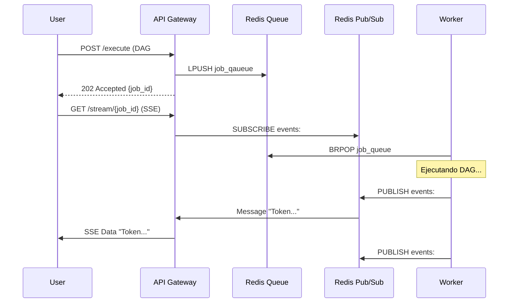

# 🐝 Colmena Cloud: Plan Maestro de Arquitectura e Implementación

Este documento consolida el análisis de escalabilidad, arquitectura técnica, estrategias de integración y el plan de implementación detallado para transformar `dag_engine` en una plataforma SaaS masiva.

---

## 🏗️ 1. Arquitectura Técnica (The Unified Platform)

### El Problema de Escalabilidad
El modelo inicial de "un puerto por DAG" es inviable a escala (10k usuarios = 10k puertos).

### La Solución: API + Workers (Producer-Consumer)
Hemos adoptado una arquitectura desacoplada que permite escalar la recepción de peticiones independientemente de la capacidad de procesamiento.

#### Componentes Principales

1.  **API Gateway (Producer)**:
    *   **Rol**: Recepcionista único.
    *   **Tech**: Rust + Axum.
    *   **Función**: Recibe `POST /execute`, valida requests, y las encola. Maneja Webhooks entrantes de WhatsApp/Slack.
2.  **Message Queue (Redis List)**:
    *   **Rol**: Buffer de persistencia.
    *   **Función**: "Haz esto cuando puedas". Garantiza que ningún trabajo se pierda si hay picos de tráfico.
3.  **Worker Fleet (Consumer)**:
    *   **Rol**: Fábrica de ejecución.
    *   **Tech**: Rust (`dag_engine` library).
    *   **Función**: Toma trabajos de la cola y ejecuta la lógica del DAG.
4.  **Pub/Sub Bridge (Redis Channel)**:
    *   **Rol**: Radio en vivo.
    *   **Función**: Permite el **streaming en tiempo real** de tokens desde el Worker hacia la API (y al usuario) mientras se ejecuta el trabajo.

### Diagrama de Flujo Completo

---

## 🛡️ 2. Estrategia de Seguridad y Aislamiento

Dado que permitimos código Python arbitrario, implementamos un **Modelo de Ejecución por Niveles (Tiered Execution)**:

1.  **Standard Tier (Fast Lane)**: DAGs que *solo* usan nodos nativos (LLM, HTTP, Math). Se ejecutan en el mismo proceso del Worker. Máxima velocidad.
2.  **Isolated Tier (Sandboxed)**: DAGs que contienen `python_script`. El Worker detecta el riesgo y delega la ejecución de ese nodo a un contenedor/job efímero (Knative/Firecracker) para evitar "vecinos ruidosos" o ataques.

---

## 🔌 3. Integraciones Externas

El sistema es agnóstico al canal mediante el patrón **Triggers & Actions**:

*   **Triggers (Inbound)**: Webhook Ingress en la API (`POST /webhooks/whatsapp`) normaliza el payload y crea un Job estándar. El Worker no sabe si vino de WhatsApp o de la Web.
*   **Actions (Outbound)**: Nodos específicos (`WhatsAppSendNode`) que el DAG ejecuta para enviar respuestas.

---

## 📋 4. Plan de Implementación (Jira Ready)

A continuación, el desglose de tareas listo para importar a tu gestor de proyectos (Jira/Linear).

### EPYC 1: Core Platform Infrastructure (Weeks 1-2)
**Objetivo**: Lograr la ejecución asíncrona básica de DAGs.

| ID | Ticket Name | Description | Priority |
| :--- | :--- | :--- | :--- |
| **CORE-01** | **Setup Monorepo Structure** | Crear carpetas `src/platform/api` y `src/platform/worker`. Configurar Cargo workspaces para compartir `dag_engine` como librería. | High |
| **CORE-02** | **Deploy Redis Infrastructure** | Configurar Redis (o KeyDB) en docker-compose y definir variables de entorno para conexión. | High |
| **CORE-03** | **Implement Job Protocol** | Definir `JobRequest` con el grafo completo (`dag_json`) embebido. Sin consultas a DB por ahora para máxima velocidad. | High |
| **CORE-04** | **API: Enqueue Endpoint** | Crear `POST /api/v1/executions` en Axum que reciba JSON, valide y haga `LPUSH` a Redis. | High |
| **CORE-05** | **Worker: Consumer Loop** | Crear binario que haga `BRPOP` infinito, deserialice el Job y loggee "Recibido". | High |
| **CORE-06** | **Worker: DAG Execution** | Integrar `DagRunUseCase` en el Worker para ejecutar el DAG recibido y guardar resultado en DB. | High |

### EPYC 2: Real-time Streaming (Week 3)
**Objetivo**: Habilitar SSE para visualización de tokens en vivo.

| ID | Ticket Name | Description | Priority |
| :--- | :--- | :--- | :--- |
| **STREAM-01** | **Worker: Pub/Sub Emitter** | Modificar `ExecutionObserver` en `dag_engine` para publicar eventos en Redis Channel `events:{job_id}`. | High |
| **STREAM-02** | **API: SSE Endpoint** | Crear `GET /api/v1/stream/{job_id}` que se suscriba a Redis y reenvíe eventos como Server-Sent Events. | High |
| **STREAM-03** | **Frontend: Streaming Client** | Crear ejemplo simple en React/Curl para verificar la recepción de tokens en tiempo real. | Medium |

### EPYC 3: External Integrations (Weeks 4-5)
**Objetivo**: Conectar WhatsApp y Slack.

| ID | Ticket Name | Description | Priority |
| :--- | :--- | :--- | :--- |
| **INT-01** | **Webhook Ingress API** | Crear endpoint `POST /webhooks/{source}` genérico. | Medium |
| **INT-02** | **WhatsApp Adapter** | Implementar lógica para validar firma HMAC de Meta y normalizar JSON de WhatsApp a `JobRequest`. | Medium |
| **INT-03** | **WhatsApp Send Node** | Crear `WhatsAppSendNode` en `dag_engine` usando la API de Meta/Twilio. | Medium |
| **INT-04** | **Slack Integration** | Implementar Ingress Adapter y `SlackPostNode`. | Low |

### EPYC 4: Security Hardening (Week 6)
**Objetivo**: Aislar ejecución de Python.

| ID | Ticket Name | Description | Priority |
| :--- | :--- | :--- | :--- |
| **SEC-01** | **DAG Inspector** | Crear servicio que analice JSON del DAG y marque `requires_isolation: true` si ve `python_script`. | High |
| **SEC-02** | **Sandbox Runner** | Crear Dockerfile mínimo para ejecutar scripts Python aislados. | High |
| **SEC-03** | **Remote Executor Node** | Modificar `python_node.rs` para que, en modo producción, llame a un servicio externo en lugar de `spawn_blocking`. | High |

---

## 🚀 Siguientes Pasos

1.  Aprobar este Plan Maestro.
2.  Crear las tareas **CORE-01** a **CORE-06** en el backlog.
3.  Comenzar Sprint 1 con **CORE-01** (Estructura de Proyecto).
