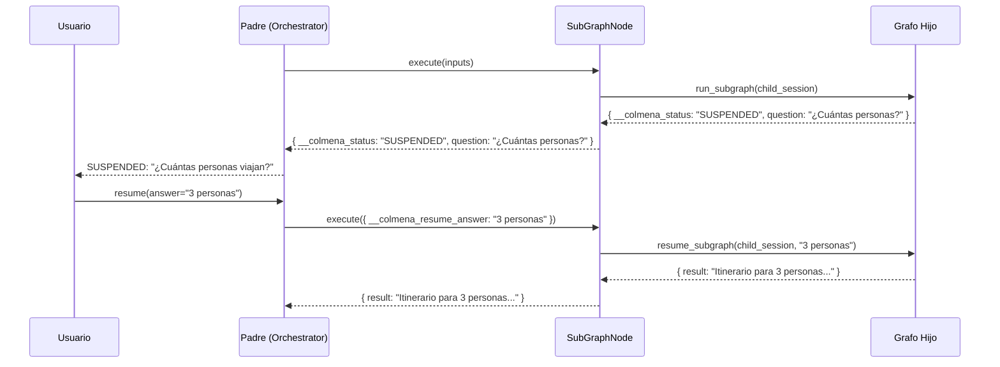
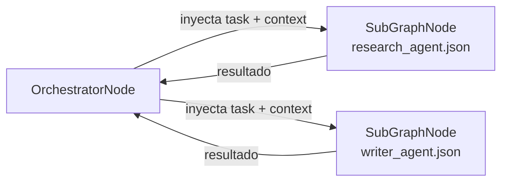
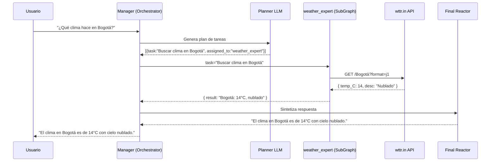

# Agentes Anidados y Sub-Grafos en Colmena

El motor de grafos de Colmena permite encapsular funcionalidades complejas en sub-grafos independientes. El nodo `subgraph` ejecuta un DAG hijo de forma aislada, con su propia sesión y estado. El nodo `orchestrator` usa este mecanismo para despachar agentes especializados.

---

## ¿Por qué usar Sub-Grafos?

1. **Aislamiento de sesión**: Cada sub-grafo tiene su propio `session_id` derivado (`parent_session_id_sub_node_id`). El historial del LLM, las variables temporales de RAG, y los reintentos del Critic no contaminan la sesión del grafo padre.
2. **Propagación HITL automática**: Si el grafo hijo se suspende (nodo `suspend`, Critic, etc.), el estado `SUSPENDED` sube automáticamente al padre. Cuando el padre recibe la respuesta del usuario, la inyecta al hijo y reanuda la ejecución.
3. **Composición modular**: Un grafo padre puede ser un Manager/Router simple que delega trabajo a hijos especializados. Cada hijo es independiente: puede tener sus propias herramientas, LLMs, nodos de memoria o cadenas RAG.

---

## El Nodo `subgraph`

### Configuración

```json
{
  "type": "subgraph",
  "config": {
    "child_graph_path": "./agents/research_agent.json"
  }
}
```

**O inline** (el grafo hijo embebido directamente):

```json
{
  "type": "subgraph",
  "config": {
    "child_graph_inline": {
      "nodes": { ... },
      "edges": [ ... ]
    }
  }
}
```

| Campo | Tipo | Requerido | Descripción |
|---|---|---|---|
| `child_graph_path` | string | Uno u otro | Ruta al archivo JSON del grafo hijo |
| `child_graph_inline` | object | Uno u otro | El grafo hijo como objeto JSON embebido |

### Flujo Interno del SubGraphNode


### Mapeo de Estado (IN)

Las entradas del nodo `subgraph` se pasan al `global_shared_state` inicial del grafo hijo. Las claves internas del motor (`__colmena_*` y `__node_id`) se filtran automáticamente.

```
Parent inputs:
  task = "Investigar atracciones turísticas en Roma"
  context = "Para viaje de 3 días"
  __colmena_session_id = "sess-abc"   ← filtrada
  __node_id = "research_agent"         ← filtrada

Child global_state recibe:
  task = "Investigar atracciones turísticas en Roma"
  context = "Para viaje de 3 días"
```

En el grafo hijo, estos valores están disponibles con la sintaxis `{{task}}` y `{{context}}` en los campos `system_message` y `prompt` de cualquier nodo LLM.

### Mapeo de Estado (OUT)

El resultado del sub-grafo es el valor del nodo marcado con `__colmena_is_output_node: true` en su `extra_info`. Este es el nodo `output` estándar de Colmena.

```json
{
  "type": "output",
  "config": {}
}
```

Si no hay ningún nodo con ese flag, se retorna el estado completo del grafo hijo.

### Session ID Aislado

```
parent session: "sess-abc-123"
│
└── subgraph node_id: "research_agent"
    child session: "sess-abc-123_sub_research_agent"
```

Esto garantiza que cada ejecución del agente tenga su propio historial en la base de datos, sin interferir con otros agentes de la misma sesión padre.

---

## Propagación de Suspensión HITL

Cuando un grafo hijo se suspende, el nodo `subgraph` propaga el estado `SUSPENDED` hacia arriba en la jerarquía.



La clave `__colmena_resume_answer` es detectada por el `SubGraphNode` en la próxima llamada y enrutada directamente al `resume_subgraph` del hijo, sin re-ejecutar el grafo desde el principio.

---

## Eventos de Streaming

Cuando el motor ejecuta un subgrafo (ya sea un nodo `subgraph` o un agente-tarea del `orchestrator`), todos los eventos internos se emiten con el prefijo `subgraph-` en el stream SSE del padre:

| Evento SSE | Cuándo se emite |
|---|---|
| `subgraph-node-start` | Al empezar a ejecutar un nodo dentro del subgrafo |
| `subgraph-node-end` | Al completar un nodo dentro del subgrafo |
| `subgraph-text-start` | Primer token de un LLM interno |
| `subgraph-text-delta` | Por cada token generado por un LLM interno |
| `subgraph-text-end` | Al finalizar el LLM interno |
| `subgraph-tool-input-delta` | Chunk de argumentos de un tool interno (streaming) |
| `subgraph-tool-input-available` | Argumentos completos de un tool interno |
| `subgraph-tool-output-available` | Tool interno terminó de ejecutarse |
| `subgraph-reasoning-start/delta/end` | Bloque de razonamiento de un LLM interno |
| `subgraph-skill-loaded` | Skill cargada dentro del subgrafo |
| `subgraph-usage-summary` | Resumen de tokens del subgrafo |
| `subgraph-error` | Error dentro del subgrafo |

> Para la referencia completa de todos los eventos SSE, incluyendo los de nivel superior y los específicos del orchestrator, ver [docs/sse_events_reference.md](../sse_events_reference.md).

Esto permite que el frontend distinga claramente cuándo habla cada agente en un flujo multi-agente.

---

## El Orchestrator como Gestor de Sub-Grafos

El `orchestrator` usa el `SubGraphNode` internamente para despachar cada tarea del plan a su agente correspondiente. La integración es automática: no necesitas declarar nodos `subgraph` en el grafo del orchestrator.



### Configurar los Agentes

En el config del orchestrator, define cada agente con su descripción y ruta al grafo hijo:

```json
{
  "type": "orchestrator",
  "config": {
    "model": "gpt-4o",
    "agents": {
      "research_agent": {
        "description": "Investiga información factual y recopila datos de fuentes externas",
        "child_graph_path": "./agents/research_agent.json"
      },
      "writer_agent": {
        "description": "Redacta documentos, itinerarios e informes detallados",
        "child_graph_path": "./agents/writer_agent.json"
      }
    }
  }
}
```

El Planner usa las `description` de cada agente para decidir a quién asignar cada tarea.

### Variables Disponibles en el Grafo Hijo

Cuando el orchestrator invoca un agente, inyecta automáticamente estas variables en el `global_shared_state` del hijo:

| Variable | Contenido |
|---|---|
| `task` | La tarea específica asignada a este agente |
| `context` | El contexto de por qué existe esta tarea (del Planner) |
| `phase_summaries` | Resúmenes de fases anteriores (para contexto histórico) |
| `qa_context` | Q&A acumulado de interacciones HITL previas |
| `critic_feedback` | Feedback del Critic si es un reintento |

En el `system_message` del LLM hijo, accede a ellas así:

```json
{
  "system_message": "Eres un investigador experto.\nTarea: {{task}}\nContexto: {{context}}"
}
```

---

## Ejemplo Completo: Asistente Climático

### Grafo Padre (Manager)

```json
{
  "nodes": {
    "start": { "type": "input", "config": {} },
    "manager": {
      "type": "orchestrator",
      "config": {
        "model": "gpt-4o",
        "agents": {
          "weather_expert": {
            "description": "Busca el tiempo o el clima de una localización usando APIs externas",
            "child_graph_path": "./weather_child_agent.json"
          }
        },
        "planner_system_message": "Descompón la petición del usuario en tareas de búsqueda climática.",
        "final_reactor_system_message": "Sintetiza los resultados del clima en una respuesta clara."
      }
    },
    "output": { "type": "output", "config": {} }
  },
  "edges": [
    { "from": "start", "to": "manager" },
    { "from": "manager", "to": "output" }
  ]
}
```

### Grafo Hijo Especialista (`weather_child_agent.json`)

```json
{
  "nodes": {
    "llm_specialist": {
      "type": "llm_call",
      "config": {
        "model": "gpt-4o",
        "system_message": "Eres un asistente del clima.\nTarea: {{task}}\nContexto: {{context}}",
        "tools": [
          {
            "tool_id": "get_weather",
            "name": "get_weather",
            "description": "Obtiene el clima actual para una ciudad",
            "node_schema": {
              "type": "object",
              "properties": {
                "city": { "type": "string", "description": "Nombre de la ciudad" }
              },
              "required": ["city"]
            }
          }
        ],
        "tool_call_edges": { "get_weather": "fetch_api" }
      }
    },
    "fetch_api": {
      "type": "http_request",
      "config": {
        "method": "GET",
        "url": "https://wttr.in/$DYNAMIC?format=j1",
        "fixed_config": {
          "url": "https://wttr.in/$DYNAMIC?format=j1"
        }
      }
    },
    "output": { "type": "output", "config": {} }
  },
  "edges": [
    { "from": "fetch_api", "to": "llm_specialist" },
    { "from": "llm_specialist", "to": "output" }
  ]
}
```

### Flujo de Ejecución



---

## Sub-Grafos Inline (sin archivo externo)

Para grafos simples o portables, puedes embeber el grafo hijo directamente:

```json
{
  "type": "subgraph",
  "config": {
    "child_graph_inline": {
      "nodes": {
        "llm": {
          "type": "llm_call",
          "config": {
            "model": "claude-opus-4-6",
            "system_message": "Eres un experto en {{domain}}. Completa la tarea: {{task}}"
          }
        },
        "out": { "type": "output" }
      },
      "edges": [
        { "from": "llm", "to": "out" }
      ]
    }
  }
}
```

---

## Ejecutar Grafos con Sub-Grafos

```bash
# Ejecutar el grafo padre (el hijo se carga automáticamente)
cargo run --bin dag_engine -- run tests/graphs/advanced/trip_planner_v2.json

# Con sesión específica (para reanudar)
cargo run --bin dag_engine -- run tests/graphs/advanced/hitl_planner_suspend_test.json \
  --session-id mi-sesion-abc \
  --answer "Roma, 5 días, presupuesto 1200€"
```

---

## Referencia de Implementación

| Archivo | Responsabilidad |
|---|---|
| [`infrastructure/nodes/subgraph.rs`](../../src/libs/colmena/src/dag_engine/infrastructure/nodes/subgraph.rs) | Implementación completa del SubGraphNode |
| [`application/ports.rs`](../../src/libs/colmena/src/dag_engine/application/ports.rs) | `SubGraphExecutorPort` — contrato para ejecutar sub-grafos |
| [`infrastructure/nodes/orchestrator.rs`](../../src/libs/colmena/src/dag_engine/infrastructure/nodes/orchestrator.rs) | Usa SubGraphNode para despachar agentes |
| [`domain/events.rs`](../../src/libs/colmena/src/dag_engine/domain/events.rs) | `SubgraphNodeFinish` y `SubgraphChildEvent` |

---

## Guías Relacionadas

- **[20_orchestrator_architecture.md](./20_orchestrator_architecture.md)** — Arquitectura completa del orchestrator con HITL y bridge tasks
- **[12_dag_engine_guide.md](./12_dag_engine_guide.md)** — Referencia completa del DAG engine
