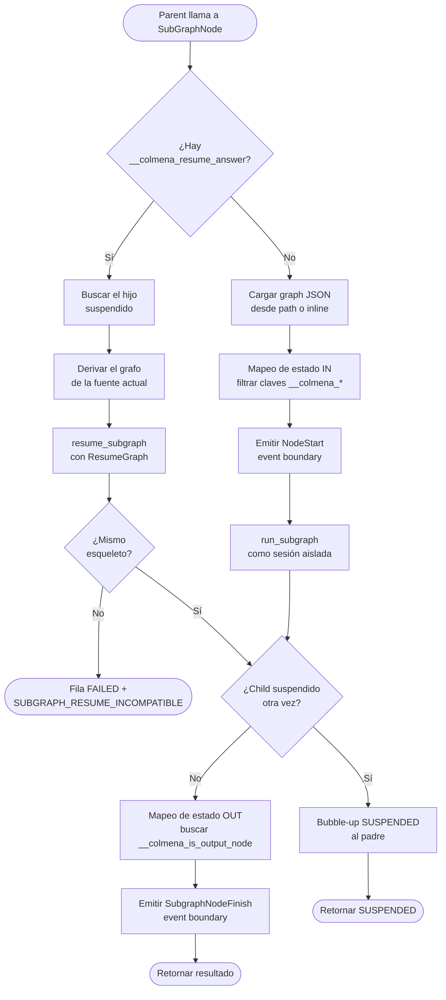
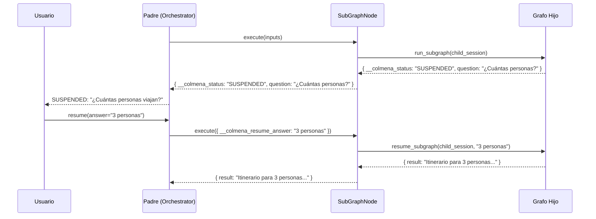
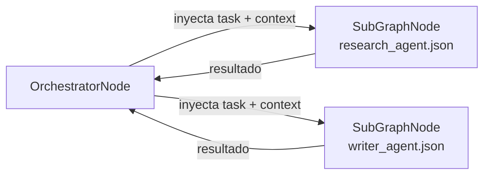
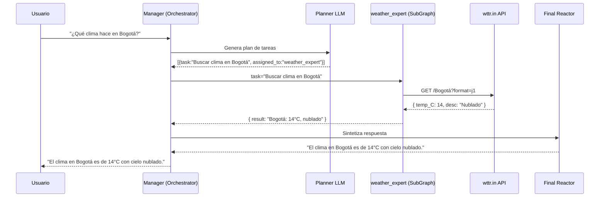

# Agentes Anidados y Sub-Grafos en Colmena

El motor de grafos de Colmena permite encapsular funcionalidades complejas en sub-grafos independientes. El nodo `subgraph` ejecuta un DAG hijo de forma aislada, con su propia sesión y estado. El nodo `orchestrator` usa este mecanismo para despachar agentes especializados.

---

## ¿Por qué usar Sub-Grafos?

1. **Aislamiento de sesión**: Cada sub-grafo recibe un UUID v4 nuevo como `session_id`, ligado al padre mediante `parent_session_id` en `dag_runs`. El historial del LLM, las variables temporales de RAG, y los reintentos del Critic no contaminan la sesión del grafo padre.
2. **Propagación HITL automática**: Si el grafo hijo se suspende (nodo `suspend`, Critic, etc.), el estado `SUSPENDED` sube automáticamente al padre. Cuando el padre recibe la respuesta del usuario, la inyecta al hijo y reanuda la ejecución.
3. **Composición modular**: Un grafo padre puede ser un Manager/Router simple que delega trabajo a hijos especializados. Cada hijo es independiente: puede tener sus propias herramientas, LLMs, nodos de memoria o cadenas RAG.

---

## El Nodo `subgraph`

### Configuración

```json
{
  "type": "subgraph",
  "config": {
    "child_graph_path": "./agents/research_agent.json"
  }
}
```

**O inline** (el grafo hijo embebido directamente):

```json
{
  "type": "subgraph",
  "config": {
    "child_graph_inline": {
      "nodes": { ... },
      "edges": [ ... ]
    }
  }
}
```

| Campo | Tipo | Requerido | Descripción |
|---|---|---|---|
| `child_graph_path` | string | Uno de los tres | Ruta al archivo JSON del grafo hijo |
| `child_graph_inline` | object | Uno de los tres | El grafo hijo como objeto JSON embebido |
| `child_graph_ref` | object | Uno de los tres | El hijo por referencia; lo resuelve el embebedor (ver [Grafo por referencia](#grafo-por-referencia-child_graph_ref)) |

Si hay más de una, gana la primera en este orden: `inline`, `path`, `ref` (y `config`
antes que `inputs`).

### Flujo Interno del SubGraphNode



### Mapeo de Estado (IN)

Las entradas del nodo `subgraph` se pasan al `global_shared_state` inicial del grafo hijo. Las claves internas del motor (`__colmena*` y `__node*`, la misma regla `is_engine_key` de todos los filtros) se filtran automáticamente.

```
Parent inputs:
  task = "Investigar atracciones turísticas en Roma"
  context = "Para viaje de 3 días"
  __colmena_session_id = "sess-abc"   ← filtrada
  __node_id = "research_agent"         ← filtrada

Child global_state recibe:
  task = "Investigar atracciones turísticas en Roma"
  context = "Para viaje de 3 días"
```

En el grafo hijo, estos valores están disponibles con la sintaxis `{{task}}` y `{{context}}` en los campos `system_message` y `prompt` de cualquier nodo LLM.

### Mapeo de Estado (OUT)

El resultado del sub-grafo es el valor del nodo marcado con `__colmena_is_output_node: true` en su `extra_info`. Este es el nodo `output` estándar de Colmena.

```json
{
  "type": "output",
  "config": {}
}
```

Si no hay ningún nodo con ese flag, se retorna el estado completo del grafo hijo.

### Session ID Aislado

Cada sub-grafo recibe un UUID v4 nuevo como `session_id`. La relación padre→hijo se
persiste en la columna `parent_session_id` de `dag_runs`:

```
dag_runs: session_id="sess-abc-123"  agent_session_id="chat_abc"  parent_session_id=NULL
│
└── dag_runs: session_id="<uuid-nuevo>"  agent_session_id="chat_abc"  parent_session_id="sess-abc-123"
    (subgraph node_id: "research_agent")
```

Esto garantiza que dos invocaciones del mismo nodo `subgraph` generen filas distintas
en lugar de colisionar. El `agent_session_id` es heredado del padre y es idéntico en
toda la jerarquía.

> **Nota histórica (legacy):** antes del feat `agent_session_id`, el session_id del hijo
> se calculaba como `{parent_session_id}_sub_{node_id}`. Ese esquema ya no se usa; la
> relación vive en `parent_session_id`.

---

## Subgrafo como Tool (agents-as-tools)

Además de dispararse por *edges* del DAG, un grafo hijo (o un `llm_call` inline)
puede exponerse como **una sola tool** de un `llm_call`. La diferencia clave es
**quién decide cuándo se ejecuta**:

- **Nodo `subgraph` clásico** — lo dispara un edge del DAG (determinista).
- **Orchestrator** — un Planner decide y planifica las tareas por adelantado.
- **Subgrafo como tool** — el **LLM padre decide en su propio loop** de
  tool-calling cuándo invocarlo, igual que con cualquier otra tool. Es el patrón
  *agents-as-tools*: tomar un agente ya construido (con sus tools, RAG y memoria)
  y ofrecérselo a otro agente como una capability más.

### Declaración

Se declara con `node_type: "subgraph"` dentro de `tool_configurations`. La fuente
del grafo hijo va en `fixed_config`, ya sea `child_graph_path` (reusar un grafo
existente) o `child_graph_inline` (un `llm_call` declarado en línea):

```json
"tool_configurations": {
  "buscar_jurisprudencia": {
    "name": "buscar_jurisprudencia",
    "description": "Busca y resume jurisprudencia relevante sobre un tema legal.",
    "node_type": "subgraph",
    "fixed_config": {
      "child_graph_path": "./agents/legal_research_agent.json"
    }
  }
}
```

> `child_graph_path` / `child_graph_inline` son plumbing estático del subgraph,
> por eso van en `fixed_config` y nunca en `node_schema`.

Y por eso el motor **los excluye del estado global del hijo**. El nodo resuelve su
grafo desde esas claves y después las descarta: nunca aparecen en el
`global_shared_state` del hijo, no las ve su nodo de entrada, y no pueden terminar
dentro de un prompt. Es una frontera de seguridad, no prolijidad — el
`child_graph_inline` contiene la config del `llm_call` del hijo con los secretos ya
resueltos (`api_key`, y el `connection_url` que [`memory_mode`](#memoria-del-sub-agente-memory_mode)
exige para los modos con memoria).

La exclusión sale de una constante única en `domain/child_graph_source.rs`
(`CHILD_GRAPH_SOURCE_KEYS`), compartida por el resolver y por el mapeo IN: una
fuente nueva del grafo hijo queda invisible para el hijo por construcción, sin
mantener una segunda lista.

La misma constante decide qué no puede traer el modelo: la fuente del grafo hijo
es un campo del autor (`SubGraphNode::author_owned_inputs`), así que un argumento
con una de esas claves que la tool no ofrece como parámetro se descarta antes
del merge
([guía 22, Step 4c](22_tool_execution_flow.md#step-4c-a-field-only-the-author-sets-is-dropped-unless-the-tool-offers-it)),
y en modo grafo ni el auto-flatten ni el estado global la llenan. Declarar la
fuente como parámetro (`"child_graph_inline": { "type": "object" }`) se la
entrega al modelo a propósito.

### Entrada

Por defecto el LLM ve un único parámetro `task` (string), que se inyecta como
`{{task}}` en el `global_shared_state` del hijo. Para entrada estructurada,
declara un `node_schema` y cada campo se inyecta como variable del hijo
(`{{ciudad}}`, `{{fecha}}`, etc.). Del mapeo IN se filtran las claves internas del
motor (`__colmena_*`, `__node_id`) y el plumbing del operador
(`child_graph_inline`, `child_graph_path`, `child_graph_ref`). Todo lo demás pasa: los argumentos que
el modelo elige mandar en cada llamada —que no son enumerables por adelantado— y
`files`. Un `llm_call` del hijo no toma `files` del estado global (es un campo del autor,
CHANGELOG 2026-09 §122): sus adjuntos vienen de su `config` o de un edge que nombra `files`.

### Comportamiento

- **Stateless por llamada (default)** — por defecto cada invocación arranca con
  memoria vacía. El aislamiento se logra con un *path qualifier* efímero derivado
  del `tool_call_id`; dos llamadas a la misma tool no comparten memoria. Por ser
  determinista del `tool_call_id`, el resume HITL reconstruye el mismo scope. Este
  comportamiento es configurable con `memory_mode` (ver
  [Memoria del sub-agente](#memoria-del-sub-agente-memory_mode)).
- **HITL (suspend/resume)** — si el sub-agente se suspende para preguntar al
  usuario, el `SUSPENDED` hace *bubble-up* por el loop de tools del padre
  reusando los mismos rieles que cualquier otra tool. El resume reanuda al hijo
  en esa misma tool call (incluido multi-suspend anidado), con el grafo que la
  tool nombra en ese momento (ver
  [Reanudar con el grafo actual](#reanudar-con-el-grafo-actual)).
- **Streaming transparente** — los pasos internos del hijo se emiten al stream
  del padre con prefijo `subgraph-*`.
- **Profundidad sin tope** — no hay límite de anidación; ver
  [Profundidad de anidación](#profundidad-de-anidación) más abajo.

### Grafo por referencia (`child_graph_ref`)

Un `subgraph` puede nombrar a su hijo por id en vez de traer el grafo. El motor no lo
busca por su cuenta: se lo pide al embebedor por `ChildGraphResolverPort`
(`EngineConfig.child_graph_resolver`; en ADP lo implementa el worker). Un ejemplo de
tool que el modelo usa para correr cualquiera de los agentes del usuario:

```json
"Run_My_Agent": {
  "name": "Run_My_Agent",
  "node_type": "subgraph",
  "description": "Corre uno de los agentes del usuario con una tarea.",
  "node_schema": {
    "child_graph_ref": { "fixed": { "agent_id": "${agentId}", "context": { "messageId": "m1" } } },
    "agentId": { "type": "string", "required": true, "description": "Id del agente" },
    "prompt":  { "type": "string", "required": true, "description": "La tarea" }
  }
}
```

- El `fixed` se templa con el argumento `agentId` del modelo, que no lo puede pisar.
  `context` le llega al resolvedor tal cual; el motor no lo interpreta.
- Se resuelve **antes** del frame `subgraph-node-start`: si falla, el hijo no emite
  nada y la tool devuelve un error con prefijo estable
  `CHILD_GRAPH_RESOLVE_FAILED:<not_found|forbidden|needs_config|not_runnable|unavailable>: <mensaje>`
  (en `ToolResult.error`; el `output` que ve el modelo lo antepone con
  `Error executing node <tool>: `).
- Sin resolvedor → `unavailable`. Un `agent_id` que todavía contiene `${` (el modelo
  no mandó `agentId`) → `not_found`, sin preguntarle al resolvedor. El resolve corta
  a los 30 s → `unavailable`.
- El grafo resuelto nunca entra en `inputs`, en un frame ni en la salida del nodo, y
  el ref no pasa al estado del hijo. En `dag_runs.graph_json` del run hijo queda solo
  su esqueleto desde v0.19, como el de un inline (antes, el grafo entero). Un resume vuelve a pedirlo con el mismo pedido y compara su
  estructura con la guardada ([Reanudar con el grafo actual](#reanudar-con-el-grafo-actual)):
  un agente despublicado o sin acceso falla con `CHILD_GRAPH_RESOLVE_FAILED:…` también
  después de una pregunta respondida.

Probado con `tests/graphs/agents/child_graph_ref_unavailable.json` (el CLI no
configura resolvedor, así que ejercita el rechazo) y con
`tests/graphs/agents/child_graph_ref_resume.json` (el resume, con un resolvedor
stub en `src/libs/colmena/tests/child_graph_ref_resume.rs`).

### `suspend` y `secure_suspend` como Tool (patrón `cfg_or_input`)

Al igual que `subgraph`, los nodos `suspend` y `secure_suspend` pueden usarse
como tool de un `llm_call` (declarándolos en `tool_configurations`). Cuando el
executor los dispara como tool pasa los argumentos elegidos por el modelo en
`inputs` y `config = {}`; cuando corren como nodo del grafo (edge), los campos
llegan por `config`. Ambos nodos resuelven esa ambigüedad, pero con
implementaciones distintas:

- **`suspend`** usa un helper explícito `cfg_or_input(config, inputs, key)`
  (`suspend.rs:27`) que hace `config.get(key).or_else(|| inputs.get(key))` —
  **`config` gana** si el campo está en ambos, así el uso tradicional como nodo
  no cambia de comportamiento. Se aplica a `id`, `question`, `question_type` y
  `options` (`suspend.rs:47,66,71,82,87`).
- **`secure_suspend`** no usa ese helper — resuelve el mismo problema inline en
  `execute()` (`secure_suspend.rs:212-229`): si `inputs` trae `secrets` o `id`,
  arma un `effective_config` tomando esos dos campos **de `inputs`** (inputs
  gana) y completa el resto desde `config` para cualquier clave ausente en
  `inputs`. Si ni `secrets` ni `id` están en `inputs`, usa `config` tal cual
  (comportamiento de nodo sin cambios).

En ambos casos el resultado es el mismo objetivo — el nodo funciona igual
declarado como edge del grafo o como tool del LLM — pero la precedencia
config-vs-inputs y el mecanismo difieren entre los dos nodos; no asumas que
`secure_suspend` respeta la misma prioridad `config` > `inputs` que `suspend`.

### Memoria del sub-agente (`memory_mode`)

Un sub-agente usado como tool no recuerda nada entre turnos **por diseño**: la
memoria conversacional se keya por `(agent_session_id | session_id, node_id)`, y el
`node_id` de una tool es `tool/<tool_call_id>` — efímero, único por llamada. Eso da
aislamiento perfecto, pero impide construir un sub-agente conversacional (que
pregunte, reciba respuesta y siga en una llamada posterior).

`memory_mode` es un campo **del operador** (nunca visible al LLM) en la entrada de
`tool_configurations` que elige cómo se keya esa memoria. Solo aplica a tools cuyo
`node_type` lleva memoria (`llm_call`, `subgraph`); ponerlo en cualquier otro
(`http_request`, etc.) **falla la validación del grafo al cargar**. Requiere que el
`llm_call` que recuerda tenga `connection_url` (sin él la memoria es en-proceso y no
sobrevive entre runs).

| `memory_mode` | `node_id` | Comportamiento |
|---|---|---|
| `stateless` (**default**) | `tool/<tool_call_id>` | Cada llamada aislada. Es lo de hoy; omitir el campo equivale a esto. |
| `persistent` | `tool/<tool_name>`; desde dentro de un hijo invocado como tool, `<caller>/tool/<tool_name>` | Una sola conversación, compartida por todas las llamadas al tool de un mismo `llm_call` anidado; fuera de un hijo de tool, compartida (ver [De quién es el hilo](#de-quién-es-el-hilo)). Todas acumulan en el mismo hilo y el modelo no maneja ningún identificador. **Activo.** |
| `dynamic` | `tool/<tool_name>/<thread_id>`; desde dentro de un hijo invocado como tool, `<caller>/tool/<tool_name>/<thread_id>` | El modelo nombra el hilo por llamada vía un parámetro `thread_id` **requerido** que el motor auto-expone; un id nuevo abre un hilo, un id previo lo continúa. **Activo.** Excepción: con `thread_id` **fijo** en `node_schema`, lo nombra la plataforma, no el modelo — ver más abajo. |

`<caller>` es el camino del `llm_call` que hace la llamada. Ver
[De quién es el hilo](#de-quién-es-el-hilo), al final de esta sección.

Los tres modos están activos. Un modo con memoria (`persistent`/`dynamic`) **requiere
`connection_url`** en el `llm_call` que recuerda — para un `subgraph`, en un `llm_call`
dentro de su `child_graph_inline` — o el grafo falla al cargar. Un `child_graph_path`
externo no es inspeccionable y no se bloquea.

**`dynamic` en detalle.** El motor auto-expone `thread_id` como parámetro **requerido**
(no lo declares en `node_schema`; el motor lo agrega). El modelo decide en cada llamada:
un id nuevo abre un hilo, un id previo lo retoma. Si el modelo **omite** el `thread_id`,
la llamada devuelve un **error corregible** que el modelo puede leer y reintentar — nunca
un aislamiento silencioso. El resultado del tool **eco-devuelve** el id como prefijo
`[hilo: <id>]` para que sobreviva a la compactación de contexto (el modelo debe reusar
el id exacto para continuar). El `thread_id` se sanitiza (`[A-Za-z0-9._-]`, resto → `-`,
máx. 128) antes de formar la clave.

En `dynamic`, el motor auto-expone además una tool `list_threads` cuando hay al menos un
tool dynamic: el modelo la llama para enumerar los hilos existentes (`thread_id`,
`messages`, `last_activity`, `opening`) y así retomar el correcto. Opcional `tool` para
enfocar uno; sin argumento lista todos agrupados. La consulta por tool está acotada a
100 filas (`MAX_LISTED_NODE_ACTIVITY`, compartida por los backends Postgres/SQLite); si
la enumeración toca ese tope, la entrada de ese tool en la respuesta agrega
`"truncated": true` para que el modelo sepa que la lista es parcial (la clave se omite
cuando no aplica).

```json
"tool_configurations": {
  "archivador": {
    "name": "archivador",
    "node_type": "subgraph",
    "memory_mode": "persistent",
    "description": "Sub-agente que guarda y consulta datos.",
    "node_schema": {
      "child_graph_inline": { "fixed": { "nodes": { "keeper": { "type": "llm_call", "config": { "connection_url": "${DATABASE_URL}", "prompt": "{{task}}" } } }, "edges": [] } },
      "task": { "type": "string", "required": true, "description": "Instrucción para el sub-agente." }
    }
  }
}
```

**`thread_id` fijo (la plataforma nombra el hilo, no el modelo).** En `dynamic`,
`node_schema.thread_id` puede llevar `fixed` en vez de auto-exponerse — p. ej.
`thread_id: { "fixed": "${agentId}" }` junto a un `agentId` LLM-visible en el mismo
`node_schema` (templado contra él, `node_schema_merge.rs`). Efecto: el motor **no**
auto-expone `thread_id`; la salida **no** lleva `[hilo: <id>]` (ese eco es para un id
que el MODELO inventó, no uno fijo); el tool queda **afuera** de `list_threads`; y la
memoria sigue keyando por el valor resuelto (`tool/<tool_name>/<valor>`, o bajo el
camino de quien llama) — un hilo **distinto por `agentId`**. Si el template no resuelve (`agentId` ausente o vacío), la
llamada falla con `unresolved_thread_id` en vez de compartir hilo entre llamadas.

`orchestrator` **no** está en el allowlist. Su propagación de `__colmena_node_id_path` sí
funcionaría (despacha sub-agentes vía `SubGraphNode` con un clon de sus `inputs`), pero el
nodo lee toda su configuración (`agents`, `planner`, …) desde `config` sin fallback a
`inputs` — y una tool dispatch pasa `config = {}` (todo llega por `inputs`). Un
`orchestrator`-como-tool corre hoy con cero agentes, independientemente de la memoria; hacerlo
apto para tool (un fallback a `inputs` como el `resolve_child_graph_source` de `subgraph`) es
prerrequisito antes de que `memory_mode` tenga sentido ahí. Los nodos internos del
orchestrator (`planner`/`critic`/`reactor`) nunca son entradas de `tool_configurations` —
heredan el path de su padre y por eso no se listan.

#### De quién es el hilo

Un hilo `persistent` o `dynamic` es de quien llama a la tool (`memory_node_path`, en
`dag_engine/domain/tool_configuration.rs`):

- **Desde la raíz, la clave es la de siempre:** `tool/<tool_name>[/<thread_id>]`. Tampoco
  cambia para quien llama sin estar dentro de un hijo invocado como tool: el hijo de un
  `subgraph` de nivel de grafo (`ventas/responder`) o un agente de un `orchestrator` en la
  raíz. Esos siguen compartiendo el hilo con el `llm_call` raíz, como antes.
- **Desde dentro de un hijo invocado como tool**, la clave cuelga del camino de quien
  llama: `<caller>/tool/<tool_name>[/<thread_id>]`. Un `llm_call` está ahí cuando su
  `node_id_path` empieza con `tool/`: todo despacho de tool le da ese prefijo a su hijo, y
  se hereda a cualquier profundidad. Por ejemplo, el padre tiene `X` (`dynamic`, hilo fijo
  en `${agentId}`) e `Y` (`persistent`), y el `llm_call` `hijo_y` del hijo de `Y` también
  tiene `X`. El hilo `x` de `X` queda en `tool/X/x/agente_x` si lo llama el padre, y en
  `tool/Y/hijo_y/tool/X/x/agente_x` si lo llama `hijo_y`. Son dos conversaciones: ninguna
  lee la otra, y una corrida fresca en una no cura una pregunta pendiente en la otra.
- **`stateless` no cambia:** `tool/<tool_call_id>` para cualquiera que llame, porque ya es
  única por llamada.
- **El hilo dura lo que dura el camino de quien llama.** Dentro del hijo de una tool
  `stateless` (`tool/<tool_call_id>/…`), una tool con memoria recuerda dentro de esa
  llamada, no entre llamadas. Para que recuerde entre llamadas, la tool de afuera también
  tiene que tener memoria.
- **`list_threads` lista los hilos de quien llama:** busca bajo `tool/<tool_name>/` en la
  raíz y bajo `<caller>/tool/<tool_name>/` dentro de un hijo. Deja afuera las filas que
  cuelgan de un hilo (`…/tool/…`, las de una tool que llamó el agente de ese hilo), antes
  del tope de 100 filas.
- **Una respuesta continúa la conversación donde se hizo la pregunta.** Un `llm_call`
  que recibe la respuesta a su pregunta corre bajo el `_conversation_key.node_id` que
  guardó su salida `SUSPENDED` en `dag_runs.all_outputs`, aunque el camino que se deriva
  hoy sea otro (`run_use_case.rs`). Solo los nodos `llm_call`, y solo en el turno que trae
  la respuesta. Así, una pregunta que un hijo anidado hizo antes de este cambio, bajo la
  clave vieja (`tool/<tool_name>/…`), se contesta sobre esa historia. En una pregunta
  hecha después, la clave guardada es la derivada y no cambia nada.

Límites conocidos:

- **Un `llm_call` invocado directamente como tool no guarda su clave.** Solo se honra la
  clave de un `llm_call` que es nodo de un grafo, por ejemplo el de un hijo de una tool
  `subgraph`. Un `llm_call` con memoria invocado como tool (`tool/<H>`), llamado desde
  dentro de un hijo, que preguntó antes del cambio bajo `tool/<H>`, deriva
  `<caller>/tool/<H>` al reanudar. Su salida `SUSPENDED` nunca se guardó en `all_outputs`,
  y bajo la clave nueva el hilo está vacío. El resume no degrada a una corrida fresca:
  corre sin prompt sobre un hilo sin mensajes, falla con `Empty message list`, y quien
  llama recibe un resultado de tool fallido (`Error executing node llm_call: …`). La
  respuesta se pierde, y quien llama ve el error. Pasa una sola vez, a través del cambio.
  En dev hay 0 cadenas así, y ADP compila los assets como `subgraph`.
- **La clave crece con la anidación.** Cada nivel `persistent` o `dynamic` suma hasta unos
  230 bytes (`/tool/<tool_name>[/<thread_id>]/<nodo>`; peor caso: nombre ≤64 + hilo ≤128 +
  nodo ~25). En ADP son unos 70 bytes por nivel. El índice btree de `llm_node_history`
  admite unos 2704 bytes por entrada, así que en el peor caso el techo ronda los 11
  niveles. Más allá, el `INSERT` falla con un error, no en silencio. Medido en dev:
  profundidad máxima 4.
- **Un nodo raíz cuyo id es `tool`.** Si tiene un `subgraph` de nivel de grafo, los
  caminos de sus hijos empiezan con `tool/` y cuentan como anidados. Los ids de ADP son
  cuids.
- **Un nodo de un hijo cuyo id es `tool`.** Las filas de los nodos que cuelgan de él
  (`…/<thread_id>/tool/<nodo>`) tienen un segmento `/tool/`, así que `list_threads` las
  deja afuera como si fueran de una tool llamada desde el hilo (`is_nested_tool_memory`,
  en `llm/domain/memory.rs`). Un hilo cuya única memoria está ahí no se lista.

E2E: `tests/graphs/agents/nested_tool_memory.json`, que corre
`src/libs/colmena/tests/nested_tool_memory.rs` con un modelo guionado. Ver
[El mismo agente a dos niveles](#el-mismo-agente-a-dos-niveles-un-hilo-por-quien-llama).

### Varias llamadas a la misma tool en un turno (`parallel`)

Un modelo puede pedir la misma tool dos veces en un mensaje. Por defecto las dos
llamadas abren su frontera con el mismo nombre (`agent>Run`), así que en el stream sus
árboles caen en el mismo nodo. `"parallel": true` en la entrada de
`tool_configurations` le da a cada llamada su propia identidad. Es un campo del
operador, nunca visible al LLM, y tiene que ser booleano. Cualquier otro valor falla la
validación del grafo al cargar, y `dag_engine lint` lo reporta como
`MALFORMED_TOOL_ENTRY`.

```json
"Run": {
  "name": "Run",
  "node_type": "subgraph",
  "parallel": true,
  "description": "Corre un agente con una tarea.",
  "node_schema": { "...": "..." }
}
```

- **Frontera `<tool>#<k>`.** Cada llamada abre su frontera como `<tool>#<k>`, donde k
  es su índice en el mensaje `tool_calls` del modelo: la posición en el mensaje, no un
  contador por tool. Pasa en toda llamada de una tool `parallel`, aunque sea la única del
  mensaje. Con `[Run, Nota, Run]`, las fronteras son `agent>Run#0`, `agent>Nota` y
  `agent>Run#2`.
- **`childScope` en los frames.** `tool-input-available` y `tool-output-available` (y sus
  variantes `subgraph-tool-*`) llevan `childScope: "<tool>#<k>"`. `tool-input-start` no
  lo lleva nunca. Ver
  [sse_events_reference.md](../sse_events_reference.md#childscope--una-llamada-a-una-tool-parallel).
- **La memoria no cambia.** `<tool>#<k>` nombra solo la frontera del stream. El
  `node_id` de la memoria sigue saliendo de `memory_mode` y de quien llama
  (`tool/<tool_name>/<thread_id>` en `dynamic`, desde la raíz), así que dos llamadas al
  mismo agente desde el mismo `llm_call` siguen compartiendo hilo.
- **k es estable.** Con streaming, las llamadas se ordenan por el índice del proveedor
  antes de persistirlas y despacharlas. Un resume recalcula k desde el mismo mensaje
  persistido, y el hijo reanudado vuelve a abrir `<tool>#<k>`.
- **Corren a la vez.** Las llamadas `parallel` seguidas de un mismo mensaje forman un
  grupo que corre concurrente. Ver «Un grupo de llamadas `parallel` corre a la vez»,
  abajo.
- Una tool sin `parallel` no cambia en nada: frontera con el nombre pelado, frames sin
  `childScope`, y corre sola, como siempre.

E2E: `tests/graphs/agents/parallel_tool_identity.json`, que corre
`src/libs/colmena/tests/parallel_tool_identity.rs` con un modelo guionado.

#### Un grupo de llamadas `parallel` corre a la vez

El loop del agente reparte las llamadas de un mensaje en tandas, en el orden del modelo
(`plan_batches`, en `llm/application/tool_batches.rs`):

- **Barrera.** Una llamada a una tool sin `parallel` corre sola. Lo que el modelo pidió
  antes termina antes de que empiece, y lo que pidió después empieza cuando terminó.
- **Grupo.** Las llamadas `parallel` seguidas forman un grupo. Dentro del grupo se
  juntan en **cadenas** por su clave de memoria (`parallel_chain_key`, en
  `DagToolExecutor`). Las cadenas corren a la vez; las llamadas de una misma cadena
  comparten un hilo de memoria y corren una tras otra, en el orden del modelo.

  | `memory_mode` | Cadena | Efecto |
  |---|---|---|
  | `stateless` (default) | una por llamada | todas a la vez |
  | `persistent` | una por tool | las llamadas a esa tool, en serie: comparten el único hilo |
  | `dynamic` | una por tool e hilo resuelto | hilos distintos a la vez, el mismo hilo en serie. Con `thread_id: { "fixed": "${agentId}" }`, cada `agentId` es su propia cadena. Sin un hilo usable (la llamada falla antes de tocar la memoria), las llamadas de esa tool comparten una cadena |

- **Tope.** A lo sumo `COLMENA_MAX_PARALLEL_TOOL_CALLS` cadenas de un grupo corren a la
  vez; las demás esperan lugar. Entero positivo, default **4**; vacío, inválido o `0`
  vale el default. Se lee una vez por proceso, y el tope es por grupo, no global.
- **Frames a medida que pasan.** Cada llamada emite su `tool-input-available` cuando
  empieza y su `tool-output-available` cuando termina, así que los frames de un grupo
  se intercalan: el hijo que termina primero cierra primero, aunque el modelo lo haya
  pedido segundo. Cada frame se cuelga de su frontera por `childScope`.
- **La historia, en el orden del modelo.** Los resultados se escriben en la
  conversación cuando termina el grupo, en el orden del mensaje y no en el que
  terminaron. El modelo lee lo mismo que si hubieran corrido en serie. Por lo mismo,
  si el run se corta a mitad del grupo (un Stop, por ejemplo), los resultados que ya
  habían terminado no llegan a la historia.
- **El guard de repetición no cambia.** Recorre el grupo en el orden del modelo, con la
  misma regla de racha consecutiva que en serie, no por cadena. Una llamada con la
  misma firma que la anterior no corre: recibe el resultado de la primera de su racha,
  y al llegar a `max_tool_repeats` el loop pasa a la síntesis final después de cerrar
  el turno. Dentro de un grupo, la repetición se contesta al escribir la historia, así
  que sus frames salen después de los del grupo.
- **Si una llamada del grupo suspende** (un `suspend` o `secure_suspend` en su hijo),
  su cadena para ahí. Las otras cadenas terminan, porque ya estaban corriendo, y sus
  resultados se escriben. Después el run se suspende en **una** pregunta: si
  preguntaron varias, la primera en el orden del modelo; las otras se cierran (fila del
  hijo `FAILED`, y el modelo lee por qué). Detalle en
  [Suspensión dentro de un batch paralelo de tools](#suspensión-dentro-de-un-batch-paralelo-de-tools).

E2E: `tests/graphs/agents/parallel_tool_groups.json`, que corre
`src/libs/colmena/tests/parallel_tool_groups.rs`. El modelo guionado pide `Run` dos
veces en un mensaje; un hijo duerme 2,3 s y el otro 2 s. En grupo, las dos llamadas
tardan 2,31 s desde el primer `tool-input-available` hasta el último
`tool-output-available`. Con `parallel: false`, la línea base del mismo archivo, tardan
4,34 s.

### ¿Y si quiero un orchestrator dentro del loop de tools?

No hace falta esperar a que `orchestrator` sea apto para tool: **envolvelo en un
`subgraph`**. El patrón funciona hoy y da exactamente la capability que se busca —
un agente conversacional que, ante un pedido complejo, delega a un equipo que
**planifica por adelantado** y ejecuta con sus agentes especializados.

```
llm_call (padre)
└── tool: subgraph                 ← soportado hoy
    └── child_graph_inline
        └── nodo orchestrator      ← acá SÍ recibe su config
            ├── planner
            ├── agents
            └── final_reactor
```

Por qué funciona: el grafo hijo de un `subgraph` se ejecuta por el **loop normal del
DAG**, donde la configuración de cada nodo sale de su campo `config`. Ahí el
orchestrator es un nodo del grafo, no una tool, así que recibe `agents`, `planner` y
`final_reactor` intactos. La limitación descrita arriba aplica únicamente a poner el
orchestrator **directamente** en `tool_configurations`.

Ejemplo mínimo verificado end-to-end (Gemini 2.5 Flash):
[`tests/graphs/advanced/orchestrator_inside_subgraph_tool.json`](../../tests/graphs/advanced/orchestrator_inside_subgraph_tool.json).
En el run, el pipeline completo del orchestrator (`planner` → agente `redactor` →
`final_reactor`) corre dentro del loop de tools del padre y devuelve una sola
respuesta consolidada.

> **Sobre `memory_mode` en este patrón:** el campo va en la entrada del `subgraph`
> (que sí lo acepta) y scopea la memoria de los `llm_call` hoja del orchestrator. El
> estado de orquestación en sí —plan y crítica— no persiste: `planner`, `critic` y
> `reactor` usan memoria efímera en proceso por diseño.

### Profundidad de anidación

Desde 2026-08-21 **no hay límite**. El guard fijo de 5 niveles fue eliminado:
rechazaba composiciones legítimas y no había forma de optar por salir. Se
verificaron **50 niveles** de anidación en ejecución, sin degradación.

#### Techo opcional (apagado por defecto)

```
COLMENA_MAX_SUBGRAPH_DEPTH=<n>
```

| Valor | Efecto |
|-------|--------|
| Sin definir (**default**) | Sin límite |
| Vacío, no parseable, o `0` | Sin límite |
| `n > 0` | Un `subgraph` a profundidad `n` o mayor falla |

El `0` se trata como "sin límite" a propósito, no como "rechazar todo": así un
`=0` accidental en un script de deploy no deja fuera de servicio a todos los
subgrafos del ambiente. La variable se lee una vez por proceso y se cachea, así
que cambiarla exige reiniciar el servicio.

Existe como válvula de operaciones contra recursión desbocada (un subgrafo que
se referencia a sí mismo, o un ciclo A→B→A), que sin tope factura llamadas LLM
hasta agotar el worker. Al superarlo, el error arranca con el código estable
`SUBGRAPH_DEPTH_EXCEEDED:`, para poder detectarlo sin parsear prosa.

#### Un límite que SÍ existe: el JSON inline

Anidar con `child_graph_inline` mete el grafo hijo **dentro del documento del
padre**. Cada nivel agrega varias capas de anidación JSON, y el deserializador
tiene un tope de recursión propio: alrededor de **30 niveles inline** el parseo
falla con `recursion limit exceeded` antes de que el grafo llegue a ejecutarse.

Es un límite del **documento**, no de la ejecución, y es anterior a este cambio.
No aplica a las otras formas de anidar:

- `child_graph_path` — cada grafo es un archivo aparte, todos poco profundos.
- Assets publicados / subgrafo-como-tool — igual, cada documento es plano.

Verificado: 50 niveles vía `child_graph_path` corren sin problema; 50 niveles
inline ni siquiera parsean. Si una composición realmente necesita más de ~30
niveles en un solo documento, la salida es partirla en archivos.

#### Cómo verificarlo

```bash
cargo run --bin dag_engine -- run tests/graphs/advanced/nested_sse_remediation_e2e.json \
  --agent-session-id verificacion_001 > /tmp/salida.sse
python3 scripts/verify_nested_sse_e2e.py /tmp/salida.sse
```

El grafo incluye una cadena de 6 subgrafos anidados (la profundidad que el guard
viejo rechazaba) y el verificador afirma que se alcanza. Con
`COLMENA_MAX_SUBGRAPH_DEPTH=3` y el verificador en modo `--ceiling`, se
comprueba el camino contrario. Ver también las
[notas de migración para ADP](../adp_migration/README.md).

Spec de diseño completa (decisiones, arquitectura del flujo con/sin HITL,
ejemplos de las dos formas de declaración):
[`docs/superpowers/specs/2026-06-18-subgraph-as-tool-design.md`](../superpowers/specs/2026-06-18-subgraph-as-tool-design.md).
La referencia de configuración por nodo vive en `docs/node_as_tools_reference.json`
(clave `node_types_as_tools.subgraph`).

---

## Propagación de Suspensión HITL

Cuando un grafo hijo se suspende, el nodo `subgraph` propaga el estado `SUSPENDED` hacia arriba en la jerarquía.



La clave `__colmena_resume_answer` es detectada por el `SubGraphNode` en la próxima llamada y enrutada directamente al `resume_subgraph` del hijo, sin re-ejecutar el grafo desde el principio.

El `result` que el diagrama muestra devolviendo `C` y `S` tras el resume **es
el mismo `extract_final_output` que corre en el camino fresco**: el valor del
nodo `__colmena_is_output_node` del hijo, no su estado completo. Vale también
cuando el subgrafo se usa como tool (`SubGraphExecutorPort`/`resume_subgraph`
vía `DagToolExecutor::execute_with_resume_answer`, que además recorta el
resultado con `scrub_tool_result_output` como cualquier tool fresca).

### Reanudar con el grafo actual

Un hijo suspendido se reanuda con el grafo que su fuente nombra **en ese momento** —el
inline del grafo fresco del padre, el archivo releído, o para un `child_graph_ref` el
resolvedor vuelto a llamar—, no con la copia que guardó al suspenderse. Así trae las
claves, el token y las rutas de skills del turno que lo reanuda. Lo que el resume necesita del estado
guardado (la cola, las salidas, la tool call pendiente en memoria) se busca por id de
nodo, así que el grafo nuevo tiene que tener el mismo **esqueleto** que el guardado:

- los mismos ids de nodo, cada uno con el mismo `type`;
- las mismas aristas `(from, to, cyclic)` (`cyclic` ausente = `false`).

Todo lo demás puede cambiar: `config`, `timezone`/`location`/`locale`, `trigger_on`, los
topes de llamadas. Si el esqueleto cambió, el resume falla sin correr nada y el error
lista solo ids y tipos, nunca un valor de `config`:

```
SUBGRAPH_RESUME_INCOMPATIBLE: the child graph changed since it asked (removed: pregunta; added: confirmar; edges changed: 4). Run it again from the start.
```

La regla vive en `domain/graph_skeleton.rs` (`GraphSkeleton::of`, `GraphSkeleton::diff`).

Un rechazo cierra la fila `FAILED` del hijo (`close_refused`), y también las de sus
propios descendientes que sigan `SUSPENDED` — si no, una fila así queda bajo un padre
ya `FAILED` y `find_resume_entry` la cuenta como una cadena aparte. `DagStateRepository`
gana `fail_if_suspended`/`fail_suspended_descendants` con impl por defecto (entrada 75
de `CHANGELOG_2026-09.md`): non-breaking para quien implemente el puerto fuera del
crate, mismo patrón que `cancel_running_descendants`.

El texto que ve cada llamador depende de cómo se disparó el `subgraph`. Por tool
(el patrón `cfg_or_input` con `child_graph_inline`/`child_graph_path`/`child_graph_ref`),
`ToolResult.error` empieza con `SUBGRAPH_RESUME_INCOMPATIBLE:` y el `output` que
ve el modelo lo antepone con `Error executing node <tool>: `; el `llm_call` padre
lo guarda como un resultado de tool más y sigue su turno, exactamente como
cualquier otra tool que falla. Por arista u orquestador (sin un `llm_call` que
absorba el error), el run entero falla con `Error de ejecución en el nodo:
SUBGRAPH_RESUME_INCOMPATIBLE: …`. Por router, el error de la rama se envuelve dos
veces: primero `router/node.rs:160` antepone `router branch '<rama>': `, y el run
lo vuelve a envolver como `Error de ejecución en el nodo: router branch '<rama>':
SUBGRAPH_RESUME_INCOMPATIBLE: …`; el router también vuelve a elegir su rama en
cada resume (su `execute` no distingue un resume de una corrida fresca), así que
una rama del mismo esqueleto reanuda con la config de esa rama. El prefijo
`SUBGRAPH_RESUME_INCOMPATIBLE:` sigue estable adelante en los tres casos; lo que
cambia es lo que lo envuelve. Ningún frame SSE nuevo: la rama de resume del
`SubGraphNode` sigue sin boundary propio, igual que antes de este cambio.
`Run_My_Agent` pasa por lo mismo: usa `child_graph_ref`, y el resume también le
vuelve a llamar al resolvedor antes de comparar esqueletos (ver
[Grafo por referencia](#grafo-por-referencia-child_graph_ref)). Un agente despublicado
o sin acceso falla con `CHILD_GRAPH_RESOLVE_FAILED:<code>:` en vez de
`SUBGRAPH_RESUME_INCOMPATIBLE:` — nunca llega a comparar esqueletos porque el
resolvedor lo rechazó antes—; uno republicado con otra forma sí llega a comparar y
falla con `SUBGRAPH_RESUME_INCOMPATIBLE:` como cualquier otra fuente. Los dos
cierran la fila del hijo como `FAILED`.

**Desde v0.19 la fila guarda solo el esqueleto.** `dag_runs.graph_json` guarda
`GraphSkeleton::at_rest_json(&graph)`: los ids con su `type` y las aristas, sin
`config`. Ninguna clave de proveedor llega a `graph_json`, y el resume no pierde nada
porque solo compara esqueletos. `global_shared_state.__graph_nodes`, que guardaba otra
copia de la `config` de cada nodo, guarda desde v0.19 solo su `description`, que es
lo único que lee el planner. La válvula que existió en v0.18,
`COLMENA_SUBGRAPH_RESUME_GRAPH=stored`, ya no existe: volvía a correr la copia
guardada, y esa copia ya no tiene config con qué correr.

Compatibilidad:
- **Una fila escrita por v0.18 o antes** tiene el grafo entero. El esqueleto se
  calcula igual, sin migrar datos.
- **Volver de v0.19 a v0.18 es seguro**, porque v0.18 también reanuda con el grafo
  fresco. La condición es no fijar la válvula en v0.18: correría un grafo sin config.
- **Por debajo de v0.18, no:** esas versiones reanudan con la copia guardada.

### Requisito: `connection_url` en cada `llm_call` que participe del HITL

Un `llm_call` que suspende —sea el raíz o uno anidado dentro de un
`child_graph_inline`— **necesita `connection_url`**. El resume se apoya en el
historial de conversación persistido para encontrar la tool call suspendida y
reproducirla con la respuesta del usuario. Sin `connection_url` el nodo cae a un
historial en memoria del proceso, que en la corrida siguiente está siempre vacío.

Desde 2026-08-21 ese caso **falla explícitamente** en vez de continuar:

```
llm_call 'especialista': received a resume answer but this node has no persistent
conversation memory, so the suspended tool call cannot be recovered.
Set `connection_url` on this llm_call (it is required for human-in-the-loop
resume, including on llm_call nodes inside a subgraph).
```

Antes, esa combinación degradaba a una corrida fresca y el agente respondía sin
contexto —típicamente inventando un error interno—, lo que hacía ver un problema
de configuración como un fallo del motor. El caso distinto (hay memoria
persistida pero no aparece la tool call pendiente) sigue degradando a corrida
fresca a propósito, como defensa en profundidad.

> Al generar grafos por código (compiladores de assets, canvas, etc.),
> propagá `connection_url` a **todos** los `llm_call` inlineados, no solo al raíz.

### Suspensión dentro de un batch paralelo de tools

Un modelo puede pedir **varias tools en un mismo turno**. Si una de ellas suspende, el
turno se pausa en **una sola pregunta**. Qué pasa con las demás llamadas depende de
cómo corren: una tras otra (tools sin `parallel`) o en un grupo (tools `parallel`, ver
[Un grupo de llamadas `parallel` corre a la vez](#un-grupo-de-llamadas-parallel-corre-a-la-vez)).

En los dos casos la historia puede guardar los resultados en otro orden que el de las
llamadas: el resume escribe el de la pregunta al final, después de los que se
escribieron al suspender. `LlmRequest::new` se los manda al modelo en el orden de las llamadas de su
mensaje del asistente, con cualquier proveedor. Gemini empareja cada `functionResponse`
con su llamada por posición, no por id.

#### En serie: la pregunta corta el batch

El loop del agente corta en la llamada que suspendió: las llamadas ordenadas después
**no se ejecutan**.

Eso es deliberado. Ejecutarlas igual invertiría la garantía que el `suspend` existe
para imponer — un batch como `[preguntar("¿borro la base?"), borrar_base()]`
dispararía el borrado antes de que el humano conteste.

Pero el mensaje del asistente ya declaró los ids de todas ellas, y tanto Anthropic
como OpenAI rechazan con **400** un turno que declara un id sin su resultado. Así
que, desde 2026-08-22, cada llamada que quedó sin ejecutar recibe un resultado
marcador que le dice al modelo, en texto que lee:

> Esta herramienta NO se ejecutó. […] Nada de lo que pediste aquí ocurrió. Ahora
> que tenés la respuesta del usuario, volvé a llamar esta herramienta si todavía la
> necesitás.

El texto vive en
[`text/prompts/agent_loop/not_executed_on_suspend.md`](../../src/libs/colmena/text/prompts/agent_loop/not_executed_on_suspend.md)
y se edita sin tocar Rust.

La llamada **que suspendió** queda sin resultado a propósito: el resume la
encuentra precisamente por esa ausencia.

```
turno del asistente:  [ ask_user ] [ get_time ] [ add_numbers ]
                            │            │             │
                       suspende      NO corre      NO corre
                            │            │             │
historial persistido:   (abierta)    marcador      marcador
                            │
                    el resume la encuentra
                    y la reproduce con la
                    respuesta del humano
```

#### En un grupo `parallel`: la pregunta espera al grupo

Cuando una llamada del grupo pregunta, las otras cadenas ya están corriendo. El loop
espera a que termine todo el grupo y recién ahí arma el turno:

- **Una pregunta por turno: la primera en el orden del modelo**, no la primera en
  preguntar. En el E2E de abajo `beta` pregunta antes, pero el modelo pidió `alfa`
  primero, y el turno se suspende en la pregunta de `alfa`.
- **Cada otra pregunta se cierra.** El loop llama una vez por cada una a
  `ToolExecutor::close_suspended`. `DagToolExecutor` pasa la fila del hijo de esa
  llamada a `FAILED`, y también a sus descendientes que sigan `SUSPENDED`
  (`fail_if_suspended` + `fail_suspended_descendants`, lo mismo que un resume
  rechazado). Solo cierra la fila si su `parent_session_id` es este run. Así el padre
  queda con un solo hijo `SUSPENDED`, el que `find_suspended_child` encuentra al
  reanudar. El modelo recibe como resultado de la llamada cerrada el texto de
  [`closed_by_parallel_suspend.md`](../../src/libs/colmena/text/prompts/agent_loop/closed_by_parallel_suspend.md),
  y el stream lo trae en su `tool-output-available`:

  > Este agente hizo una pregunta mientras otro también preguntaba. No terminó: volvé
  > a correrlo solo cuando termine el otro.
- **Lo que no corrió recibe «NO se ejecutó».** Son las llamadas que venían después de
  cualquier pregunta en su misma cadena (la cadena se corta en su pregunta) y las que
  el modelo pidió después del grupo. Una llamada que corrió nunca recibe el marcador.
- **Lo que terminó queda.** El resultado de una cadena que terminó se escribe en la
  historia, y su `tool-output-available` sale antes del `finish` suspendido.
- **El resume contesta la que quedó.** Es la única llamada del mensaje del asistente
  sin resultado. `llm_call` la reproduce con la respuesta y con el mismo k, así que el
  hijo reanudado vuelve a colgarse de `<tool>#<k>`.

Frames reales del E2E (`src/libs/colmena/tests/parallel_tool_suspend.rs`, escenario B),
recortados. `Run` es `parallel` y `dynamic` con el hilo fijo en `${agentId}`, como Run
My Agent; el modelo pidió `alfa` y `beta` en un mensaje, y los dos hijos preguntan:

```json
{ "type": "tool-input-available",  "toolCallId": "call_alfa", "input": { "agentId": "alfa", "task": "alfa: preguntá lento" }, "childScope": "Run#0", "path": "agent" }
{ "type": "subgraph-node-start",   "node_id": "Run#0", "node_type": "subgraph", "path": "agent>Run#0" }
{ "type": "tool-input-available",  "toolCallId": "call_beta", "input": { "agentId": "beta", "task": "beta: preguntá" }, "childScope": "Run#1", "path": "agent" }
{ "type": "subgraph-node-start",   "node_id": "Run#1", "node_type": "subgraph", "path": "agent>Run#1" }
{ "type": "subgraph-tool-input-available", "toolCallId": "ask_beta", "toolName": "Preguntar", "input": { "question": "¿beta: seguimos?" }, "path": "agent>Run#1>hijo" }
{ "type": "subgraph-tool-input-available", "toolCallId": "ask_alfa", "toolName": "Preguntar", "input": { "question": "¿alfa: seguimos?" }, "path": "agent>Run#0>hijo" }
{ "type": "tool-output-available", "toolCallId": "call_beta", "output": "Este agente hizo una pregunta mientras otro también preguntaba. No terminó: volvé a correrlo solo cuando termine el otro.", "childScope": "Run#1", "path": "agent" }
{ "type": "finish", "finishReason": "suspended", "output": { "__colmena_status": "SUSPENDED", "questions": [{ "id": "pregunta_hijo", "question": "¿alfa: seguimos?" }], "_pending_tool_call_id": "call_alfa" } }
```

- En `dag_runs`, los hijos del padre quedan uno `SUSPENDED` (`alfa`) y uno `FAILED`
  (`beta`); `SELECT count(*)` de los hijos `SUSPENDED` da 1.
- En `llm_node_history` del padre (`node_id = 'agent'`), el único mensaje `tool` es el
  de `call_beta`, con el texto de arriba.
- El turno siguiente, con la respuesta, reanuda el hijo de `alfa` y el padre termina
  con «Listo.». Los frames del hijo reanudado vienen con `path` `agent>Run#0>hijo`.
  Como en cualquier resume de un `subgraph` usado como tool, ese turno no emite otro
  `subgraph-node-start` de la frontera `agent>Run#0` ni un `tool-output-available` de
  `call_alfa`. Tampoco emite el `subgraph-node-end` de `agent>Run#0`: la frontera que
  se abrió en el turno 1 no se cierra nunca.
- Ni la frontera de la pregunta que queda (`agent>Run#0`) ni la de la cerrada
  (`agent>Run#1`) emiten `subgraph-node-end` en el turno 1: un hijo suspendido deja su
  frontera abierta, como siempre.

Con una sola pregunta y un hermano que termina (escenario A), el `tool-output-available`
del hermano sale antes del `finish` suspendido, y los hijos quedan uno `SUSPENDED` y
uno `COMPLETED`.

#### Re-correr el agente cerrado

El texto le dice al modelo que vuelva a correr el agente cerrado, y eso funciona. El
hilo del hijo cerrado (con memoria; en Run My Agent, `dynamic` con un hilo por
`agentId`) termina en el mensaje del asistente que pidió `Preguntar`, con ese id
abierto. En la corrida siguiente sobre ese hilo, `AgentService::run` contesta primero,
en el camino fresco y nunca en el resume, cada id que el último mensaje del asistente
dejó sin resultado. Lo contesta con
[`abandoned_tool_call.md`](../../src/libs/colmena/text/prompts/agent_loop/abandoned_tool_call.md),
y después agrega el prompt nuevo:

> Esta llamada quedó sin resultado: la conversación siguió sin ella (se cortó, o era
> una pregunta que no se contestó). No la retomes; si todavía hace falta, volvé a
> hacerla.

Sin eso, la request llevaría el id abierto: un 400 en Anthropic y OpenAI, en esa
request y en todas las siguientes del hilo. La curación vale para **todos** los
agentes en una corrida fresca:
- un hijo que un grupo cerró;
- un hijo cuyo resume se rechazó (`close_refused`);
- una corrida que un Stop o el watchdog cortó después de guardar el mensaje del
  asistente, con los ids que todavía no tenían resultado (una llamada sola guarda el
  suyo apenas termina).

Solo se contesta el turno en el que termina el hilo. Un turno que el hilo ya dejó
atrás (con un `user` o un `assistant` después) no se toca, porque un `tool` en ese
lugar lo rechazan igual.

En el E2E (escenario C), un tercer turno fresco vuelve a llamar a `beta` en el mismo
hilo (`tool/Run/beta/hijo`). El modelo de `beta` recibe, sin contar el system:
`user` «beta: preguntá», el `assistant` con `ask_beta`, el `tool` de `ask_beta` con
el texto de arriba y `user` «beta: terminá». Ningún id queda abierto, y
`llm_node_history` guarda un solo mensaje `tool` para `ask_beta`.

#### Un Stop a mitad de grupo

Los resultados de un grupo se escriben cuando el grupo cierra, pero el mensaje del
asistente se guarda antes de correr las llamadas. Un Stop (o el watchdog) a mitad de
grupo pierde los resultados de las llamadas que ya habían terminado, y deja abiertos
los ids que todavía no tenían resultado: los del grupo y los de las llamadas
posteriores. Las llamadas solas anteriores al grupo ya guardaron el suyo, una por una.
La próxima corrida fresca contesta los abiertos con
`abandoned_tool_call.md`, así que el modelo sabe que no tiene esos resultados y los
vuelve a pedir si le hacen falta.

#### El mismo agente a dos niveles: un hilo por quien llama

Hasta v0.20.1 el hilo de memoria de una tool era `tool/<nombre>[/<hilo>]` para
cualquiera que la llamara. El mismo agente llamado a la vez desde dos niveles (el raíz
lo llama, y también un hijo del raíz) compartía hilo. Si uno tenía una pregunta
pendiente y el otro arrancaba fresco, la curación contestaba la pregunta pendiente, y
el resume de esa pregunta ya no encontraba la llamada y degradaba a una corrida fresca.

Ya no pasa: llamado desde dentro de un hijo invocado como tool, el hilo cuelga del
camino de quien llama (ver [De quién es el hilo](#de-quién-es-el-hilo)), así que cada
nivel tiene el suyo. En el E2E (`nested_tool_memory`, escenario A), el padre pide en un
mensaje `X{x}`, que pregunta, e `Y`, cuyo hijo llama a `X{x}` 600 ms después:

- `tool/X/x/agente_x` conserva la pregunta abierta, sin el marcador;
- lo que corrió `X` para `Y` queda en `tool/Y/hijo_y/tool/X/x/agente_x`, con sus dos
  mensajes;
- el resume le entrega la respuesta a `X`, y el padre termina.

Sin el cambio, el hilo del raíz recibe el marcador y los mensajes del otro nivel, y el
resume vuelve a preguntar. Siguen compartiendo hilo los que no están dentro de un hijo
invocado como tool: el raíz, los hijos de un `subgraph` de nivel de grafo y los agentes
de un `orchestrator` en la raíz. Entre ellos el riesgo de antes sigue: si el raíz y el
hijo de un `subgraph` de nivel de grafo, o dos agentes de un `orchestrator` en la raíz
que corren en paralelo, llaman la misma tool con el mismo hilo, una corrida fresca de uno
todavía puede curar la pregunta pendiente del otro.

#### Consecuencias prácticas al diseñar un agente HITL

- **No asumas que las tools del mismo turno corrieron.** Si el modelo pregunta y
  actúa en la misma tanda, lo que sigue a la pregunta se pospone hasta después de
  la respuesta, y solo si el modelo lo vuelve a pedir.
- **Una pregunta por turno.** Dos tools que suspenden en el mismo batch no generan
  dos preguntas. En serie, la primera suspende y la segunda queda marcada como no
  ejecutada. En un grupo `parallel`, la primera en el orden del modelo suspende y la
  otra se cierra. Si necesitás dos datos del usuario, pedilos en una sola pregunta o
  en turnos distintos.
- **El costo es a lo sumo un turno extra**, cuando el modelo decide re-emitir la
  llamada pospuesta o volver a correr la cerrada.
- **El orden del batch lo elige el modelo, no tu prompt.** Por eso el síntoma es
  intermitente: si el modelo pone el `suspend` al final —cosa que hace a menudo— no
  queda ninguna llamada sin ejecutar y no se nota nada. Para reproducirlo a
  voluntad, poné **dos** tools respaldadas por `suspend` en el mismo batch.

Una conversación que un build anterior a 2026-08-22 dejó con un id huérfano
devolvía 400 en cada turno posterior, de forma permanente. El camino de resume
sanea ese estado: al reproducir la llamada pendiente cierra también, con el mismo
marcador, cualquier otro id sin resolver del mismo turno.

---

## Eventos de Streaming

Cuando el motor ejecuta un subgrafo (ya sea un nodo `subgraph` o un agente-tarea del `orchestrator`), todos los eventos internos se emiten con el prefijo `subgraph-` en el stream SSE del padre:

| Evento SSE | Cuándo se emite |
|---|---|
| `subgraph-node-start` | Al empezar a ejecutar un nodo dentro del subgrafo |
| `subgraph-node-end` | Al completar **o fallar** un nodo dentro del subgrafo — ver ["Cuando el sub-agente falla"](#cuando-el-sub-agente-falla) |
| `subgraph-text-start` | Primer token de un LLM interno |
| `subgraph-text-delta` | Por cada token generado por un LLM interno |
| `subgraph-text-end` | Al finalizar el LLM interno |
| `subgraph-tool-input-delta` | Chunk de argumentos de un tool interno (streaming) |
| `subgraph-tool-input-available` | Argumentos completos de un tool interno |
| `subgraph-tool-output-available` | Tool interno terminó de ejecutarse |
| `subgraph-reasoning-start/delta/end` | Bloque de razonamiento de un LLM interno |
| `subgraph-skill-loaded` | Skill cargada dentro del subgrafo |
| `subgraph-usage-summary` | Resumen de tokens del subgrafo |
| `subgraph-error` | **Nunca se emite hoy** — ningún código construye este evento; una falla que el padre sobrevive cierra como `subgraph-node-end` con `status:"error"` (ver abajo), no como `subgraph-error` |

> Para la referencia completa de todos los eventos SSE, incluyendo los de nivel superior y los específicos del orchestrator, ver [docs/sse_events_reference.md](../sse_events_reference.md).

Esto permite que el frontend distinga claramente cuándo habla cada agente en un flujo multi-agente.

### Cuando el sub-agente falla

Cuando el child de un `subgraph`-as-tool falla, la frontera cierra con
`status: "error"` en vez de quedar abierta para siempre (`errorText` solo si
vino del despacho como tool — masked, #310). SUSPENDED deja la frontera
abierta a propósito. Un nodo **interno** que falla también cierra el suyo, a
cualquier profundidad — mismo `errorText` enmascarado (#312). Un `subgraph`
anidado por edge cierra DOS veces por diseño (su propio start/end y el de su
boundary interno, #313 — pares distintos, no un duplicado). El run raíz
sigue cerrando solo vía el frame `error`. Ver [sse_events_reference.md](../sse_events_reference.md#nodo-que-falla).

---

## El Orchestrator como Gestor de Sub-Grafos

El `orchestrator` usa el `SubGraphNode` internamente para despachar cada tarea del plan a su agente correspondiente. La integración es automática: no necesitas declarar nodos `subgraph` en el grafo del orchestrator.



### Configurar los Agentes

En el config del orchestrator, define cada agente con su descripción y ruta al grafo hijo:

```json
{
  "type": "orchestrator",
  "config": {
    "model": "gpt-4o",
    "agents": {
      "research_agent": {
        "description": "Investiga información factual y recopila datos de fuentes externas",
        "child_graph_path": "./agents/research_agent.json"
      },
      "writer_agent": {
        "description": "Redacta documentos, itinerarios e informes detallados",
        "child_graph_path": "./agents/writer_agent.json"
      }
    }
  }
}
```

El Planner usa las `description` de cada agente para decidir a quién asignar cada tarea.

Cada agente admite las mismas tres fuentes que el `subgraph` standalone
(`child_graph_path`, `child_graph_inline` o `child_graph_ref` — ver [Grafo por
referencia](#grafo-por-referencia-child_graph_ref)); exactamente una, si no el
grafo falla al cargar con «Agent must be a subgraph: add 'child_graph_path',
'child_graph_inline' or 'child_graph_ref' to its config».

### Variables Disponibles en el Grafo Hijo

Cuando el orchestrator invoca un agente, inyecta automáticamente estas variables en el `global_shared_state` del hijo:

| Variable | Contenido |
|---|---|
| `task` | La tarea específica asignada a este agente |
| `context` | El contexto de por qué existe esta tarea (del Planner) |
| `phase_summaries` | Resúmenes de fases anteriores (para contexto histórico) |
| `qa_context` | Q&A acumulado de interacciones HITL previas |
| `critic_feedback` | Feedback del Critic si es un reintento |

En el `system_message` del LLM hijo, accede a ellas así:

```json
{
  "system_message": "Eres un investigador experto.\nTarea: {{task}}\nContexto: {{context}}"
}
```

---

## Ejemplo Completo: Asistente Climático

### Grafo Padre (Manager)

```json
{
  "nodes": {
    "start": { "type": "input", "config": {} },
    "manager": {
      "type": "orchestrator",
      "config": {
        "model": "gpt-4o",
        "agents": {
          "weather_expert": {
            "description": "Busca el tiempo o el clima de una localización usando APIs externas",
            "child_graph_path": "./weather_child_agent.json"
          }
        },
        "planner_system_message": "Descompón la petición del usuario en tareas de búsqueda climática.",
        "final_reactor_system_message": "Sintetiza los resultados del clima en una respuesta clara."
      }
    },
    "output": { "type": "output", "config": {} }
  },
  "edges": [
    { "from": "start", "to": "manager" },
    { "from": "manager", "to": "output" }
  ]
}
```

### Grafo Hijo Especialista (`weather_child_agent.json`)

```json
{
  "nodes": {
    "llm_specialist": {
      "type": "llm_call",
      "config": {
        "model": "gpt-4o",
        "system_message": "Eres un asistente del clima.\nTarea: {{task}}\nContexto: {{context}}",
        "tools": [
          {
            "tool_id": "get_weather",
            "name": "get_weather",
            "description": "Obtiene el clima actual para una ciudad",
            "node_schema": {
              "type": "object",
              "properties": {
                "city": { "type": "string", "description": "Nombre de la ciudad" }
              },
              "required": ["city"]
            }
          }
        ],
        "tool_call_edges": { "get_weather": "fetch_api" }
      }
    },
    "fetch_api": {
      "type": "http_request",
      "config": {
        "method": "GET",
        "url": "https://wttr.in/$DYNAMIC?format=j1",
        "fixed_config": {
          "url": "https://wttr.in/$DYNAMIC?format=j1"
        }
      }
    },
    "output": { "type": "output", "config": {} }
  },
  "edges": [
    { "from": "fetch_api", "to": "llm_specialist" },
    { "from": "llm_specialist", "to": "output" }
  ]
}
```

### Flujo de Ejecución



---

## Sub-Grafos Inline (sin archivo externo)

Para grafos simples o portables, puedes embeber el grafo hijo directamente:

```json
{
  "type": "subgraph",
  "config": {
    "child_graph_inline": {
      "nodes": {
        "llm": {
          "type": "llm_call",
          "config": {
            "model": "claude-opus-4-6",
            "system_message": "Eres un experto en {{domain}}. Completa la tarea: {{task}}"
          }
        },
        "out": { "type": "output" }
      },
      "edges": [
        { "from": "llm", "to": "out" }
      ]
    }
  }
}
```

---

## Ejecutar Grafos con Sub-Grafos

```bash
# Ejecutar el grafo padre (el hijo se carga automáticamente)
cargo run --bin dag_engine -- run tests/graphs/advanced/trip_planner_v2.json

# Con sesión específica (para reanudar)
cargo run --bin dag_engine -- run tests/graphs/advanced/hitl_planner_suspend_test.json \
  --session-id mi-sesion-abc \
  --answer "Roma, 5 días, presupuesto 1200€"
```

---

## Referencia de Implementación

| Archivo | Responsabilidad |
|---|---|
| [`infrastructure/nodes/subgraph.rs`](../../src/libs/colmena/src/dag_engine/infrastructure/nodes/subgraph.rs) | Implementación completa del SubGraphNode |
| [`application/ports.rs`](../../src/libs/colmena/src/dag_engine/application/ports.rs) | `SubGraphExecutorPort` — contrato para ejecutar sub-grafos |
| [`infrastructure/nodes/orchestrator.rs`](../../src/libs/colmena/src/dag_engine/infrastructure/nodes/orchestrator.rs) | Usa SubGraphNode para despachar agentes |
| [`domain/events.rs`](../../src/libs/colmena/src/dag_engine/domain/events.rs) | `SubgraphNodeFinish` y `SubgraphChildEvent` |

---

---

## Propagación de identificadores en subgrafos

Cuando un nodo `subgraph` dispara un grafo hijo, propaga tres identificadores hacia
abajo:

1. **`agent_session_id`** — heredado del padre. Todos los runs de la conversación
   comparten el mismo handle, sin importar cuán profundos sean.
2. **`parent_session_id`** — el `session_id` del run padre. Se escribe en la fila
   del hijo en `dag_runs`, dando navegabilidad explícita del árbol de runs.
3. **Path prefix** — el `node_id` cualificado del nodo `subgraph`. Los nodos
   internos del hijo ven `__colmena_node_id_path = "<path_prefix>/<inner_id>"`.

### `session_id` ya no es derivable del nombre

Antes (legacy), el `session_id` del hijo se calculaba como
`{parent_session_id}_sub_{node_id}`. Ahora cada hijo recibe un UUID v4 nuevo y la
relación padre→hijo vive en la columna `parent_session_id` de `dag_runs`. La
ventaja: dos invocaciones del mismo `subgraph` node generan rows distintos en
lugar de colisionar.

### Resume con árbol de runs

Si un subsubgrafo suspende, el árbol de `dag_runs` queda con `status = SUSPENDED`
en cada nivel. Reanudar con `agent_session_id` encuentra automáticamente la hoja
(el run SUSPENDED que no es padre de ningún otro SUSPENDED) y le pasa la respuesta
del usuario. Cada nivel re-deriva el grafo de su hijo (ver
[Reanudar con el grafo actual](#reanudar-con-el-grafo-actual)) — incluido un nivel
por `child_graph_ref`, que vuelve a llamar al resolvedor — así que un cambio de
config llega a cualquier profundidad.

### Memoria LLM dentro del subgrafo

Un `llm_call` dentro de un `subgraph_ventas` con un nodo interno `responder`
indexa su historia bajo `(agent_session_id, "subgraph_ventas/responder")`.
Si el mismo grafo corre dos veces bajo el mismo `agent_session_id`, el
`responder` recupera el historial de la primera ejecución automáticamente.

Si dos subgrafos distintos contienen ambos un nodo `responder`, sus historias
quedan aisladas por el path qualifier
(`subgraph_ventas/responder` vs `subgraph_soporte/responder`). Esto resuelve
una colisión silenciosa que existía antes.

---

## Guías Relacionadas

- **[20_orchestrator_architecture.md](./20_orchestrator_architecture.md)** — Arquitectura completa del orchestrator con HITL y bridge tasks
- **[12_dag_engine_guide.md](./12_dag_engine_guide.md)** — Referencia completa del DAG engine
- **[15_memory_guide.md](./15_memory_guide.md)** — Memoria persistente y `agent_session_id` para chats multi-run
