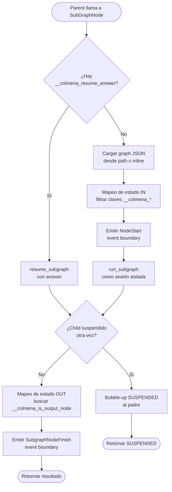
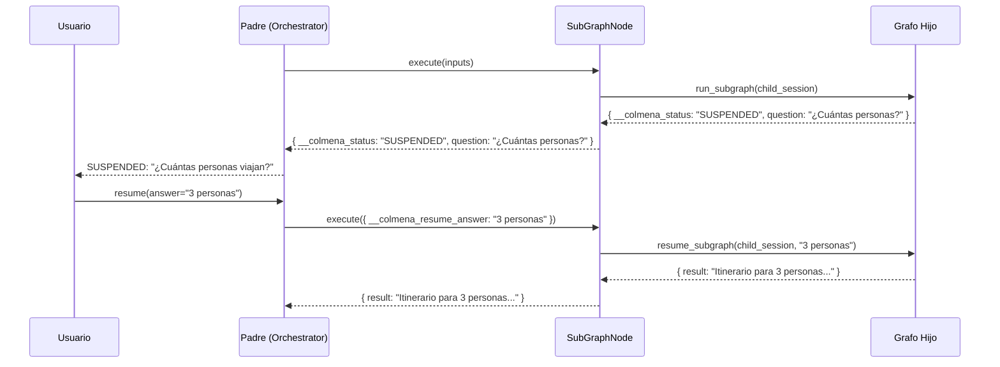
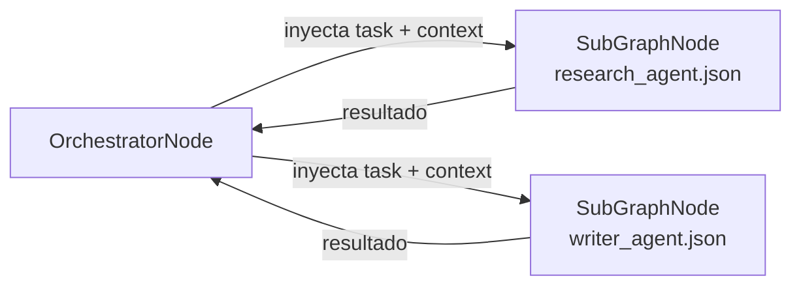
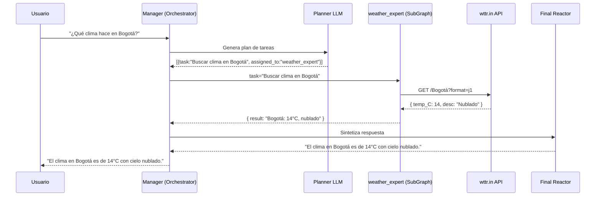

# Agentes Anidados y Sub-Grafos en Colmena

El motor de grafos de Colmena permite encapsular funcionalidades complejas en sub-grafos independientes. El nodo `subgraph` ejecuta un DAG hijo de forma aislada, con su propia sesión y estado. El nodo `orchestrator` usa este mecanismo para despachar agentes especializados.

---

## ¿Por qué usar Sub-Grafos?

1. **Aislamiento de sesión**: Cada sub-grafo recibe un UUID v4 nuevo como `session_id`, ligado al padre mediante `parent_session_id` en `dag_runs`. El historial del LLM, las variables temporales de RAG, y los reintentos del Critic no contaminan la sesión del grafo padre.
2. **Propagación HITL automática**: Si el grafo hijo se suspende (nodo `suspend`, Critic, etc.), el estado `SUSPENDED` sube automáticamente al padre. Cuando el padre recibe la respuesta del usuario, la inyecta al hijo y reanuda la ejecución.
3. **Composición modular**: Un grafo padre puede ser un Manager/Router simple que delega trabajo a hijos especializados. Cada hijo es independiente: puede tener sus propias herramientas, LLMs, nodos de memoria o cadenas RAG.

---

## El Nodo `subgraph`

### Configuración

```json
{
  "type": "subgraph",
  "config": {
    "child_graph_path": "./agents/research_agent.json"
  }
}
```

**O inline** (el grafo hijo embebido directamente):

```json
{
  "type": "subgraph",
  "config": {
    "child_graph_inline": {
      "nodes": { ... },
      "edges": [ ... ]
    }
  }
}
```

| Campo | Tipo | Requerido | Descripción |
|---|---|---|---|
| `child_graph_path` | string | Uno u otro | Ruta al archivo JSON del grafo hijo |
| `child_graph_inline` | object | Uno u otro | El grafo hijo como objeto JSON embebido |

### Flujo Interno del SubGraphNode



### Mapeo de Estado (IN)

Las entradas del nodo `subgraph` se pasan al `global_shared_state` inicial del grafo hijo. Las claves internas del motor (`__colmena_*` y `__node_id`) se filtran automáticamente.

```
Parent inputs:
  task = "Investigar atracciones turísticas en Roma"
  context = "Para viaje de 3 días"
  __colmena_session_id = "sess-abc"   ← filtrada
  __node_id = "research_agent"         ← filtrada

Child global_state recibe:
  task = "Investigar atracciones turísticas en Roma"
  context = "Para viaje de 3 días"
```

En el grafo hijo, estos valores están disponibles con la sintaxis `{{task}}` y `{{context}}` en los campos `system_message` y `prompt` de cualquier nodo LLM.

### Mapeo de Estado (OUT)

El resultado del sub-grafo es el valor del nodo marcado con `__colmena_is_output_node: true` en su `extra_info`. Este es el nodo `output` estándar de Colmena.

```json
{
  "type": "output",
  "config": {}
}
```

Si no hay ningún nodo con ese flag, se retorna el estado completo del grafo hijo.

### Session ID Aislado

Cada sub-grafo recibe un UUID v4 nuevo como `session_id`. La relación padre→hijo se
persiste en la columna `parent_session_id` de `dag_runs`:

```
dag_runs: session_id="sess-abc-123"  agent_session_id="chat_abc"  parent_session_id=NULL
│
└── dag_runs: session_id="<uuid-nuevo>"  agent_session_id="chat_abc"  parent_session_id="sess-abc-123"
    (subgraph node_id: "research_agent")
```

Esto garantiza que dos invocaciones del mismo nodo `subgraph` generen filas distintas
en lugar de colisionar. El `agent_session_id` es heredado del padre y es idéntico en
toda la jerarquía.

> **Nota histórica (legacy):** antes del feat `agent_session_id`, el session_id del hijo
> se calculaba como `{parent_session_id}_sub_{node_id}`. Ese esquema ya no se usa; la
> relación vive en `parent_session_id`.

---

## Subgrafo como Tool (agents-as-tools)

Además de dispararse por *edges* del DAG, un grafo hijo (o un `llm_call` inline)
puede exponerse como **una sola tool** de un `llm_call`. La diferencia clave es
**quién decide cuándo se ejecuta**:

- **Nodo `subgraph` clásico** — lo dispara un edge del DAG (determinista).
- **Orchestrator** — un Planner decide y planifica las tareas por adelantado.
- **Subgrafo como tool** — el **LLM padre decide en su propio loop** de
  tool-calling cuándo invocarlo, igual que con cualquier otra tool. Es el patrón
  *agents-as-tools*: tomar un agente ya construido (con sus tools, RAG y memoria)
  y ofrecérselo a otro agente como una capability más.

### Declaración

Se declara con `node_type: "subgraph"` dentro de `tool_configurations`. La fuente
del grafo hijo va en `fixed_config`, ya sea `child_graph_path` (reusar un grafo
existente) o `child_graph_inline` (un `llm_call` declarado en línea):

```json
"tool_configurations": {
  "buscar_jurisprudencia": {
    "name": "buscar_jurisprudencia",
    "description": "Busca y resume jurisprudencia relevante sobre un tema legal.",
    "node_type": "subgraph",
    "fixed_config": {
      "child_graph_path": "./agents/legal_research_agent.json"
    }
  }
}
```

> `child_graph_path` / `child_graph_inline` son plumbing estático del subgraph,
> por eso van en `fixed_config` y nunca en `node_schema`.

Y por eso el motor **los excluye del estado global del hijo**. El nodo resuelve su
grafo desde esas claves y después las descarta: nunca aparecen en el
`global_shared_state` del hijo, no las ve su nodo de entrada, y no pueden terminar
dentro de un prompt. Es una frontera de seguridad, no prolijidad — el
`child_graph_inline` contiene la config del `llm_call` del hijo con los secretos ya
resueltos (`api_key`, y el `connection_url` que [`memory_mode`](#memoria-del-sub-agente-memory_mode)
exige para los modos con memoria).

La exclusión sale de una constante única en `subgraph.rs`
(`CHILD_GRAPH_SOURCE_KEYS`), compartida por el resolver y por el mapeo IN: una
fuente nueva del grafo hijo queda invisible para el hijo por construcción, sin
mantener una segunda lista.

### Entrada

Por defecto el LLM ve un único parámetro `task` (string), que se inyecta como
`{{task}}` en el `global_shared_state` del hijo. Para entrada estructurada,
declara un `node_schema` y cada campo se inyecta como variable del hijo
(`{{ciudad}}`, `{{fecha}}`, etc.). Del mapeo IN se filtran las claves internas del
motor (`__colmena_*`, `__node_id`) y el plumbing del operador
(`child_graph_inline`, `child_graph_path`). Todo lo demás pasa: los argumentos que
el modelo elige mandar en cada llamada —que no son enumerables por adelantado— y
`files`, del que `llm.rs` resuelve los adjuntos.

### Comportamiento

- **Stateless por llamada (default)** — por defecto cada invocación arranca con
  memoria vacía. El aislamiento se logra con un *path qualifier* efímero derivado
  del `tool_call_id`; dos llamadas a la misma tool no comparten memoria. Por ser
  determinista del `tool_call_id`, el resume HITL reconstruye el mismo scope. Este
  comportamiento es configurable con `memory_mode` (ver
  [Memoria del sub-agente](#memoria-del-sub-agente-memory_mode)).
- **HITL (suspend/resume)** — si el sub-agente se suspende para preguntar al
  usuario, el `SUSPENDED` hace *bubble-up* por el loop de tools del padre
  reusando los mismos rieles que cualquier otra tool. El resume reanuda al hijo
  en esa misma tool call (incluido multi-suspend anidado).
- **Streaming transparente** — los pasos internos del hijo se emiten al stream
  del padre con prefijo `subgraph-*`.
- **Profundidad sin tope** — no hay límite de anidación; ver
  [Profundidad de anidación](#profundidad-de-anidación) más abajo.

### Memoria del sub-agente (`memory_mode`)

Un sub-agente usado como tool no recuerda nada entre turnos **por diseño**: la
memoria conversacional se keya por `(agent_session_id | session_id, node_id)`, y el
`node_id` de una tool es `tool/<tool_call_id>` — efímero, único por llamada. Eso da
aislamiento perfecto, pero impide construir un sub-agente conversacional (que
pregunte, reciba respuesta y siga en una llamada posterior).

`memory_mode` es un campo **del operador** (nunca visible al LLM) en la entrada de
`tool_configurations` que elige cómo se keya esa memoria. Solo aplica a tools cuyo
`node_type` lleva memoria (`llm_call`, `subgraph`); ponerlo en cualquier otro
(`http_request`, etc.) **falla la validación del grafo al cargar**. Requiere que el
`llm_call` que recuerda tenga `connection_url` (sin él la memoria es en-proceso y no
sobrevive entre runs).

| `memory_mode` | `node_id` | Comportamiento |
|---|---|---|
| `stateless` (**default**) | `tool/<tool_call_id>` | Cada llamada aislada. Es lo de hoy; omitir el campo equivale a esto. |
| `persistent` | `tool/<tool_name>` | Una sola conversación compartida por todas las llamadas al tool; todas acumulan en el mismo hilo y el modelo no maneja ningún identificador. **Activo.** |
| `dynamic` | `tool/<tool_name>/<thread_id>` | El modelo nombra el hilo por llamada vía un parámetro `thread_id` **requerido** que el motor auto-expone; un id nuevo abre un hilo, un id previo lo continúa. **Activo.** |

Los tres modos están activos. Un modo con memoria (`persistent`/`dynamic`) **requiere
`connection_url`** en el `llm_call` que recuerda — para un `subgraph`, en un `llm_call`
dentro de su `child_graph_inline` — o el grafo falla al cargar. Un `child_graph_path`
externo no es inspeccionable y no se bloquea.

**`dynamic` en detalle.** El motor auto-expone `thread_id` como parámetro **requerido**
(no lo declares en `node_schema`; el motor lo agrega). El modelo decide en cada llamada:
un id nuevo abre un hilo, un id previo lo retoma. Si el modelo **omite** el `thread_id`,
la llamada devuelve un **error corregible** que el modelo puede leer y reintentar — nunca
un aislamiento silencioso. El resultado del tool **eco-devuelve** el id como prefijo
`[hilo: <id>]` para que sobreviva a la compactación de contexto (el modelo debe reusar
el id exacto para continuar). El `thread_id` se sanitiza (`[A-Za-z0-9._-]`, resto → `-`,
máx. 128) antes de formar la clave.

En `dynamic`, el motor auto-expone además una tool `list_threads` cuando hay al menos un
tool dynamic: el modelo la llama para enumerar los hilos existentes (`thread_id`,
`messages`, `last_activity`, `opening`) y así retomar el correcto. Opcional `tool` para
enfocar uno; sin argumento lista todos agrupados. La consulta por tool está acotada a
100 filas (`MAX_LISTED_NODE_ACTIVITY`, compartida por los backends Postgres/SQLite); si
la enumeración toca ese tope, la entrada de ese tool en la respuesta agrega
`"truncated": true` para que el modelo sepa que la lista es parcial (la clave se omite
cuando no aplica).

```json
"tool_configurations": {
  "archivador": {
    "name": "archivador",
    "node_type": "subgraph",
    "memory_mode": "persistent",
    "description": "Sub-agente que guarda y consulta datos.",
    "node_schema": {
      "child_graph_inline": { "fixed": { "nodes": { "keeper": { "type": "llm_call", "config": { "connection_url": "${DATABASE_URL}", "prompt": "{{task}}" } } }, "edges": [] } },
      "task": { "type": "string", "required": true, "description": "Instrucción para el sub-agente." }
    }
  }
}
```

`orchestrator` **no** está en el allowlist. Su propagación de `__colmena_node_id_path` sí
funcionaría (despacha sub-agentes vía `SubGraphNode` con un clon de sus `inputs`), pero el
nodo lee toda su configuración (`agents`, `planner`, …) desde `config` sin fallback a
`inputs` — y una tool dispatch pasa `config = {}` (todo llega por `inputs`). Un
`orchestrator`-como-tool corre hoy con cero agentes, independientemente de la memoria; hacerlo
apto para tool (un fallback a `inputs` como el `resolve_child_graph_source` de `subgraph`) es
prerrequisito antes de que `memory_mode` tenga sentido ahí. Los nodos internos del
orchestrator (`planner`/`critic`/`reactor`) nunca son entradas de `tool_configurations` —
heredan el path de su padre y por eso no se listan.

### ¿Y si quiero un orchestrator dentro del loop de tools?

No hace falta esperar a que `orchestrator` sea apto para tool: **envolvelo en un
`subgraph`**. El patrón funciona hoy y da exactamente la capability que se busca —
un agente conversacional que, ante un pedido complejo, delega a un equipo que
**planifica por adelantado** y ejecuta con sus agentes especializados.

```
llm_call (padre)
└── tool: subgraph                 ← soportado hoy
    └── child_graph_inline
        └── nodo orchestrator      ← acá SÍ recibe su config
            ├── planner
            ├── agents
            └── final_reactor
```

Por qué funciona: el grafo hijo de un `subgraph` se ejecuta por el **loop normal del
DAG**, donde la configuración de cada nodo sale de su campo `config`. Ahí el
orchestrator es un nodo del grafo, no una tool, así que recibe `agents`, `planner` y
`final_reactor` intactos. La limitación descrita arriba aplica únicamente a poner el
orchestrator **directamente** en `tool_configurations`.

Ejemplo mínimo verificado end-to-end (Gemini 2.5 Flash):
[`tests/graphs/advanced/orchestrator_inside_subgraph_tool.json`](../../tests/graphs/advanced/orchestrator_inside_subgraph_tool.json).
En el run, el pipeline completo del orchestrator (`planner` → agente `redactor` →
`final_reactor`) corre dentro del loop de tools del padre y devuelve una sola
respuesta consolidada.

> **Sobre `memory_mode` en este patrón:** el campo va en la entrada del `subgraph`
> (que sí lo acepta) y scopea la memoria de los `llm_call` hoja del orchestrator. El
> estado de orquestación en sí —plan y crítica— no persiste: `planner`, `critic` y
> `reactor` usan memoria efímera en proceso por diseño.

### Profundidad de anidación

Desde 2026-08-21 **no hay límite**. El guard fijo de 5 niveles fue eliminado:
rechazaba composiciones legítimas y no había forma de optar por salir. Se
verificaron **50 niveles** de anidación en ejecución, sin degradación.

#### Techo opcional (apagado por defecto)

```
COLMENA_MAX_SUBGRAPH_DEPTH=<n>
```

| Valor | Efecto |
|-------|--------|
| Sin definir (**default**) | Sin límite |
| Vacío, no parseable, o `0` | Sin límite |
| `n > 0` | Un `subgraph` a profundidad `n` o mayor falla |

El `0` se trata como "sin límite" a propósito, no como "rechazar todo": así un
`=0` accidental en un script de deploy no deja fuera de servicio a todos los
subgrafos del ambiente. La variable se lee una vez por proceso y se cachea, así
que cambiarla exige reiniciar el servicio.

Existe como válvula de operaciones contra recursión desbocada (un subgrafo que
se referencia a sí mismo, o un ciclo A→B→A), que sin tope factura llamadas LLM
hasta agotar el worker. Al superarlo, el error arranca con el código estable
`SUBGRAPH_DEPTH_EXCEEDED:`, para poder detectarlo sin parsear prosa.

#### Un límite que SÍ existe: el JSON inline

Anidar con `child_graph_inline` mete el grafo hijo **dentro del documento del
padre**. Cada nivel agrega varias capas de anidación JSON, y el deserializador
tiene un tope de recursión propio: alrededor de **30 niveles inline** el parseo
falla con `recursion limit exceeded` antes de que el grafo llegue a ejecutarse.

Es un límite del **documento**, no de la ejecución, y es anterior a este cambio.
No aplica a las otras formas de anidar:

- `child_graph_path` — cada grafo es un archivo aparte, todos poco profundos.
- Assets publicados / subgrafo-como-tool — igual, cada documento es plano.

Verificado: 50 niveles vía `child_graph_path` corren sin problema; 50 niveles
inline ni siquiera parsean. Si una composición realmente necesita más de ~30
niveles en un solo documento, la salida es partirla en archivos.

#### Cómo verificarlo

```bash
cargo run --bin dag_engine -- run tests/graphs/advanced/nested_sse_remediation_e2e.json \
  --agent-session-id verificacion_001 > /tmp/salida.sse
python3 scripts/verify_nested_sse_e2e.py /tmp/salida.sse
```

El grafo incluye una cadena de 6 subgrafos anidados (la profundidad que el guard
viejo rechazaba) y el verificador afirma que se alcanza. Con
`COLMENA_MAX_SUBGRAPH_DEPTH=3` y el verificador en modo `--ceiling`, se
comprueba el camino contrario. Ver también las
[notas de migración para ADP](../adp_migration/README.md).

Spec de diseño completa (decisiones, arquitectura del flujo con/sin HITL,
ejemplos de las dos formas de declaración):
[`docs/superpowers/specs/2026-06-18-subgraph-as-tool-design.md`](../superpowers/specs/2026-06-18-subgraph-as-tool-design.md).
La referencia de configuración por nodo vive en `docs/node_as_tools_reference.json`
(clave `node_types_as_tools.subgraph`).

---

## Propagación de Suspensión HITL

Cuando un grafo hijo se suspende, el nodo `subgraph` propaga el estado `SUSPENDED` hacia arriba en la jerarquía.



La clave `__colmena_resume_answer` es detectada por el `SubGraphNode` en la próxima llamada y enrutada directamente al `resume_subgraph` del hijo, sin re-ejecutar el grafo desde el principio.

### Requisito: `connection_url` en cada `llm_call` que participe del HITL

Un `llm_call` que suspende —sea el raíz o uno anidado dentro de un
`child_graph_inline`— **necesita `connection_url`**. El resume se apoya en el
historial de conversación persistido para encontrar la tool call suspendida y
reproducirla con la respuesta del usuario. Sin `connection_url` el nodo cae a un
historial en memoria del proceso, que en la corrida siguiente está siempre vacío.

Desde 2026-08-21 ese caso **falla explícitamente** en vez de continuar:

```
llm_call 'especialista': received a resume answer but this node has no persistent
conversation memory, so the suspended tool call cannot be recovered.
Set `connection_url` on this llm_call (it is required for human-in-the-loop
resume, including on llm_call nodes inside a subgraph).
```

Antes, esa combinación degradaba a una corrida fresca y el agente respondía sin
contexto —típicamente inventando un error interno—, lo que hacía ver un problema
de configuración como un fallo del motor. El caso distinto (hay memoria
persistida pero no aparece la tool call pendiente) sigue degradando a corrida
fresca a propósito, como defensa en profundidad.

> Al generar grafos por código (compiladores de assets, canvas, etc.),
> propagá `connection_url` a **todos** los `llm_call` inlineados, no solo al raíz.

### Suspensión dentro de un batch paralelo de tools

Un modelo puede pedir **varias tools en un mismo turno**. Si una de ellas suspende,
el loop del agente corta ahí: las llamadas ordenadas después **no se ejecutan**.

Eso es deliberado. Ejecutarlas igual invertiría la garantía que el `suspend` existe
para imponer — un batch como `[preguntar("¿borro la base?"), borrar_base()]`
dispararía el borrado antes de que el humano conteste.

Pero el mensaje del asistente ya declaró los ids de todas ellas, y tanto Anthropic
como OpenAI rechazan con **400** un turno que declara un id sin su resultado. Así
que, desde 2026-08-22, cada llamada que quedó sin ejecutar recibe un resultado
marcador que le dice al modelo, en texto que lee:

> Esta herramienta NO se ejecutó. […] Nada de lo que pediste aquí ocurrió. Ahora
> que tenés la respuesta del usuario, volvé a llamar esta herramienta si todavía la
> necesitás.

El texto vive en
[`text/prompts/agent_loop/not_executed_on_suspend.md`](../../src/libs/colmena/text/prompts/agent_loop/not_executed_on_suspend.md)
y se edita sin tocar Rust.

La llamada **que suspendió** queda sin resultado a propósito: el resume la
encuentra precisamente por esa ausencia.

```
turno del asistente:  [ ask_user ] [ get_time ] [ add_numbers ]
                            │            │             │
                       suspende      NO corre      NO corre
                            │            │             │
historial persistido:   (abierta)    marcador      marcador
                            │
                    el resume la encuentra
                    y la reproduce con la
                    respuesta del humano
```

Consecuencias prácticas al diseñar un agente HITL:

- **No asumas que las tools del mismo turno corrieron.** Si el modelo pregunta y
  actúa en la misma tanda, lo que sigue a la pregunta se pospone hasta después de
  la respuesta, y solo si el modelo lo vuelve a pedir.
- **Un `suspend` por turno.** Dos tools que suspenden en el mismo batch no generan
  dos preguntas: la primera suspende y la segunda queda marcada como no ejecutada.
  Si necesitás dos datos del usuario, pedilos en una sola pregunta o en turnos
  distintos.
- **El costo es a lo sumo un turno extra**, cuando el modelo decide re-emitir la
  llamada pospuesta.
- **El orden del batch lo elige el modelo, no tu prompt.** Por eso el síntoma es
  intermitente: si el modelo pone el `suspend` al final —cosa que hace a menudo— no
  queda ninguna llamada sin ejecutar y no se nota nada. Para reproducirlo a
  voluntad, poné **dos** tools respaldadas por `suspend` en el mismo batch.

Una conversación que un build anterior a 2026-08-22 dejó con un id huérfano
devolvía 400 en cada turno posterior, de forma permanente. El camino de resume
sanea ese estado: al reproducir la llamada pendiente cierra también, con el mismo
marcador, cualquier otro id sin resolver del mismo turno.

---

## Eventos de Streaming

Cuando el motor ejecuta un subgrafo (ya sea un nodo `subgraph` o un agente-tarea del `orchestrator`), todos los eventos internos se emiten con el prefijo `subgraph-` en el stream SSE del padre:

| Evento SSE | Cuándo se emite |
|---|---|
| `subgraph-node-start` | Al empezar a ejecutar un nodo dentro del subgrafo |
| `subgraph-node-end` | Al completar un nodo dentro del subgrafo |
| `subgraph-text-start` | Primer token de un LLM interno |
| `subgraph-text-delta` | Por cada token generado por un LLM interno |
| `subgraph-text-end` | Al finalizar el LLM interno |
| `subgraph-tool-input-delta` | Chunk de argumentos de un tool interno (streaming) |
| `subgraph-tool-input-available` | Argumentos completos de un tool interno |
| `subgraph-tool-output-available` | Tool interno terminó de ejecutarse |
| `subgraph-reasoning-start/delta/end` | Bloque de razonamiento de un LLM interno |
| `subgraph-skill-loaded` | Skill cargada dentro del subgrafo |
| `subgraph-usage-summary` | Resumen de tokens del subgrafo |
| `subgraph-error` | Error dentro del subgrafo |

> Para la referencia completa de todos los eventos SSE, incluyendo los de nivel superior y los específicos del orchestrator, ver [docs/sse_events_reference.md](../sse_events_reference.md).

Esto permite que el frontend distinga claramente cuándo habla cada agente en un flujo multi-agente.

---

## El Orchestrator como Gestor de Sub-Grafos

El `orchestrator` usa el `SubGraphNode` internamente para despachar cada tarea del plan a su agente correspondiente. La integración es automática: no necesitas declarar nodos `subgraph` en el grafo del orchestrator.



### Configurar los Agentes

En el config del orchestrator, define cada agente con su descripción y ruta al grafo hijo:

```json
{
  "type": "orchestrator",
  "config": {
    "model": "gpt-4o",
    "agents": {
      "research_agent": {
        "description": "Investiga información factual y recopila datos de fuentes externas",
        "child_graph_path": "./agents/research_agent.json"
      },
      "writer_agent": {
        "description": "Redacta documentos, itinerarios e informes detallados",
        "child_graph_path": "./agents/writer_agent.json"
      }
    }
  }
}
```

El Planner usa las `description` de cada agente para decidir a quién asignar cada tarea.

### Variables Disponibles en el Grafo Hijo

Cuando el orchestrator invoca un agente, inyecta automáticamente estas variables en el `global_shared_state` del hijo:

| Variable | Contenido |
|---|---|
| `task` | La tarea específica asignada a este agente |
| `context` | El contexto de por qué existe esta tarea (del Planner) |
| `phase_summaries` | Resúmenes de fases anteriores (para contexto histórico) |
| `qa_context` | Q&A acumulado de interacciones HITL previas |
| `critic_feedback` | Feedback del Critic si es un reintento |

En el `system_message` del LLM hijo, accede a ellas así:

```json
{
  "system_message": "Eres un investigador experto.\nTarea: {{task}}\nContexto: {{context}}"
}
```

---

## Ejemplo Completo: Asistente Climático

### Grafo Padre (Manager)

```json
{
  "nodes": {
    "start": { "type": "input", "config": {} },
    "manager": {
      "type": "orchestrator",
      "config": {
        "model": "gpt-4o",
        "agents": {
          "weather_expert": {
            "description": "Busca el tiempo o el clima de una localización usando APIs externas",
            "child_graph_path": "./weather_child_agent.json"
          }
        },
        "planner_system_message": "Descompón la petición del usuario en tareas de búsqueda climática.",
        "final_reactor_system_message": "Sintetiza los resultados del clima en una respuesta clara."
      }
    },
    "output": { "type": "output", "config": {} }
  },
  "edges": [
    { "from": "start", "to": "manager" },
    { "from": "manager", "to": "output" }
  ]
}
```

### Grafo Hijo Especialista (`weather_child_agent.json`)

```json
{
  "nodes": {
    "llm_specialist": {
      "type": "llm_call",
      "config": {
        "model": "gpt-4o",
        "system_message": "Eres un asistente del clima.\nTarea: {{task}}\nContexto: {{context}}",
        "tools": [
          {
            "tool_id": "get_weather",
            "name": "get_weather",
            "description": "Obtiene el clima actual para una ciudad",
            "node_schema": {
              "type": "object",
              "properties": {
                "city": { "type": "string", "description": "Nombre de la ciudad" }
              },
              "required": ["city"]
            }
          }
        ],
        "tool_call_edges": { "get_weather": "fetch_api" }
      }
    },
    "fetch_api": {
      "type": "http_request",
      "config": {
        "method": "GET",
        "url": "https://wttr.in/$DYNAMIC?format=j1",
        "fixed_config": {
          "url": "https://wttr.in/$DYNAMIC?format=j1"
        }
      }
    },
    "output": { "type": "output", "config": {} }
  },
  "edges": [
    { "from": "fetch_api", "to": "llm_specialist" },
    { "from": "llm_specialist", "to": "output" }
  ]
}
```

### Flujo de Ejecución



---

## Sub-Grafos Inline (sin archivo externo)

Para grafos simples o portables, puedes embeber el grafo hijo directamente:

```json
{
  "type": "subgraph",
  "config": {
    "child_graph_inline": {
      "nodes": {
        "llm": {
          "type": "llm_call",
          "config": {
            "model": "claude-opus-4-6",
            "system_message": "Eres un experto en {{domain}}. Completa la tarea: {{task}}"
          }
        },
        "out": { "type": "output" }
      },
      "edges": [
        { "from": "llm", "to": "out" }
      ]
    }
  }
}
```

---

## Ejecutar Grafos con Sub-Grafos

```bash
# Ejecutar el grafo padre (el hijo se carga automáticamente)
cargo run --bin dag_engine -- run tests/graphs/advanced/trip_planner_v2.json

# Con sesión específica (para reanudar)
cargo run --bin dag_engine -- run tests/graphs/advanced/hitl_planner_suspend_test.json \
  --session-id mi-sesion-abc \
  --answer "Roma, 5 días, presupuesto 1200€"
```

---

## Referencia de Implementación

| Archivo | Responsabilidad |
|---|---|
| [`infrastructure/nodes/subgraph.rs`](../../src/libs/colmena/src/dag_engine/infrastructure/nodes/subgraph.rs) | Implementación completa del SubGraphNode |
| [`application/ports.rs`](../../src/libs/colmena/src/dag_engine/application/ports.rs) | `SubGraphExecutorPort` — contrato para ejecutar sub-grafos |
| [`infrastructure/nodes/orchestrator.rs`](../../src/libs/colmena/src/dag_engine/infrastructure/nodes/orchestrator.rs) | Usa SubGraphNode para despachar agentes |
| [`domain/events.rs`](../../src/libs/colmena/src/dag_engine/domain/events.rs) | `SubgraphNodeFinish` y `SubgraphChildEvent` |

---

---

## Propagación de identificadores en subgrafos

Cuando un nodo `subgraph` dispara un grafo hijo, propaga tres identificadores hacia
abajo:

1. **`agent_session_id`** — heredado del padre. Todos los runs de la conversación
   comparten el mismo handle, sin importar cuán profundos sean.
2. **`parent_session_id`** — el `session_id` del run padre. Se escribe en la fila
   del hijo en `dag_runs`, dando navegabilidad explícita del árbol de runs.
3. **Path prefix** — el `node_id` cualificado del nodo `subgraph`. Los nodos
   internos del hijo ven `__colmena_node_id_path = "<path_prefix>/<inner_id>"`.

### `session_id` ya no es derivable del nombre

Antes (legacy), el `session_id` del hijo se calculaba como
`{parent_session_id}_sub_{node_id}`. Ahora cada hijo recibe un UUID v4 nuevo y la
relación padre→hijo vive en la columna `parent_session_id` de `dag_runs`. La
ventaja: dos invocaciones del mismo `subgraph` node generan rows distintos en
lugar de colisionar.

### Resume con árbol de runs

Si un subsubgrafo suspende, el árbol de `dag_runs` queda con `status = SUSPENDED`
en cada nivel. Reanudar con `agent_session_id` encuentra automáticamente la hoja
(el run SUSPENDED que no es padre de ningún otro SUSPENDED) y le pasa la respuesta
del usuario.

### Memoria LLM dentro del subgrafo

Un `llm_call` dentro de un `subgraph_ventas` con un nodo interno `responder`
indexa su historia bajo `(agent_session_id, "subgraph_ventas/responder")`.
Si el mismo grafo corre dos veces bajo el mismo `agent_session_id`, el
`responder` recupera el historial de la primera ejecución automáticamente.

Si dos subgrafos distintos contienen ambos un nodo `responder`, sus historias
quedan aisladas por el path qualifier
(`subgraph_ventas/responder` vs `subgraph_soporte/responder`). Esto resuelve
una colisión silenciosa que existía antes.

---

## Guías Relacionadas

- **[20_orchestrator_architecture.md](./20_orchestrator_architecture.md)** — Arquitectura completa del orchestrator con HITL y bridge tasks
- **[12_dag_engine_guide.md](./12_dag_engine_guide.md)** — Referencia completa del DAG engine
- **[15_memory_guide.md](./15_memory_guide.md)** — Memoria persistente y `agent_session_id` para chats multi-run
