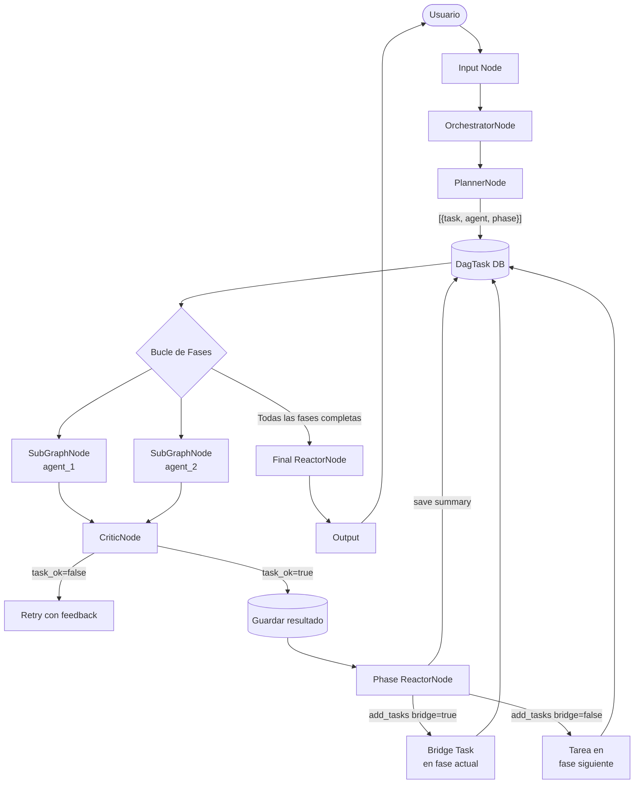
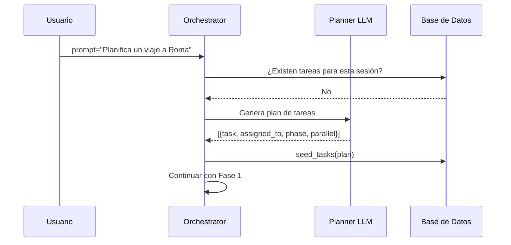
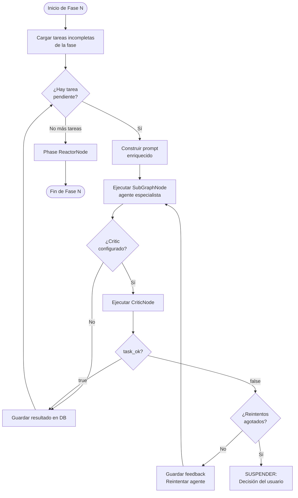
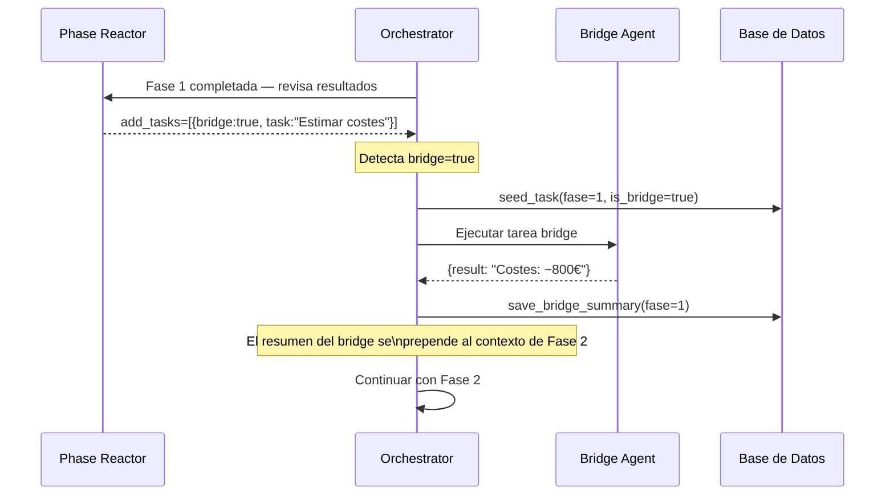
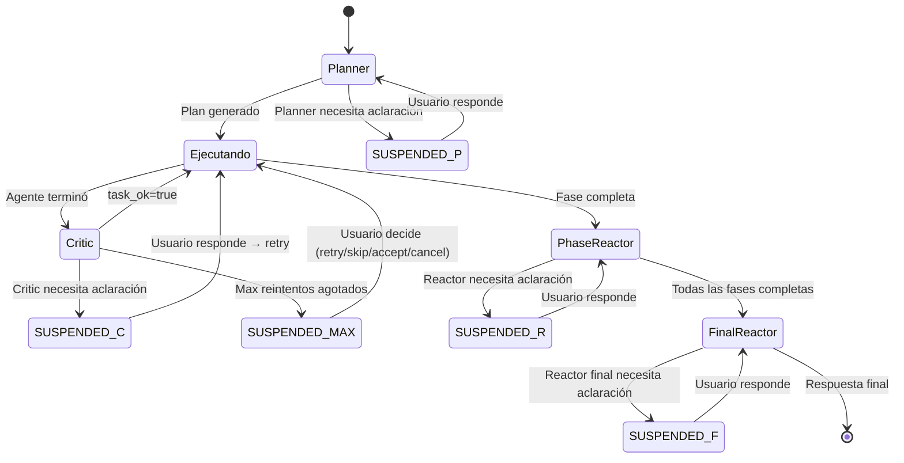
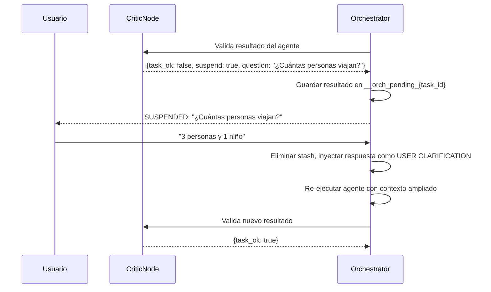
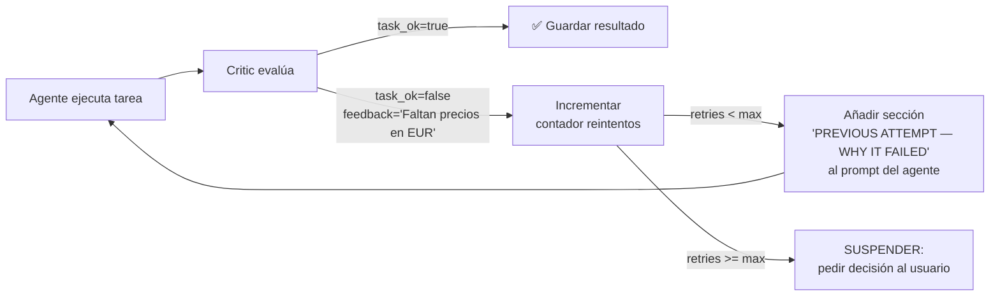
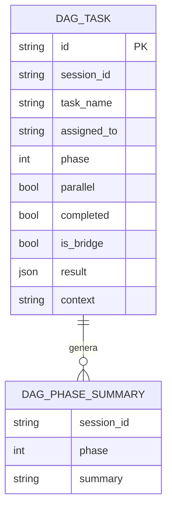

# Guía del Nodo Orchestrator

Este documento describe en detalle la arquitectura y el funcionamiento interno del nodo `orchestrator`: el núcleo de los flujos multi-agente de Colmena.

---

## ¿Qué es el Orchestrator?

El nodo `orchestrator` implementa un bucle completo de planificación → ejecución → crítica → reacción para coordinar equipos de agentes especializados. A diferencia de un nodo `llm_call` simple, el orchestrator:

- Descompone automáticamente una petición en tareas estructuradas por fases.
- Despacha cada tarea a un sub-grafo agente independiente.
- Valida resultados con un Critic antes de aceptarlos.
- Genera un resumen de fase y decide si hacen falta tareas adicionales (replanning).
- Sintetiza la respuesta final con un Reactor.
- Puede suspenderse en cualquier punto para pedir aclaración al usuario (HITL).

---

## Arquitectura de Alto Nivel



---

## Componentes Internos

El orchestrator coordina cinco sub-componentes:

| Componente | Nodo | Función |
|---|---|---|
| **Planner** | `planner` | Descompone la petición en tareas estructuradas |
| **Agent** | `subgraph` | Ejecuta cada tarea como un grafo hijo aislado |
| **Critic** | `critic` | Valida la calidad del resultado del agente |
| **Phase Reactor** | `reactor` | Revisa cada fase y propone tareas adicionales |
| **Final Reactor** | `reactor` | Sintetiza la respuesta final para el usuario |

---

## Flujo de Ejecución Detallado

### Fase 0: Planificación



El Planner produce un array JSON con esta estructura:

```json
[
  {
    "task": "Investigar atracciones turísticas en Roma",
    "assigned_to": "research_agent",
    "phase": 1,
    "parallel": true,
    "completed": false,
    "context": "El usuario quiere planificar un viaje y necesita información turística"
  },
  {
    "task": "Escribir itinerario de 3 días",
    "assigned_to": "writer_agent",
    "phase": 2,
    "parallel": false,
    "completed": false,
    "context": "Depende de la investigación de la fase 1"
  }
]
```

### Fase N: Ejecución de Tareas



### Prompt Enriquecido por Capas

Cada agente recibe un prompt estructurado con hasta cinco secciones:

```
┌─────────────────────────────────────────────────────┐
│  === USER CLARIFICATION ===                          │
│  Q [destination]: "¿A dónde viaja?" → A: "Roma"     │
│  Q [budget]: "¿Presupuesto?" → A: "1000€"           │
├─────────────────────────────────────────────────────┤
│  === CONTEXTO DE ESTA TAREA ===                      │
│  "El usuario quiere planificar un viaje y necesita   │
│   información turística sobre Roma"                  │
├─────────────────────────────────────────────────────┤
│  === LO QUE HA OCURRIDO HASTA AHORA ===             │
│  Fase 1: [resumen de investigación]                  │
│  [BRIDGE RESULTS — fase 1]: [análisis de costes]    │
├─────────────────────────────────────────────────────┤
│  === PREVIOUS ATTEMPT — WHY IT FAILED ===           │
│  "Incluye precios en EUR y horarios de apertura"    │
├─────────────────────────────────────────────────────┤
│  === LO QUE TIENES QUE HACER AHORA TÚ ===          │
│  "Escribe el itinerario detallado de 3 días"        │
└─────────────────────────────────────────────────────┘
```

---

## Bridge Tasks

Las **bridge tasks** son tareas de relleno inter-fase. Cuando el Phase Reactor detecta que faltan datos necesarios para la siguiente fase, puede inyectar una tarea bridge que se ejecuta **dentro de la fase actual** antes de continuar.

### Flujo de Bridge Task



### Por qué son necesarias

Sin bridge tasks, el Planner tendría que prever todas las dependencias desde el principio. Con bridge tasks:

1. El Planner hace un plan inicial razonable.
2. El Reactor detecta gaps en tiempo de ejecución.
3. La bridge task llena el gap **antes** de que la siguiente fase lo necesite.
4. La deduplicación previene loops infinitos: si ya existe una tarea con el mismo nombre y agente, se descarta.

### Esquema JSON del Reactor para Bridge Tasks

```json
{
  "task_ok": true,
  "response": "Resumen de la fase 1...",
  "add_tasks": [
    {
      "task": "Estimar el coste total del viaje",
      "assigned_to": "budget_agent",
      "parallel": false,
      "bridge": true,
      "context": "La fase 2 necesita datos de coste antes de escribir el itinerario"
    }
  ],
  "suspend": false
}
```

---

## HITL — Human in the Loop

El orchestrator puede suspenderse en cuatro puntos distintos del ciclo de vida:



### Punto 1: Suspensión del Planner

El Planner detecta ambigüedad y pide aclaración antes de generar el plan.

**Formato de respuesta del Planner (suspensión):**
```json
{
  "questions": [
    {
      "id": "destination",
      "question": "¿A qué ciudad viajas?",
      "type": "open"
    },
    {
      "id": "budget",
      "question": "¿Cuál es tu presupuesto?",
      "type": "choice",
      "options": ["< 500€", "500-1000€", "> 1000€"]
    }
  ]
}
```

**Clave de estado en DB:** `__orchestrator_suspend` (suspended_at: "planner")

**En reanudación:**
- Las respuestas del usuario se guardan como resumen de fase 0.
- Todos los agentes ven el Q&A acumulado en la sección `USER CLARIFICATION`.

### Punto 2: Suspensión del Critic

El Critic no puede validar el resultado sin más información del usuario.



### Punto 3: Max Reintentos Agotados

Si el Critic rechaza el resultado más veces que `max_retries`, el orchestrator escala al usuario.

**Opciones presentadas al usuario:**

| Opción | Efecto |
|---|---|
| `accept` | Acepta el resultado actual tal como está |
| `skip` | Marca la tarea como completada sin resultado |
| `retry` | Reintenta con instrucciones adicionales del usuario |
| `cancel` | Cancela la ejecución completa |

### Punto 4: Suspensión del Reactor (Phase o Final)

El Reactor solicita información adicional antes de generar el resumen o la respuesta final.

**Claves de estado usadas:**

| Clave | Descripción |
|---|---|
| `__orchestrator_suspend` | Estado de suspensión actual |
| `__orchestrator_qa_context` | Q&A acumulado para agentes |
| `__orchestrator_planner_qa` | Q&A del Planner (fase 0) |
| `__orchestrator_phase_reactor_qa` | Q&A del Phase Reactor |
| `__orch_pending_{task_id}` | Resultado en espera durante revisión critic |
| `__orch_retries_{task_id}` | Contador de reintentos del critic |
| `__orch_critic_feedback_{task_id}` | Feedback del critic para el siguiente intento |
| `__orch_reactor_done_{phase}` | Flag: reactor ejecutado, esperando bridge tasks |

---

## Critic Feedback Loop



**Formato del Critic:**
```json
{
  "task_ok": false,
  "feedback": "El itinerario no incluye precios específicos. Añade costes en EUR para cada actividad.",
  "suspend": false
}
```

**Sección inyectada en el re-intento del agente:**
```
=== PREVIOUS ATTEMPT — WHY IT FAILED ===
El itinerario no incluye precios específicos. Añade costes en EUR para cada actividad.
```

---

## Gestión de Fases y Memoria



### Flujo de Summaries

1. Cada fase completada genera un `DagPhaseSummary`.
2. Las bridge tasks generan su propio `bridge_summary` marcado como `[BRIDGE RESULTS — fase N]`.
3. Los agentes de fases posteriores reciben **todos** los summaries previos, no los resultados crudos.
4. Esto mantiene las ventanas de contexto manejables.

---

## Configuración JSON del Orchestrator

La config del orchestrator es **anidada**: cada sub-componente (`planner`, `critic`, `phase_reactor`, `final_reactor`) lleva su propio bloque con `provider`, `model`, `api_key` y `system_message`. **No** existen campos planos como `planner_system_message` o `model` en la raíz — `schema()` los rechaza.

Cada agente en `agents` declara una `description` (usada por el Planner para decidir asignaciones) y un grafo hijo, normalmente vía `child_graph_inline` (definición embebida) o `child_graph_path` (ruta a otro JSON).

Ejemplo canónico — derivado de [`tests/graphs/advanced/trip_planner_v2.json`](../../tests/graphs/advanced/trip_planner_v2.json):

```json
{
  "type": "orchestrator",
  "config": {
    "verbose": false,
    "max_phases": 10,
    "planner": {
      "provider": "google",
      "model": "gemini-2.5-flash",
      "api_key": "${GEMINI_API_KEY}",
      "system_message": "Read the user's request and break it down into tasks using the agents you have."
    },
    "agents": {
      "research_agent": {
        "description": "Investiga información factual y recopila datos relevantes.",
        "child_graph_inline": {
          "nodes": {
            "in":  { "type": "input",  "config": {} },
            "llm": {
              "type": "llm_call",
              "config": {
                "provider": "google",
                "model": "gemini-2.5-flash",
                "api_key": "${GEMINI_API_KEY}",
                "system_message": "Eres un investigador. Responde con datos verificables."
              }
            },
            "out": { "type": "output", "config": {} }
          },
          "edges": [
            { "from": "in",  "to": "llm" },
            { "from": "llm", "to": "out" }
          ]
        }
      },
      "writer_agent": {
        "description": "Redacta documentos, itinerarios e informes detallados.",
        "child_graph_path": "./agents/writer_agent.json"
      }
    },
    "critic": {
      "provider": "google",
      "model": "gemini-2.5-flash",
      "api_key": "${GEMINI_API_KEY}",
      "system_message": "Eres un evaluador crítico. Si el resultado cumple, devuelve task_ok=true y add_tasks=[].",
      "max_retries": 3
    },
    "phase_reactor": {
      "provider": "google",
      "model": "gemini-2.5-flash",
      "api_key": "${GEMINI_API_KEY}",
      "system_message": "Resume la fase en una frase. Si faltan datos para la siguiente, propón bridge tasks."
    },
    "final_reactor": {
      "provider": "google",
      "model": "gemini-2.5-flash",
      "api_key": "${GEMINI_API_KEY}",
      "system_message": "Sintetiza todos los summaries en una respuesta cohesionada para el usuario."
    }
  }
}
```

### Campos de Configuración

Campos raíz:

| Campo | Tipo | Descripción |
|---|---|---|
| `agents` | object | Mapa `nombre → { description, child_graph_inline | child_graph_path }`. El Planner usa `description` para asignar tareas; solo los agentes listados aquí son válidos. |
| `planner` | object | Sub-config del Planner LLM (ver más abajo). Si se omite, el orchestrator espera que la DB ya esté sembrada vía `inputs.plan` / `config.plan`. |
| `critic` | object | Sub-config del Critic LLM. Si se omite, los resultados de los agentes se aceptan sin validación. |
| `phase_reactor` | object | Sub-config del Phase Reactor. Si se omite, el orchestrator concatena los resultados de la fase (truncado a 4000 chars) como summary y no hay replanning. |
| `final_reactor` | object | **Obligatorio**. Sub-config del LLM que sintetiza la respuesta final. |
| `max_phases` | int | Límite duro de fases (default `10`). Si se excede, se fuerza la finalización para evitar loops infinitos. |
| `verbose` | bool | Si `true`, imprime el estado interno por log al inicio de cada ejecución. |

Sub-config común para `planner`, `critic`, `phase_reactor`, `final_reactor`:

| Campo | Tipo | Descripción |
|---|---|---|
| `provider` | string | `"openai"`, `"google"` o `"anthropic"`. |
| `model` | string | ID del modelo (p. ej. `"gemini-2.5-flash"`, `"gpt-4o"`). |
| `api_key` | string | Clave o referencia a variable de entorno (`"${GEMINI_API_KEY}"`). |
| `system_message` | string | System prompt del sub-componente. El orchestrator le añade plantillas (schema del reactor, grounding rules, historial de tareas, etc.) según el rol. |
| `temperature` | float | Opcional. |
| `thinking_budget` | int | Opcional. Para modelos con extended thinking. |
| `max_retries` | int | Solo en `critic`: número de reintentos del bucle agente↔critic antes de escalar al usuario. |

> Para HITL — si quieres deshabilitar la suspensión y forzar modo batch — añade `"allow_suspend": false` dentro del sub-bloque correspondiente (`planner`, `critic`, `phase_reactor`).

---

## Protecciones Anti-Loop

El orchestrator incluye varias salvaguardas para evitar bucles infinitos:

1. **Max fases**: Límite de 10 fases por defecto. Si se excede, se fuerza la finalización.
2. **Deduplicación de tareas**: Si el reactor propone una tarea que ya existe (mismo nombre + agente), se descarta silenciosamente.
3. **Validación de agentes**: Si el reactor nombra un agente desconocido, la tarea se descarta con un warning. Solo los agentes en `config.agents` son válidos.
4. **Max reintentos del critic**: Protege contra un ciclo agente↔critic infinito.

---

## Casos de Uso y Test Graphs

Los siguientes grafos de prueba ilustran las capacidades del orchestrator:

| Graph | Funcionalidad demostrada |
|---|---|
| `tests/graphs/advanced/trip_planner_v2.json` | Planificación multi-fase con agentes paralelos |
| `tests/graphs/advanced/trip_planner_replanning_test.json` | Replanning dinámico mediante Phase Reactor |
| `tests/graphs/advanced/bridge_tasks_test.json` | Bridge tasks inter-fase |
| `tests/graphs/advanced/hitl_planner_suspend_test.json` | Suspensión del Planner para aclaración |
| `tests/graphs/advanced/hitl_critic_answer_rerun_test.json` | Critic suspende y re-ejecuta agente |
| `tests/graphs/advanced/hitl_critic_max_retries_test.json` | Gestión de max reintentos con decisión del usuario |
| `tests/graphs/advanced/critic_feedback_injection_test.json` | Critic feedback loop sin suspensión |
| `tests/graphs/advanced/critic_feedback_multiretry_test.json` | Múltiples iteraciones de critic feedback |
| `tests/graphs/advanced/critic_feedback_with_suspend_test.json` | Feedback + suspensión combinados |
| `tests/graphs/advanced/hitl_allow_suspend_false_test.json` | Orchestrator en modo batch (sin suspensión) |

### Ejecutar un test graph

```bash
cargo run --bin dag_engine -- run tests/graphs/advanced/trip_planner_v2.json

# Con respuesta a suspensión
cargo run --bin dag_engine -- run tests/graphs/advanced/hitl_planner_suspend_test.json \
  --session-id mi-sesion-123 \
  --answer "Roma, presupuesto 800€, del 10 al 15 de mayo"
```

---

## Eventos SSE del Orchestrator

El nodo `orchestrator` emite una mezcla de eventos de nivel superior y eventos con prefijo `subgraph-`. La distinción clave es:

| Actividad interna | Tipo de evento SSE |
|---|---|
| LLMs de planeación/revisión (planner, phase_reactor, critic, final_reactor) | `thinking-delta` (sin prefijo `subgraph-`) |
| Agentes-tarea ejecutados como subgrafos | `subgraph-node-start/end`, `subgraph-text-*`, etc. |

### Flujo de eventos de un ciclo completo

```
node-start { node_id: "orchestrator" }

  thinking-delta { node_id: "orchestrator", delta: "..." }  ← planner analizando
  thinking-delta ...                                          ← más tokens del planner

  subgraph-node-start { node_id: "researcher_agent" }        ← tarea Phase 1
    subgraph-text-start { id: "txt_xyz" }
    subgraph-text-delta { id: "txt_xyz", delta: "..." }
    subgraph-tool-input-available { ... }
    subgraph-tool-output-available { ... }
    subgraph-text-end { id: "txt_xyz" }
  subgraph-node-end { node_id: "researcher_agent" }

  thinking-delta ...                                          ← critic revisando
  thinking-delta ...                                          ← phase_reactor sintetizando
  thinking-delta ...                                          ← final_reactor produciendo respuesta

node-end { node_id: "orchestrator" }
usage-summary { nodes: [...] }
finish { finishReason: "stop", ... }
```

> Para la referencia completa de todos los eventos SSE ver [docs/sse_events_reference.md](../sse_events_reference.md).

---

## Referencia de Implementación

Los archivos Rust relevantes para el orchestrator:

| Archivo | Responsabilidad |
|---|---|
| [`infrastructure/nodes/orchestrator.rs`](../../src/libs/colmena/src/dag_engine/infrastructure/nodes/orchestrator.rs) | Implementación principal del orchestrator (2244 líneas) |
| [`infrastructure/nodes/planner.rs`](../../src/libs/colmena/src/dag_engine/infrastructure/nodes/planner.rs) | Nodo Planner con schema forzado |
| [`infrastructure/nodes/critic.rs`](../../src/libs/colmena/src/dag_engine/infrastructure/nodes/critic.rs) | Nodo Critic con retry logic |
| [`infrastructure/nodes/reactor.rs`](../../src/libs/colmena/src/dag_engine/infrastructure/nodes/reactor.rs) | Nodos Phase Reactor y Final Reactor |
| [`infrastructure/nodes/subgraph.rs`](../../src/libs/colmena/src/dag_engine/infrastructure/nodes/subgraph.rs) | Ejecución de grafos hijo como agentes |
| [`infrastructure/dag_tool_executor.rs`](../../src/libs/colmena/src/dag_engine/infrastructure/dag_tool_executor.rs) | Puente entre tool calls LLM y nodos DAG |
| [`domain/events.rs`](../../src/libs/colmena/src/dag_engine/domain/events.rs) | Eventos de ejecución para streaming |
| [`domain/observer.rs`](../../src/libs/colmena/src/dag_engine/domain/observer.rs) | Pattern observer para eventos en tiempo real |
| [`application/run_use_case.rs`](../../src/libs/colmena/src/dag_engine/application/run_use_case.rs) | Orquestación del DAG completo |
| [`infrastructure/nodes/mod.rs`](../../src/libs/colmena/src/dag_engine/infrastructure/nodes/mod.rs) | Registro de todos los tipos de nodo |
