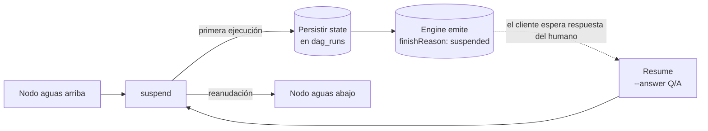
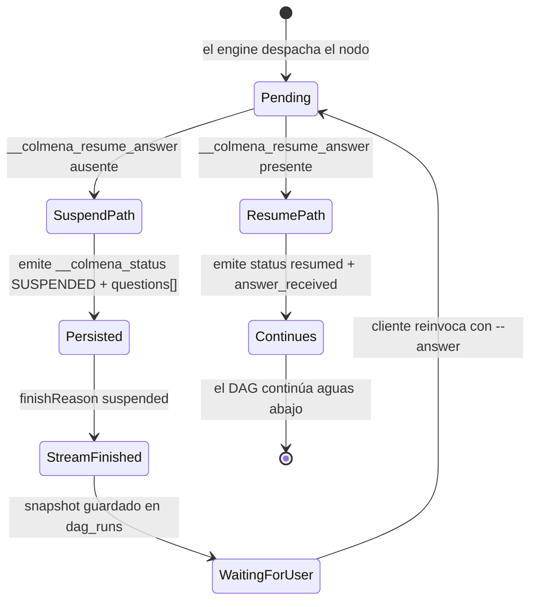
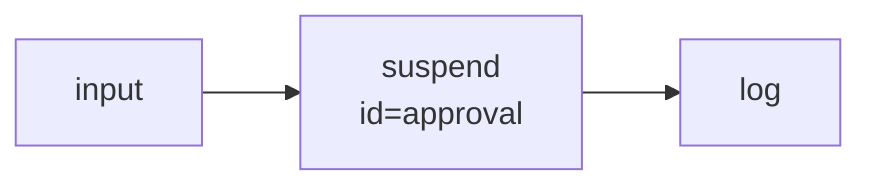
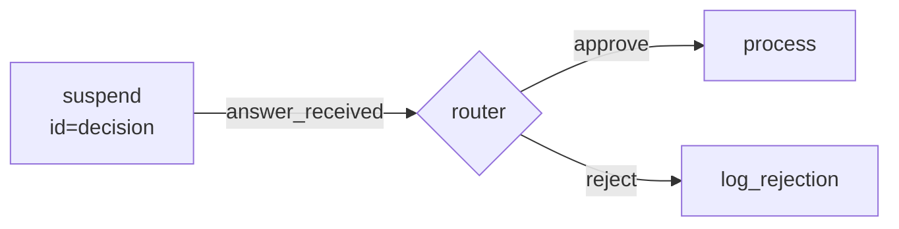
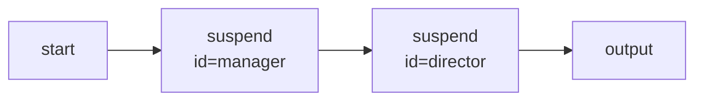
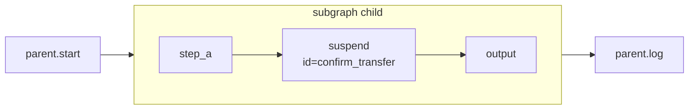
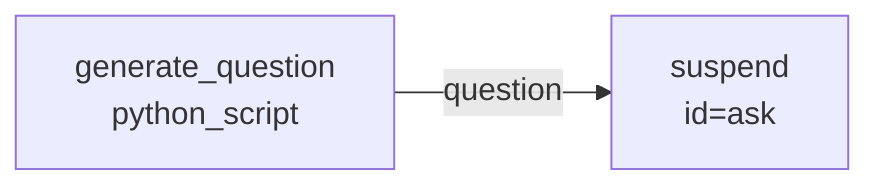

# Nodo `suspend` — Human-in-the-Loop

El nodo `suspend` **pausa la ejecución de un DAG** y espera a que un humano (o un sistema externo) proporcione una respuesta. Es el mecanismo canónico de Colmena para construir flujos *Human-in-the-Loop* (HITL): aprobaciones, confirmaciones, recolección de inputs libres, reviews intermedios, etc.

> **No confundir con `secure_suspend`** — ese nodo se usa para recolectar **secretos** (API keys, passwords) cifrados con AES-256-GCM. Si lo que necesitás es pedir un secreto, ver [13_security_strategy.md](13_security_strategy.md) y la sección "The `secure_suspend` Node" en [agent_context/node_ports_reference.md](../agent_context/node_ports_reference.md).

- **Tipo**: `"suspend"`
- **Categoría**: `control_flow`
- **Source**: [`src/libs/colmena/src/dag_engine/infrastructure/nodes/suspend.rs`](../../src/libs/colmena/src/dag_engine/infrastructure/nodes/suspend.rs)
- **Requiere**: PostgreSQL (`DATABASE_URL`) — el estado del run se persiste para poder reanudar.
- **Default input port**: `question`
- **Default output port**: `answer_received`

---

## 1. Modelo mental



El mismo nodo se ejecuta **dos veces**:

1. **Suspend** — emite `__colmena_status: "SUSPENDED"` y una `questions[]` array. El engine detecta el marker, guarda el snapshot del run en Postgres (`dag_runs.find_resume_entry`), y termina el stream SSE con `finishReason: "suspended"`.
2. **Resume** — el cliente vuelve a invocar el run con la misma `agent_session_id` (o `session_id`) **más** `--answer "Q[<id>]: ...\nA[<id>]: ..."`. El engine restaura el snapshot, inyecta `__colmena_resume_answer` al input del nodo, y `suspend` ahora emite `{ "status": "resumed", "answer_received": <texto> }` que fluye al puerto `answer_received` y continúa el DAG.

> **Importante:** keyear por `agent_session_id` (estable) — no por `session_id` (efímero, rota por invocación de CLI). Ver `CLAUDE.md` → *"Usar `--agent-session-id` en todas las pruebas de grafos"*.

---

## 2. Configuración

| Campo | Tipo | Requerido | Default | Descripción |
|---|---|---|---|---|
| `id` | string | **sí** | — | Identificador estable de la pregunta. Charset `[A-Za-z0-9_-]{1,64}`. Es el id que el cliente usa en el payload de resume (`Q[<id>]:` / `A[<id>]:`). **No hay fallback al `__node_id`** — renombrar el nodo no rompe el contrato. |
| `question` | string | no | `"What is your input?"` | Pregunta visible para el humano. Puede ser sobrescrita por un edge upstream que conecte al puerto `question`. |
| `question_type` | `"open"` \| `"choice"` | no | `"open"` | `open` = texto libre; `choice` = la frontend muestra opciones (UX hint). |
| `options` | string[] | no | `null` | Solo aplica si `question_type == "choice"`. **Sugerencia UX, NO whitelist** — el parser de resume acepta cualquier texto libre, incluso si no aparece en `options`. |

Esquema canónico completo: [`docs/node_configurations.json`](../node_configurations.json) → `suspend`.

### Mínimo viable

```json
{
  "approval": {
    "type": "suspend",
    "config": {
      "id": "approval",
      "question": "¿Aprobás continuar?"
    }
  }
}
```

### Choice question

```json
{
  "pick_env": {
    "type": "suspend",
    "config": {
      "id": "pick_env",
      "question": "¿A qué entorno hacemos deploy?",
      "question_type": "choice",
      "options": ["staging", "production", "rollback"]
    }
  }
}
```

---

## 3. Puertos

### Entradas

| Puerto | Origen | Tipo | Descripción |
|---|---|---|---|
| `question` | edge upstream **o** config | string | Pregunta dinámica. Si llega por edge, **gana** sobre `config.question`. |
| `__colmena_resume_answer` | inyectado por el engine | string | Payload Q/A del usuario. Nunca lo conectes manualmente — lo maneja el `DagRunUseCase`. |

### Salidas

#### Primera ejecución (suspend path)

```json
{
  "__colmena_status": "SUSPENDED",
  "question": "¿Aprobás continuar?",
  "questions": [
    {
      "id": "approval",
      "question": "¿Aprobás continuar?",
      "type": "open",
      "options": null
    }
  ]
}
```

- `__colmena_status` es el marker que el engine detecta para pausar.
- `question` (string legacy) se mantiene por retro-compatibilidad.
- `questions[]` es el array **canónico** — un día reemplaza a `question`. Una entrada por pregunta; siempre 1 entrada en `suspend` (en `secure_suspend` puede haber N).

#### Reanudación (resume path)

```json
{
  "status": "resumed",
  "answer_received": "Aprobado"
}
```

El puerto **default output** es `answer_received`, por lo que `{ "from": "approval", "to": "next_node" }` propaga el string crudo del usuario al siguiente nodo.

---

## 4. Formato canónico Q/A para `--answer`

Compartido con `secure_suspend`. Spec completo: [`docs/superpowers/specs/2026-05-08-suspend-qa-response-format-design.md`](../superpowers/specs/2026-05-08-suspend-qa-response-format-design.md).

```
Q[<id>]: <eco de la pregunta — opcional, no se valida>
A[<id>]: <respuesta>
Q[<id2>]: <eco de la pregunta>
A[<id2>]: <respuesta multilínea
que puede ocupar
varias líneas hasta el próximo prefijo o EOF>
```

Reglas:

- `<id>` debe coincidir exactamente con el `config.id` del nodo (`[A-Za-z0-9_-]{1,64}`).
- El parser **bindea por id**, no por posición — el orden de los bloques `Q/A` no importa.
- El texto entre `A[<id>]:` y el siguiente prefijo (o EOF) se preserva verbatim, con trimming externo.
- Una sola invocación de resume puede responder **múltiples** suspends (cuando varios `suspend` están en la misma capa o cuando un orchestrator levanta varias preguntas en una fase).
- En `question_type: "choice"`, las `options` son hint UX — cualquier texto libre es válido.

### Ejemplo de uso por CLI

```bash
# 1. Run inicial — el grafo suspende
source .env
cargo run --bin dag_engine -- run \
  tests/graphs/basic/test_suspend_manual.json \
  --agent-session-id agent_demo_001

# Output: finishReason: "suspended", questions: [{ id: "manual_input", ... }]

# 2. Resume con la misma agent_session_id + --answer
cargo run --bin dag_engine -- run \
  tests/graphs/basic/test_suspend_manual.json \
  --agent-session-id agent_demo_001 \
  --answer "Q[manual_input]: Provide some manual input
A[manual_input]: Hola mundo"
```

---

## 5. Ciclo de vida (diagrama de estados)



Persistencia (3 subsistemas que keyean estado entre runs):

1. **DAG state** (`dag_runs`) — para reanudar el run exacto.
2. **Memoria conversacional** (`llm_node_history`) — si en aguas arriba hubo `llm_call` con memoria.
3. **Secure values** (`secure_value_mappings`) — si en el run participa un `secure_suspend`.

Los tres priorizan `agent_session_id` con fallback a `session_id`. Ver [30_database_schema.md](30_database_schema.md).

---

## 6. Patrones de uso

### 6.1 Gate de aprobación simple



```json
{
  "nodes": {
    "request": { "type": "input", "config": { "message": "Procesar orden #123" } },
    "approval": {
      "type": "suspend",
      "config": { "id": "approval", "question": "¿Aprobás la orden?" }
    },
    "finish": { "type": "log" }
  },
  "edges": [
    { "from": "request", "to": "approval" },
    { "from": "approval", "to": "finish" }
  ]
}
```

Resume: `--answer "Q[approval]: ¿Aprobás la orden?\nA[approval]: sí"`.

### 6.2 Routing condicional sobre la respuesta



```json
{
  "nodes": {
    "decision": {
      "type": "suspend",
      "config": { "id": "decision", "question": "¿Qué hacés?", "question_type": "choice", "options": ["approve", "reject"] }
    },
    "router": {
      "type": "router",
      "config": {
        "mode": "extract_and_route",
        "schema": { "intent": { "type": "string" } },
        "branches": [
          { "name": "approve", "when": { "intent": { "equals": "approve" } } },
          { "name": "reject",  "when": { "intent": { "equals": "reject"  } } }
        ]
      }
    }
  },
  "edges": [
    { "from": "decision.answer_received", "to": "router.input" }
  ]
}
```

Ver [37_router_and_output_parser.md](37_router_and_output_parser.md) para el DSL completo de `router`.

### 6.3 Cascada de múltiples suspends

Cada nodo `suspend` declara su propio `config.id`. Los payloads de resume son **order-independent**:



En el primer run pausa en `manager`. El segundo run resume con `Q[manager]:/A[manager]:` y pausa en `director`. El tercer run resume con `Q[director]:/A[director]:`.

> Si tu UI pre-acumula respuestas, podés enviar ambas en un solo `--answer` cuando los suspends se dispararían en paralelo en el mismo turno. El parser las bindea por id.

### 6.4 Suspend dentro de un `subgraph`

El status `SUSPENDED` **burbujea** hacia el padre — el subgrafo "pausa al padre" como si el suspend estuviera al top-level.



Ejemplo en repo: [`tests/graphs/basic/suspend_in_subgraph.json`](../../tests/graphs/basic/suspend_in_subgraph.json). Ver [19_nested_agents_and_subgraphs.md](19_nested_agents_and_subgraphs.md) para la propagación HITL.

### 6.5 Suspend dentro de un `orchestrator` (multi-agente)

El orchestrator suspende cuando un agente interno suspende. El `agent_session_id` del padre keyea el estado del run entero — el resume usa esa misma sesión.

Test e2e canónico: [`tests/graphs/advanced/nested_orchestrators_suspend.json`](../../tests/graphs/advanced/nested_orchestrators_suspend.json) (2 orchestrators anidados + suspend en el agente más profundo). Ver [20_orchestrator_architecture.md](20_orchestrator_architecture.md) §"HITL".

### 6.6 Pregunta dinámica desde upstream



```json
{
  "edges": [
    { "from": "generate_question.question", "to": "ask.question" }
  ]
}
```

El input por edge gana sobre `config.question`. El `id` siempre viene del config.

---

## 7. Grafos de prueba existentes

Todos viven en `tests/graphs/`:

| Grafo | Categoría | Qué ejercita |
|---|---|---|
| [`basic/test_suspend_manual.json`](../../tests/graphs/basic/test_suspend_manual.json) | mínimo | `suspend` puro entre `mock_input` y `log`. Smoke test base. |
| [`basic/suspend_in_subgraph.json`](../../tests/graphs/basic/suspend_in_subgraph.json) | composición | `suspend` dentro de un `subgraph` que burbujea al padre. |
| [`advanced/test_suspend.json`](../../tests/graphs/advanced/test_suspend.json) | aprobación | `suspend` actuando como gate de aprobación entre `input` y `log`. |
| [`advanced/nested_orchestrators_suspend.json`](../../tests/graphs/advanced/nested_orchestrators_suspend.json) | orchestrator anidado | 2 orchestrators anidados + `suspend` en el agente más profundo (3 niveles de cascade). |

Ejecutar (siempre con `--agent-session-id` estable):

```bash
source .env

# Run inicial
cargo run --bin dag_engine -- run \
  tests/graphs/basic/test_suspend_manual.json \
  --agent-session-id agent_t1

# Resume
cargo run --bin dag_engine -- run \
  tests/graphs/basic/test_suspend_manual.json \
  --agent-session-id agent_t1 \
  --answer "Q[manual_input]: Provide some manual input
A[manual_input]: hello world"
```

---

## 8. Troubleshooting

| Síntoma | Causa probable | Fix |
|---|---|---|
| El engine no pausa, el DAG continúa | El nodo no se ejecutó, o `__colmena_status` no llegó al engine | Verificá `finishReason: "suspended"` en el `finish` event SSE; confirmá que `suspend` aparezca en el plan de ejecución; chequeá `DATABASE_URL` |
| `config.id is required` | Falta `config.id` en el JSON | Agregar `"id": "<slug>"` — no hay fallback al `__node_id` desde el spec 2026-05-08 |
| `invalid config.id '<x>'` | El id no matchea `[A-Za-z0-9_-]{1,64}` | Usar solo ASCII alfanuméricos + `_-` (sin espacios, sin acentos, ≤64 chars) |
| `missing answer` al resumir | El `--answer` no contiene `A[<id>]:` para el id esperado | Validá que el id en `Q[<id>]:/A[<id>]:` coincida exactamente con `config.id` |
| `Session not found` al resumir | `session_id` rotó / cleanup limpió el run | **Usar `--agent-session-id`** (estable) en lugar de `--session-id` (efímero). Ver `CLAUDE.md` |
| `answer_received` es `null` | No se pasó `--answer` o el formato es inválido | Confirmá formato Q/A line-anchored: cada `Q[`/`A[` al inicio de línea |
| El payload se rechaza con parser error | Id desconocido, duplicado, o `A[<id>]:` vacío | Cada id esperado debe aparecer **exactamente una vez**; no permitir cuerpos vacíos |

Detalles adicionales (troubleshooting profundo de Q/A, multi-suspend, secure_suspend) en [`docs/agent_context/node_ports_reference.md`](../agent_context/node_ports_reference.md) §"Troubleshooting the `suspend` Node".

---

## 9. Referencias cruzadas

- **Esquema canónico**: [`docs/node_configurations.json`](../node_configurations.json) → entrada `suspend`.
- **Spec del formato Q/A**: [`docs/superpowers/specs/2026-05-08-suspend-qa-response-format-design.md`](../superpowers/specs/2026-05-08-suspend-qa-response-format-design.md).
- **Secure variant**: [`13_security_strategy.md`](13_security_strategy.md) (`secure_suspend`).
- **HITL en subgrafos**: [`19_nested_agents_and_subgraphs.md`](19_nested_agents_and_subgraphs.md).
- **HITL en orchestrators**: [`20_orchestrator_architecture.md`](20_orchestrator_architecture.md).
- **Routing sobre la respuesta**: [`37_router_and_output_parser.md`](37_router_and_output_parser.md).
- **Persistencia del run**: [`30_database_schema.md`](30_database_schema.md) (tabla `dag_runs`).
- **Source Rust**: [`src/libs/colmena/src/dag_engine/infrastructure/nodes/suspend.rs`](../../src/libs/colmena/src/dag_engine/infrastructure/nodes/suspend.rs).
- **Parser compartido**: `src/libs/colmena/src/dag_engine/infrastructure/nodes/qa_response_parser.rs`.
