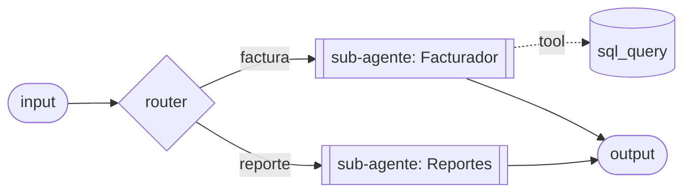

# Design: ADP Prod Skills (`adp-prod-api` + `adp-node-catalog`)

- **Fecha:** 2026-07-23
- **Autor:** daniel@startti.co (con Claude Code)
- **Estado:** En especificación. Revisión colaborativa 2026-07-25 — se agregó la **Parte II (Filosofía y UX del asistente)**: flujo de 6 pasos, modelo de dos ejes, catálogo de patrones, diagrama-primero y frontera de capacidad + handoff. Los inventarios técnicos (§4-9) siguen válidos.
- **Fuentes de verdad:** código ADP `apps/api/src/public-api/*`, `packages/shared/src/lib/types/group-package.ts`, `apps/api/src/agents/groups/application/group-dag-write.service.ts`, y el skill `apps/service/ia/platform/worker/skills/adp-node-catalog/`. `Downloads/public-api.md` se usa como referencia pero **el código manda** (ver §9 Correcciones).

---

## 1. Objetivo y alcance

Crear un stack de skills para **Claude Code** que permita, desde este entorno, conectarse a **ADP en producción** (`app.startti.co` frontend / backend `/v1`) y **crear, correr, editar y modificar agentes** vía la API pública, diseñando el DAG con un catálogo de nodos estilo brainstorm (paso a paso: qué nodo, cuándo, sus fuerzas).

Dos skills que componen:
- **`adp-prod-api`** — capa de conexión y ciclo de vida (endpoints, permisos, package, sesiones, suspend, streaming, triggers, adjuntos, cancel, errores).
- **`adp-node-catalog`** — catálogo de nodos adaptado al **modo package `/v1`** (copia autocontenida, sin `artifact_write`).

### Fuera de alcance (v1)
- Gestión de platform-keys (crear/revocar) — es sesión de usuario en el backoffice, no la API `adp_`.
- Webhooks/schedules/triggers CRUD (modalidades) — se documentan como referencia, pero la skill no las crea automáticamente en v1.
- El canvas / API interna del backoffice (`api.md`).

---

## 2. Decisiones de diseño (confirmadas)

| Decisión | Valor | Nota |
|---|---|---|
| Consumidor | Claude Code (este entorno) | "que me permitan interactuar" = yo ejecuto, tú diriges |
| Ubicación | `~/.claude/skills/` (user-level) | Disponible en cualquier repo |
| Estructura | 2 skills que componen | Enfoque A |
| Catálogo | Copia adaptada autocontenida | No depende del repo ADP en runtime |
| Idioma | Español en prosa; inglés en JSON/identificadores | Convención `docs/` + idioma del usuario |
| Base URL prod | `ADP_BASE_URL`, default `https://api.startti.ai` | Confirmado (dev = `api.dev.startti.ai`) |
| API key | Env var `ADP_API_KEY`, nunca hardcodear/imprimir | Guardarraíl de seguridad |
| Guardarraíl prod | Confirmar antes de toda llamada que mute/dispare | Ver §8 |
| Diagrama-primero | Mermaid fiel (edges sólidos, tools punteadas), antes de tocar prod | Ver §14 |
| Composición | `child_graph_inline` (NO `assetVersionId` por `/v1`); reuso client-side | Ver §12, §16 |
| Frontera de capacidad | Lo que `/v1` no puede → handoff interactivo al usuario | Ver §16 + gap doc |

---

## 3. Estructura de archivos

```
~/.claude/skills/
├── adp-prod-api/
│   ├── SKILL.md
│   └── references/
│       ├── auth-and-permissions.md
│       ├── run-existing-agent.md
│       ├── create-from-package.md
│       ├── package-schema.md
│       ├── provider-keys.md
│       ├── sessions-and-suspend.md
│       ├── streaming.md
│       ├── triggers.md
│       ├── attachments.md
│       ├── cancel-and-sessions.md
│       └── error-reference.md
└── adp-node-catalog/
    ├── SKILL.md
    └── references/
        ├── discovery.md
        ├── authoring-agents.md
        ├── recipes.md
        ├── package-authoring.md          (reemplaza building-with-artifact-write)
        ├── input.md
        ├── llm_call.md
        ├── output.md
        ├── output_parser.md
        ├── router.md
        ├── suspend.md
        ├── secure_suspend.md
        ├── for_each.md
        ├── http_request.md
        ├── knowledge_base_search.md
        ├── socketio_request.md
        ├── sql_query.md
        ├── tavily_client.md
        ├── data_run_python.md
        ├── python_script.md
        ├── image_generation.md
        ├── image_edit.md
        ├── tts.md
        ├── orchestrator.md
        ├── planner.md
        ├── subgraph.md
        └── agent-modalities.md
```

---

## 4. INVENTARIO A — API `/v1` (endpoints)

Todas las rutas `/v1/*` requieren `Authorization: Bearer adp_<secret>`. Sin/ inválida/revocada → **401 `invalid or revoked API key`** antes de cualquier handler.

### 4.0 Contrato de error
Cuerpo plano: `{ statusCode, error, message, code?, details? }`. `code` es el discriminador legible por máquina — ramificar contra él, no contra el texto. **Solo existen 6 `code`:** `invalid_package`, `unknown_node_type`, `edge_wrong_key_format`, `edge_references_missing_node`, `agent_not_runnable`, `incomplete_nodes`. Muchos 400/403/404/409 NO llevan `code`.

### 4.1 `POST /v1/run`
Endpoint principal. Body `V1RunBody`:

| campo | tipo | obligatorio |
|---|---|---|
| `agentId` | string | exactamente uno de `agentId` \| `package` |
| `package` | objeto (package v3, o bare colmena) | exactamente uno |
| `projectId` | string | opcional (solo package) |
| `prompt` | string | **sí** (no vacío tras trim) |
| `sessionKey` | string | opcional (id de conversación tuyo) |
| `sessionId` | string | opcional (id que devolvió ADP) |
| `name` | string | opcional (nombre del agente en import bare-colmena) |
| `attachments` | `Array<{ url; contentType?; name? }>` | opcional |
| `stream` | boolean | opcional |
| `timeoutMs` | number | opcional |

**Reglas de dispatch:**
- `agentId` y `package` **mutuamente excluyentes, uno obligatorio**. Ambos o ninguno → **400 `send exactly one of agentId | package`**.
- `prompt` vacío/ausente → **400 `prompt is required`**.
- `stream: true` → SSE (§4.7). Si no, JSON síncrono.

**Respuesta síncrona (id-mode):**
```json
{ "sessionId": "clx...", "sessionKey": "opcional-si-lo-mandaste",
  "output": { "text": "...", "suspended": false, "suspendQuestions": [], "errorText": null } }
```

**Respuesta síncrona (package-mode):** además `agentId` y `runnable`:
- `runnable: true` → se importó y corrió; lleva `output`.
- `runnable: false` → se importó pero NO corrió (refs externas sin resolver); lleva `unresolvedRefs`, sin `output`. **Es un 200, no un error.**

**Timeout por defecto (CORRECCIÓN):** `/v1/run` usa `SYNC_TIMEOUT_BATCH_MS` = **1 hora**, no 10 min. `timeoutMs` lo sobreescribe (solo en modo síncrono; en streaming no se pasa).

**Errores:**
| status | code | condición |
|---|---|---|
| 400 | — | `send exactly one of agentId \| package` |
| 400 | — | `prompt is required` |
| 400 | — | `send sessionId OR sessionKey, not both` |
| 400 | — | `no target project in the API key workspace (pass projectId)` (package sin proyecto resoluble) |
| 400 | `edge_wrong_key_format` / `unknown_node_type` / `edge_references_missing_node` / `invalid_package` | validación de shape del colmena en import |
| 403 | — | `agent outside the API key workspace` |
| 403 | — | `agent not allowed for this API key` (allowlist) |
| 403 | — | `package mode not allowed for agent-restricted API keys` |
| 404 | — | `agent not found` |
| 404 | — | `session not found` |
| 409 | — | `session belongs to another agent` |
| 422 | `invalid_package` | el package no pasa el Zod |
| 422 | `agent_not_runnable` | la corrida no produjo sessionId |
| 422 | — | `imported agent has no environment` |

### 4.2 `GET /v1/agents`
Sin body. Devuelve agentes que alcanza la key: `{ id, name, publishStatus }`, orden `createdAt asc`. Con allowlist no vacío, solo los listados.

### 4.3 `POST /v1/agents/:agentId/triggers/:name`
Body: `{ params?, sessionKey?, sessionId?, stream?, timeoutMs? }`. `stream` está en el tipo pero **siempre corre síncrono** (streaming es follow-up). Rellena la plantilla del trigger (`{key}` desde `params`, faltante → string vacío). Respuesta = `V1RunResponse`.
- **Gate de publicación:** si el agente no está `PUBLISHED` → **409 `agent not published`**.
- Errores del trigger service: **404** `trigger "<name>" not found`, **409** `trigger "<name>" is disabled`, **400** `missing required params: <keys>`.

### 4.4 `POST /v1/attachments`
`multipart/form-data`, campo `file`; opcional `sessionId`. Límite **100 MB**.
- Sin buffer → **400** `multipart form field "file" is required`.
- Tamaño 0 → **400** `Uploaded file is empty`.
- > 100 MB → **413** `{ error: { message, sizeInBytes, limit } }`.
- MIME no permitido → **415** `Disallowed contentType: <ct>` (CORRECCIÓN — el doc no lo menciona).
- **MIME permitidos:** `image/png`, `image/jpeg`, `image/jpg`, `image/webp`, `application/pdf`, docx, xlsx, `text/csv`, `text/plain`, `audio/mpeg`, `audio/wav`, `audio/ogg`.
- Éxito → `{ id, url, storageKey, name, contentType, sizeInBytes }`. `url` = URL firmada de GCS (vence — usar en la misma tanda). Storage key scoped al `userId` de la key.

### 4.5 `GET /v1/sessions/:id`
`{ sessionId, agentId, suspended, suspendQuestions, createdAt, updatedAt }`. Ownership: la sesión debe ser de un agente que la key alcance (si no, 404/403). Sirve para ver si una sesión quedó esperando sin correrla.

### 4.6 `POST /v1/cancel`
Body `{ sessionId }`. Sin él → **400 `sessionId is required`**. Corta la corrida en curso. Devuelve `{ accepted: boolean }` (`accepted:false` si no hay run activo trackeado; `accepted:true` incluso si el platform devuelve 404/red — best-effort). Ownership vía la sesión (404/403).

### 4.7 `GET /v1/provider-keys` y `/:id/models` (VERIFICADO en código)
Read-only, guardados por `ApiKeyGuard`. **No requieren confirmación** (§8). Ningún endpoint expone el secreto del provider — el `id` de una key **no es** una credencial.

- **`GET /v1/provider-keys`** → `[{ id, name, provider, permission }]`. Incluye las provider keys del workspace **y las GLOBAL públicas** (las "Default" que comparte la plataforma); las INTERNAL (admin-only) nunca aparecen. Sin body.
- **`GET /v1/provider-keys/:id/models`** → `[{ name, tier, supportsReasoning, inputCostUsdPerMillion, outputCostUsdPerMillion }]`. Solo modelos **LLM activos** del provider de esa key (alias `gemini → google`), ordenados por `name`, leídos del catálogo `AiModel` (no llama al provider). `tier` ∈ BUDGET/MID/PREMIUM.
  - **404** `provider key not found` — id inexistente.
  - **403** `provider key outside the API key workspace` — la key no es del workspace ni una GLOBAL pública.

**Uso:** `provider_key_id` (de la lista) + `model` (de `/models`) alimentan cada `llm_call`. **No inventar nombres de modelo** — un `model` que el provider no reconoce compila igual (el import no valida config) y falla recién al correr.

### 4.8 Streaming (`stream: true`)
Deja de ser JSON, pasa a SSE. Framing = **protocolo data-stream del AI SDK de Vercel** (mismo `ChatService.streamChat` del backoffice), no formato propio de ADP. El `sessionId` llega de dos formas: primer frame `{ "type": "data-session", "data": { "sessionId": "..." } }` **o** header `x-agent-session-id`. En package-mode con refs sin resolver **no abre stream**: responde JSON `{ agentId, runnable: false, unresolvedRefs }` con 200.

---

## 5. INVENTARIO A (cont.) — Autenticación y permisos

### 5.1 Validación del Bearer
- Strip `Bearer `, trim. Debe empezar con `adp_`; si no → 401.
- Lookup por `sha256(secret)`; si no existe o `revokedAt` está seteado → 401.
- **La key actúa como su creador** (`req.user = { id: createdBy }`). En cada request se revalida que el creador siga siendo miembro del workspace; si salió, la key deja de servir aunque no esté revocada (un rejoin la reactiva). CORRECCIÓN vs doc.

### 5.2 Alcance de la key
- Vive en **un workspace**. `agentId` de otro workspace → 403 `agent outside the API key workspace`.
- **Allowlist `agentIds`:**
  - Vacío `[]` = key sin restricción → alcanza todos los agentes del workspace **y puede usar modo package**.
  - No vacío = restringida a esos agentes; `GET /v1/agents` solo los lista; **modo package rechazado entero** con 403 `package mode not allowed for agent-restricted API keys` (para que no se esquive el allowlist importando un grafo nuevo).
- **Para crear agentes por API hace falta una key sin restricción de agentes.**

### 5.3 Matriz de permisos
| Capacidad | Allowlist vacío | Allowlist no vacío |
|---|---|---|
| `POST /v1/run` por `agentId` (mismo workspace) | ✅ | ✅ solo si está en la lista |
| `POST /v1/run` por `agentId` (otro workspace) | ❌ 403 | ❌ 403 |
| `POST /v1/run` con `package` | ✅ | ❌ 403 |
| `GET /v1/agents` | todos | solo listados |
| Trigger | ✅ (si PUBLISHED) | ✅ si listado + PUBLISHED |
| `cancel` / `GET sessions/:id` | sesiones de agentes del workspace | solo de agentes listados |
| `attachments` | ✅ (scoped al userId) | ✅ |
| Gestión de platform-keys | ❌ (sesión de usuario, no la key `adp_`) | ❌ |

### 5.4 Cómo se obtiene la key (fuera de alcance de la skill, pero documentado)
Se crea desde el backoffice con **sesión de usuario** (no con otra API key): `POST /workspace/:workspaceId/platform-keys` body `{ name, agentIds? }` → `{ id, secret, prefix, name }`. **El secreto solo viene en esa respuesta** (se guarda su SHA-256). `GET` lista, `DELETE /:keyId` revoca.

---

## 6. INVENTARIO A (cont.) — Package, import, sesiones

### 6.1 El package acepta 3 formas (CORRECCIÓN — el doc solo describe 2)
1. **Bare colmena:** `{ nodes, edges }` pelado (sin `format_version`); ADP lo envuelve solo (`name` opcional para el título). El más simple para armar a mano.
2. **Package v3 completo:** pasa `COLMENA_PACKAGE_SCHEMA` (Zod). Falla → **422 `invalid_package`**.
3. (v1.1/v2 existen para otros importadores; `/v1/run` solo parsea v3 o bare.)

### 6.2 Schema v3 campo por campo
| campo | zod | restricción |
|---|---|---|
| `format_version` | `literal('3.0')` | exacto `"3.0"` |
| `exported_at` | `string().datetime()` | ISO 8601 |
| `kind` | `literal('group')` | exacto `"group"` |
| `source.workspace/project/environment` | `{ id, name }` | claves presentes; id/name pueden ser `""` |
| `source.exported_by.userId` | `string().min(1)` | **no vacío** |
| `group.name` | `string()` | presente (puede ser `""`) |
| `group.description` | `string().nullable()` | **presente**, puede ser `null` (no omitir) |
| `group.customId` | `string().nullable()` | **presente**, puede ser `null` |
| `colmena.nodes` | `record(any)` | objeto; internals NO validados por Zod |
| `colmena.edges` | `array(any)` | array; internals NO validados por Zod |
| `external_refs.{api_keys,websocket_connections,database_connections}` | `record(ref).default({})` | opcionales (default `{}`) pero `external_refs` debe existir |

### 6.3 Qué se valida en import (400) vs qué falla al correr
Validado por `validateColmenaShape` (400 con `code`):
- `edge_wrong_key_format` — aristas con `source`/`target` en vez de `from`/`to`.
- `unknown_node_type` — `type` fuera de la lista canónica.
- `edge_references_missing_node` — arista apunta a nodo inexistente (toma la base del id antes del `.`, así los selectores `router.<rama>` siguen válidos).
- `invalid_package` — colmena no objeto / `nodes` no objeto / `edges` no array.

**NO validado (falla al correr):** config de cada nodo (URL, query, model, provider_key_id, system_message), topología (nadie exige input/output ni acyclicidad). La coherencia LLM se reporta como aviso `incomplete[]` en el documento, **no** como error de import → **200 no garantiza que el agente funcione.**

### 6.4 Lista canónica de `type` (única válida)
`input, llm_call, output, output_parser, router, suspend, subgraph, orchestrator, python_script, data_run_python, http_request, sql_query, socketio_request, tavily_client, image_generation, image_edit, tts`. Alias: `code → python_script`. Ids que empiezan con `__sink__` saltan el chequeo de tipo.

### 6.5 Pipeline de import (qué se borra/deriva/inyecta)
- **Re-bind de refs externas por nombre** en el workspace destino (api_keys por `name`+`provider`, con OR `GLOBAL`; conexiones por `name`+`workspaceId`). Lo que no matchea → `unresolvedRefs`.
- **`api_key` se borra recursivamente** antes de persistir y se re-inyecta en destino.
- **Se regeneran todos los node ids** (son PK globales). Los ids solo deben ser consistentes dentro de tu documento.
- **Canvas + sidecar se derivan** enteros del colmena; etiquetas se sintetizan del `name`/id.
- **Claves de resume de un `suspend`** se derivan del id del nodo.
- **Credenciales:** de `(model, provider_key_id)` la plataforma resuelve `provider` + token `${secret:...}`. **Nunca escribir `api_key` literal ni `${...}` a mano.**

### 6.6 Idempotencia
- `hash = sha256(JSON.stringify(package))` sobre **lo que enviaste** (no la forma normalizada). Mismo hash en el mismo workspace → **reusa el agente** (no duplica). Cambia un byte → agente nuevo.
- Se estampa **al final**, solo si import+poda+selección salieron bien; si algo falla, el próximo intento crea uno nuevo (no reusa uno a medio importar).
- Agente reusado: `unresolvedRefs` se re-deriva del documento almacenado (no se re-importa).

### 6.7 Dónde se crea el agente
Con `projectId` (debe ser del workspace de la key). Sin él, el proyecto **más viejo** del workspace. Ninguno → **400 `no target project...`**.

### 6.8 Sesiones (`sessionId` vs `sessionKey`)
- **Sin nada:** cada llamada abre sesión nueva.
- **`sessionId`** (id que devolvió ADP): de otro agente → 409; inexistente → 404.
- **`sessionKey`** (tuyo: ticket, chat de Slack...): ADP lo mapea a su sesión interna; primera vez lo crea, después continúa el hilo.
- Ambos juntos → **400 `send sessionId OR sessionKey, not both`**.

### 6.9 Suspend / resume (CORRECCIÓN importante)
Una corrida suspendida devuelve `output.suspended: true` + `output.suspendQuestions: [{ id, text }]`. Para contestar: **otra llamada a `/v1/run`** con el mismo `sessionId`/`sessionKey` y la respuesta en `prompt`.
- **El formato `Q[<id>]: ... / A[<id>]: ...` es un contrato de parseo de Colmena, NO de la capa ADP.** ADP no parsea ni valida el Q/A: reenvía `prompt` verbatim como `resume_answer`. **No existe `code: qa_response` en ADP.** Un answer mal formado falla dentro de Colmena y aparece como `output.errorText` en la siguiente corrida.
- Los errores `qa_response: ...` (missing answer, not in expected id set, appears more than once, empty answer, no matching A) son de **Colmena** (`qa_response_parser.rs`). Se documentan como referencia porque igual hay que respetar el formato.
- Formato canónico (anclado a inicio de línea, un par por pregunta):
  ```
  Q[<id>]: <la pregunta>
  A[<id>]: <tu respuesta>
  ```
- **`secure_suspend`** (secretos reales) solo existe en la superficie interna `/chat`, no en `/v1`. El resume por `/v1` siempre usa el `prompt`.

---

## 7. INVENTARIO B — Catálogo de nodos (modo package)

### 7.0 Mecanismo (lo que cambia vs el skill original)
- El DAG se envía **entero** en `colmena: { nodes: {...}, edges: [...] }` (modo package), no por JSON Patch `artifact_write`. Se **elimina** todo lo de `baseRev`/OCC/`incomplete[]` loop/`/colmena/*`.
- **Se conserva** (intrínseco a Colmena): shape de nodo `{ type, name?, config }`; contrato de credenciales `(model, provider_key_id)` (plataforma inyecta `provider`+`api_key`); modelo de tools plegadas (`tool_configurations` + `enabled_tools`); selectores de arista (`from`/`to`, `router.<rama>`, `.result`→`.prompt`); reglas por nodo y gotchas.
- **Aristas: `from`/`to`** (idéntico entre artifact_write y package — el error más común es usar `source`/`target` del canvas).
- **Shape universal de tool plegada** (bajo `config.tool_configurations`, keyed por id único):
  ```json
  { "name": "<display>", "node_type": "<tool type>", "description": "<qué hace + cuándo llamarla>",
    "node_schema": { "<campo>": { "type": "string", "fixed": "<oculto al LLM>" },
                     "<campo>": { "type": "string", "description": "<lo llena el LLM>" } },
    "eager": false }
  ```
  El `name` **sanitizado** (espacios/no-alfanum → `_`) debe aparecer verbatim en `enabled_tools` o la tool queda silenciosamente deshabilitada. Excepciones al `node_schema`: `tavily_client` usa `node_config` + `expose_sub_tools`; `subgraph` (tool) usa `assetVersionId`.

### 7.1 Flujo canónico de build
`input(chat) → llm_call` es el agente mínimo (una arista). `output` solo cuando se necesita un pase de formato final aparte. La lista canónica de `type` es la única válida (§6.4). `planner` no es nodo (bloque dentro de `orchestrator`); `secure_suspend` no es nodo (flag en `llm_call`); `gsheets`/`gdocs`/`api_explorer` no son nodos ni tools (aliases en `enabled_tools`); `knowledge_base_search` no es tipo nativo (es un `http_request`).

### 7.2 Nodos — resumen (cada uno tendrá su reference con schema completo + ejemplo)

**`input` (Trigger)** — único punto de entrada; el mensaje del usuario llega como `inputs.prompt`. Config: `inputType: "chat"` (único valor), `data: {}`. Solo salida. Nunca un 2º trigger.

**`llm_call` (AI)** — base de casi todo agente. Config clave: `system_message` (obligatorio no vacío), `model` + `provider_key_id`, `stream` (def true), `allow_suspend` (def true), `secure_suspend_allowed` (def false), `enableMemory` (def false — **obligatorio si el prompt refiere al historial**), `enabled_tools`, `tool_configurations`, `thinking_budget`, `lazy_tool_loading`, `response_format`, `skill_ids`. Interpolación `{{campo}}` **solo** en `prompt`/`system_message`, por el nombre del campo destino de la arista entrante (gotcha: arista sin etiqueta cae en `prompt` y un `prompt` entrante gana sobre el de config → texto templado se pierde). Fuerza: desde one-pass hasta workflows con tools.

**`output` (Output)** — sink terminal passthrough (sin LLM/formato). Muchas veces opcional. Para respuesta formateada, poner un `llm_call` antes. Config: `data: {}`.

**`output_parser` (Output)** — extractor JSON estructurado terminal. Config: `schema` (objeto keyed por campo, cada uno `{ type, required, description }`), `instructions`, `model`, `provider_key_id`. Usar cuando la salida debe ser máquina-legible; para chat normal usar `output`.

**`router` (Logic)** — enruta por rama. Modos `llm_direct` (LLM elige por `name`+`description`) o `extract_and_route` (extrae `schema`, reglas `when` deciden). Config: `mode`, `model`, `branches[]` (`name` snake_case único = selector, `description`, `when?`), `schema` (solo extract). **No** se autora `provider_key_id` (lo resuelve el server). Arista upstream plana; ramas `{ from: "<routerId>.<rama>", to: "<target>" }`; catch-all (sin `when`) al final.

**`suspend` (Logic)** — checkpoint humano fijo. Config: `question` (obligatorio no vacío), `question_type` (`open`/`choice`), `options[]` (si choice; agregar `"__OTHER__"` para libre), `id` (no autora — se deriva del node key). **Gotcha crítico: texto ESTÁTICO** — no interpola `{{...}}`/`${...}`/`$[...]`; llega verbatim. Para saludar por nombre usar `allow_suspend` en un `llm_call` o un `llm_call` entre dos suspends. Si tiene arista entrante y omites `question`, el valor upstream se vuelve la pregunta.

**`secure_suspend` (Secrets)** — flag `secure_suspend_allowed: true` en `llm_call` (NO es nodo). Obligatorio para recolectar credenciales de usuario en runtime. Auto-registra `ask_secret`; el usuario ve prompt enmascarado, el valor se cifra y el LLM solo ve un handle `<value_N>`; las tools descifran just-in-time. Instruir en el system_message que use `ask_secret` y pase el handle.

**`for_each` (Logic / tool plegada / standalone)** — corre una tool embebida una vez por fila, determinista (iteración en el engine, no el LLM llamando N veces). Forma primaria = tool plegada. `node_schema`: `target` (siempre `fixed`, `{ node_type, node_schema }`), `items` (LLM-visible normalmente), `items_from` (`fixed`, lee de sheet), `on_error` (`continue`/`abort`), `concurrency` (1–64), `max_items` (1000), `results_to` (dump a Sheet nueva). **Regla:** dejar los campos por-fila ABIERTOS (`properties`) en el `node_schema` del target o las N llamadas son idénticas. No puede targetear otro `for_each`. Resultado: `{ total, ok, err, results: [...] }`.

**`orchestrator` (AI)** — coordinador multi-agente plan→ejecuta→revisa. **Solo** para procesos multi-rol reales; por defecto un `llm_call`. Pairing obligatorio: `planner` + ≥1 `agents`. Config: `max_phases` (10), `include_extra_info`, `verbose`, `planner`, `agents{}`, `critic?`, `phase_reactor?`, `final_reactor?`. Todos los slots viven en config (no nodos, no aristas). **No conecta directo a `output`** — necesita un `llm_call` puente. Gotcha de fases: solo cruza un resumen entre fases (usar `enableMemory` en un sub-agente para conservar valores exactos; skills se caen en sub-agentes anidados).

**`planner`** — bloque `config.planner` dentro de `orchestrator` (no nodo). `model`, `provider_key_id` (preferir PREMIUM/reasoning), `system_message`, `allow_suspend`, `thinking_budget`. Sin memoria/skills/lazy/secure.

**`subgraph` (Reusable)** — embebe un grafo hijo. **Por `/v1` SOLO funciona `child_graph_inline`** (grafo `{nodes, edges}` verbatim), tanto en modo nodo (`config.child_graph_inline`) como en modo tool (entry en `tool_configurations` con `child_graph_inline` dentro de su config). ⚠️ **`assetVersionId` NO sirve por `/v1`**: es un artificio del canvas que `compileGraph` resuelve/baja a inline; el import de `/v1` no lo resuelve y el `subgraph` falla al correr (ver §9 corrección #7 y §16). Anidamiento ≤5 (`MAX_SUBGRAPH_TOOL_DEPTH`).

### 7.3 Tools plegadas (dentro de `llm_call.tool_configurations` + `enabled_tools`)

**`http_request`** — llamada HTTP. `node_schema`: `base_url` (`fixed`), `endpoint` (fixed o description), `method` (`fixed`), `secure` (`fixed`, redacta auth de logs), `bearer_token?`, `headers?`, `body?`, `query_params?`. También es el vehículo de `knowledge_base_search`.

**`knowledge_base_search`** — autorado como `http_request` (no tipo nativo). Solo autoras `endpoint` `{ fixed: "/knowledge-bases/<kb-id>/search" }` y `body.properties.query`. `base_url`/`method`/`secure`/`headers`/`workspaceId` los inyecta el server. KB id debe ser real.

**`socketio_request`** — Socket.IO. `node_schema`: `url` (`http(s)://`, no `ws://`), `namespace`, `event`, `wait_event` (`""` = ack-only), `cookies`, `payload`, `timeout_ms` (5000), `headers?`, `transport?`, `pre_events?` — casi todo `fixed`.

**`sql_query`** — SQL parametrizado contra una Connection del workspace. **Exactamente UNA por modelo de datos** (nunca una tool por operación — el `query` no es fixed, el LLM escribe SQL). `node_schema`: `connection_url` (`fixed`), `query` (LLM-visible), `permissions` (`fixed`; **`preset` obligatorio** — `read_only` def bloquea writes silenciosamente; presets: read_only/read_write/read_write_delete/full), `runtime_limits` (`fixed`; max_rows 100, statement_timeout 30000, work_mem 64), `guardrail_enabled` (`fixed: true`), `guardrail_llm` (`fixed: {enabled:false}`), `setup_sql` (`fixed`, DDL idempotente **una línea, `; `-separado**). Siempre bloqueado: `TRUNCATE`/`DROP`/`CREATE SCHEMA`/ALTER destructivo/DELETE-UPDATE sin WHERE. Auto-introspección agrega el schema por tabla a la descripción.

**`tavily_client`** — búsqueda web. **Excepción de shape:** usa `node_config` (no `node_schema`) + `expose_sub_tools: "all"` (sin esto no expone sub-tools). `node_config`: `max_calls_per_run` (10), `search_defaults` (`max_results` 5, `search_depth`, `include_domains`, etc.). Nunca autora `api_key`.

**`data_run_python`** — LA tool tabular unificada (pandas sandbox sobre Sheets/CSV/SQL/inline; las filas nunca entran al contexto del LLM). Activación: `"gsheets"` en `enabled_tools`. Args: `bindings` (obligatorio), `code` (define `output`; opcional `output_sheets = {"Tab": df}`), `write_to_spreadsheet`, `on_existing_sheet` (`fail`/`auto_suffix`/`overwrite`). **Supersede `gsheets_run_python`/`attachment_run_python` — nunca nombrarlos.**

**`python_script`** — sandbox Python restringido (math/parsing/shaping). Tool plegada o standalone. `node_schema`: `sandbox_mode` (`fixed: "restricted"`), `sandbox_timeout_secs` (`fixed`, def 10), `code` (LLM o `fixed`). **Límites duros (nunca planear alrededor): sin red, sin Sheets/Docs, sin tools de plataforma, sin filesystem, sin `config.tools`.** Imports permitidos: math, json, re, datetime, collections, itertools, functools, string, decimal, statistics. Asignar a `output`.

**`image_generation`** — texto→imagen. `node_schema`: `model` (`fixed`, ej. dall-e-3 / imagen-3.0 — nunca inventar), `size`, `n` (1–10), `quality` (**OpenAI only**), `prompt` (LLM-visible). Modelo debe existir con modalidad `IMAGE_GEN` o se descarta.

**`image_edit`** — edita imagen existente. **OpenAI only** (ej. gpt-image-1); otro provider → se descarta. `node_schema`: `model`, `size`, `n`, `source_url` (LLM-visible; handle `chat-attachments/…` o URL http(s)/data:, **no** el `document_id` de image_generation), `prompt`, `mask_url?`.

**`tts`** — texto→voz. `node_schema`: `model` (tts-1 / gemini-2.5-flash-preview-tts), `voice`, `format` (OpenAI: mp3/wav/opus/pcm; Google: forzado a wav), `speed` (**OpenAI only**, 0.25–4.0), `text` (LLM-visible, <1000 chars).

### 7.4 Discovery playbook (interrogar antes de construir)
Cargar al inicio. Entender el *resultado*, no la primera frase. Preguntar suspend-first, batch 2–5 preguntas en un suspend abierto, 1–2 rondas max, aprobación también por suspend. Parar cuando puedas describir: (a) comportamiento, (b) inputs/fuentes, (c) ≥1 caso borde. Siempre: resultado & éxito, usuario & idioma, **el caso difícil** (input faltante/ambiguo o step que falla). Preguntas de alto apalancamiento por arquetipo (data, RAG, API, web, imagen/audio, branching, scheduled). Anti-patrones: asumir y construir lo mínimo; preguntar por tipos de nodo en vez de resultados; preguntar en texto plano y seguir construyendo el mismo turno.

### 7.5 Authoring de agentes robustos (system_message)
Esqueleto de 5 partes: **Rol** · **Instrucciones** (qué hace, qué tool cuándo, por propósito) · **Casos borde** (lo que los agentes básicos omiten — siempre incluir, concreto) · **Preguntar-si-dudas** (usar su propio suspend en vez de asumir) · **Tono & idioma**. Checklist de robustez: `enableMemory` si refiere al historial; cada tool con `description` de qué+cuándo; fallbacks (qué hacer si una tool falla/vuelve vacía — nunca fabricar); seguridad DB (mínimo privilegio); **altitud correcta** (no sub- ni sobre-construir — un `llm_call` basta para la mayoría). Deliberar modelo por nodo (BUDGET extracción/clasificación; MID generación ordinaria; PREMIUM/reasoning multi-step/planning/salida principal).

### 7.6 Recipes (blueprints por arquetipo)
1. Chatbot simple: `input → llm_call`. 2. Web-research: + `tavily_client`. 3. RAG: + `knowledge_base_search` (resolver KB antes). 4. Data/DB: + **una** `sql_query` (`preset` obligatorio para writes). 5. API: + `http_request` por operación. 6. Sheets: alias `"gsheets"`. 7. Docs: alias `"gdocs"`. 8. Imagen/audio: `image_*`/`tts`. 9. Branching: `input → router`, arista por rama, catch-all al final. 10. Structured output: `input → llm_call → output_parser`. 11. Scheduled/webhook/trigger: agente normal + modalidad por API. 12. Orchestrator: `orchestrator + planner + ≥1 child + bridge llm_call → output`.

### 7.7 Modalidades (webhook/schedule/trigger — API, no nodos)
Ninguna es nodo. El colmena tiene un solo entry (`input` chat); cada modalidad entrega su prompt por ahí como `inputs.prompt`. Se configuran vía CRUD scoped al agente (`/agents/agent/<id>/{webhooks,schedules,triggers}`). El system_message debe manejar el prompt inyectado además del humano. (En v1 se documentan como referencia; la skill no las crea automáticamente.)

---

## 8. Guardarraíles de producción

Como el target es **prod**, el `SKILL.md` de `adp-prod-api` instruye:
- **Confirmar contigo antes de toda llamada que mute o dispare:** crear agente (`package`), correr (`/v1/run`), trigger, cancel. Mostrar qué se va a mandar (agente/proyecto destino, prompt) y esperar tu "sí".
- **Descubrir NO requiere confirmación:** `GET /v1/agents`, `GET /v1/provider-keys`, `GET /v1/provider-keys/:id/models`, `GET /v1/sessions/:id`.
- **Nunca** hardcodear ni imprimir `ADP_API_KEY`; leerla de env var.
- **Idempotencia como red de seguridad:** reenviar el mismo package no duplica; aprovecharlo en reintentos.
- **`200 ≠ funciona`:** tras crear, si `runnable:false` o hay `incomplete[]`, reportarlo y no dar por hecho.

---

## 9. Correcciones al `public-api.md` (a reflejar en las skills)
1. **Q/A del suspend NO es capa ADP** — es Colmena; no existe `code: qa_response` en ADP; ADP reenvía `prompt` como `resume_answer`.
2. **Timeout sync por defecto = 1 hora** (batch), no 10 min.
3. **3er modo: bare colmena** (`{ nodes, edges }` + `name` opcional).
4. **Adjuntos: 415 por MIME** no permitido + lista blanca fija (no está en el doc).
5. **La key actúa como su creador** y se revalida su membresía en cada request.
6. **`incomplete_nodes` / `incomplete[]`** es aviso, no error de import.
7. **`subgraph` por `/v1` usa `child_graph_inline`, no `assetVersionId`** (verificado en código ADP 2026-07-25). Publicar assets (`POST /agents/assets/publish`) es sesión de usuario (canvas), no `/v1`; el import de `/v1` (`importColmenaPackage`) solo re-bindea `external_refs` y persiste el colmena verbatim, nunca resuelve `assetVersionId` (comentario `colmena-config-to-adp.ts:549`: *"compileGraph drops assetVersionId ... only child_graph_inline survives"*). Un `subgraph` con `assetVersionId` pasa el import en silencio y **falla al correr**. Consecuencia de diseño: la composición y el reuso de sub-agentes son **client-side / inline** (ver §16). Detalle completo en `docs/superpowers/adp-v1-capability-gaps.md`.

---

## 10. Decisiones cerradas y preguntas abiertas

### Cerradas
- **Platform keys (`adp_`) = las keys de la API** (autentican tus llamadas a `/v1`; allowlist opcional de `agentIds`; se crean/revocan en backoffice con sesión de usuario). **Provider keys = credenciales de modelos** (referencias `id` en `llm_call.provider_key_id`; se descubren con `GET /v1/provider-keys`). Son cosas distintas.
- **Crear/revocar platform keys: FUERA de v1** — es sesión de usuario, no la API `adp_`. Solo se documenta.
- **Modalidades (webhook/schedule/trigger CRUD): solo referencia en v1** — la skill no las crea automáticamente.
- **`GET /v1/provider-keys` y `/models`: VERIFICADOS en código** (§4.7).

### Abiertas
- (ninguna — todas resueltas)

**Base URL de prod: `https://api.startti.ai`** (confirmado; dev = `api.dev.startti.ai`).

---

## 11. Plan de implementación (resumen — detalle en writing-plans)
1. `adp-node-catalog` — SKILL.md + references (adaptar cada nodo a modo package).
2. `adp-prod-api` — SKILL.md + references (endpoints/permisos/package/sesiones/errores).
3. Enlazar ambas (el catálogo produce `colmena`, la API lo despliega).
4. Verificar frontmatter válido (skill-creator) y triggers.
5. (Opcional) smoke test contra prod con una key sin restricción y el DAG mínimo, previa confirmación.
6. Escribir/incluir las nuevas secciones de la **Parte II** en el `SKILL.md` de `adp-node-catalog` (flujo, dos ejes, patrones, diagrama, frontera).

---

# PARTE II — Filosofía y UX del asistente de creación

> Agregada en la revisión colaborativa 2026-07-25. Define **cómo se comporta** el asistente (no solo qué endpoints existen). Los inventarios técnicos (§4-9) son el *qué*; esta parte es el *cómo*.

## 12. Principios rectores

1. **Diagrama-primero.** Antes de tocar prod, el asistente muestra un **mermaid fiel** del grafo a crear y espera aprobación (§14).
2. **Sesgo radical a lo simple.** `input → llm_call + tools` es el default casi absoluto. La complejidad va en el **prompt / system_message / skills**, NO en la topología. El asistente **nombra el nivel de complejidad y por qué** sube (§13).
3. **Composición sobre customización.** Cuando una unidad no basta, se **componen agentes simples** (vía `child_graph_inline`) antes de recurrir a nodos monolíticos. El reuso/versionado vive **client-side** (librería del asistente que se inline-a), porque `/v1` no tiene assets por-referencia (§9 #7, §16).
4. **Frontera de capacidad honesta.** Lo que `/v1` no puede hacer no se falsea: se **delega al usuario** con pasos concretos, antes de construir (§16).

## 13. Modelo de dos ejes (reemplaza "altitud correcta" §7.5 como principio)

Dos ejes ortogonales, no una escalera única:

- **Eje 1 — la unidad (qué tan simple es cada agente):** `llm_call` + (tools / skill / suspend). Mantener mínima.
- **Eje 2 — la composición (cuando una unidad no basta):**
  - **`router`** = despacho por rama (determinista o LLM-elige).
  - **sub-agente embebido** (`child_graph_inline`) = grafo hijo invocable por *tool-call* del `llm_call` o como *target de una rama del router*.
  - **`orchestrator`** = último recurso (multi-rol real), exige justificación.

**Clave:** `router` y sub-agentes **se combinan** (`router.ramaA → subAgente A`). El router es el *"cómo elijo"*, el sub-agente el *"qué ejecuto"* — no se excluyen.

## 14. Diagrama-primero (mermaid fiel)

- Formato: **mermaid `flowchart`**, 1:1 con el package que se generará; renderizable como artifact HTML.
- Convención: **flechas sólidas = edges reales** del package; **flechas punteadas `-.tool.->` a cajas redondeadas = tools plegadas** (que son config dentro de `llm_call`, no nodos). Sub-agentes inline como `[[nodo]]`.
- Va **antes** de construir (paso 2-3 del flujo §15). Doble función: contrato visual + verificación de topología antes de mutar prod.



## 15. Flujo del asistente (6 pasos)

| Paso | Qué hace |
|------|----------|
| 1. **Discovery** | Interroga por el *resultado* (suspend-style, 1-2 rondas): qué hace, inputs/fuentes, **el caso difícil** (§7.4). |
| 2. **Diseño + diagrama** | Elige y **nombra un patrón** (§17), arma el agente en el modelo de dos ejes, muestra el **mermaid fiel** y explica el nivel de complejidad. |
| 3. **Aprobación** | Espera el OK del usuario sobre el diagrama antes de construir. |
| 4. **Frontera de capacidad** | Si el diseño toca algo fuera de `/v1`, lo marca y da el **handoff** *antes* de construir (§16). |
| 5. **Build + deploy** | Genera el package (`child_graph_inline` para sub-agentes), confirma antes de mutar prod (§8), sube por `/v1/run`. |
| 6. **Verificación** | `200 ≠ funciona`: revisa `runnable` / `incomplete[]`, reporta; smoke-run opcional con confirmación. |

**Orden invariante:** diagrama (2-3) y handoff (4) van **antes** de tocar prod (5).

## 16. Frontera de capacidad + handoff interactivo

El asistente conoce qué puede y qué no por `/v1`. Fuera de la frontera **no falla ni finge**: delega con pasos concretos y sigue.

Plantilla: *"Esto no lo puedo hacer por `/v1` (razón). Hazlo tú así: [pasos en el canvas]. Cuando esté, pásame [dato] y continúo."*

| Fuera de `/v1` | Handoff |
|---|---|
| Editar un agente existente (prompt/config in-place) | Usuario edita en canvas; o re-crear = agente nuevo |
| Borrar un agente | Usuario en backoffice |
| Publicar un asset / `assetVersionId` | Composición **inline**; o el usuario compone en canvas |
| Referenciar asset por id desde package | **Inline** (no resuelve por `/v1`) |
| Leer el grafo de un agente existente | Usuario exporta el JSON |
| CRUD de modalidades | Usuario en backoffice / referencia |

⚠️ **Único handoff que NO cierra por `/v1`:** "crear un asset y conectarlo por referencia" — porque `assetVersionId` no resuelve en import. Vías válidas: **(a)** inline (el asistente tiene/recibe el JSON del sub-agente), **(b)** el usuario hace la composición entera en el canvas.

Lista completa de gaps + propuestas de endpoint para el equipo ADP: **`docs/superpowers/adp-v1-capability-gaps.md`** (deliverable hermano).

## 17. Catálogo de patrones de diseño (evoluciona las recipes §7.6)

Cada patrón = *intención + estructura + mecanismo `/v1`*. El asistente elige y nombra uno en el paso 2 del flujo.

| Patrón | Intención | Estructura | `/v1` |
|--------|-----------|------------|-------|
| **1. Agente-Herramienta** *(default)* | Una unidad que razona y actúa | `input → llm_call + tools` | ✅ nativo |
| **2. Checkpoint Humano** | Pausar por dato/decisión/credencial | `+ suspend` / `secure_suspend` | ✅ nativo |
| **3. Despacho por Rama** | Entradas heterogéneas, manejo distinto | `input → router → {handler, catch-all}` | ✅ nativo |
| **4. Composición Inline** | Descomponer en sub-agentes simples reutilizables | `llm_call` con sub-agentes `child_graph_inline` como tools, o ramas de router → sub-agentes inline | ✅ inline; reuso client-side |
| **5. Salida Estructurada** | Output máquina-legible | `… → output_parser` | ✅ nativo |
| **6. Lote Determinista** | Correr una tool N veces por filas | `for_each` sobre tool embebida | ✅ nativo |
| **7. Orquestación Multi-rol** *(último recurso)* | plan→ejecuta→revisa real | `orchestrator + planner + agents + bridge` | ✅ con justificación |

- Patrones **1-3** cubren la gran mayoría; **4** es la vía de composición preferida; **7** queda arrinconado.
- **3 y 4 se combinan** (router que despacha sub-agentes inline).
- *(Base aprobada 2026-07-25; RAG/knowledge base queda como variante de tools del patrón 1, no patrón aparte, por ahora.)*
